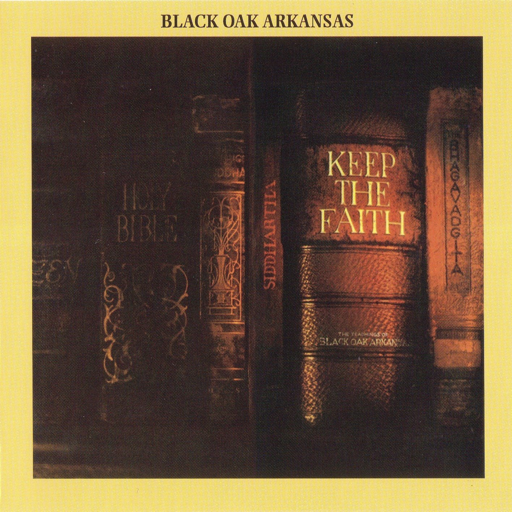

# Keep the Faith

By **Black Oak Arkansas**

## Album Data

- **Catalog:** Beets
- **Format:** Digital, Album
- **Album:** Keep the Faith
- **Artist:** Black Oak Arkansas
- **Albumartist:** Black Oak Arkansas
- **Genre:** Southern Rock
- **MusicBrainz Album Artist ID:** [1ff4b10b-4214-48b7-87b4-64394773bfcc](https://musicbrainz.org/artist/1ff4b10b-4214-48b7-87b4-64394773bfcc)
- **MusicBrainz Album ID:** [8599b1e1-cbde-4601-b4ee-ad33208abd3a](https://musicbrainz.org/release/8599b1e1-cbde-4601-b4ee-ad33208abd3a)
- **MusicBrainz Release Group ID:** [c2d11f48-5eb1-34f0-b19f-8b24940d5ced](https://musicbrainz.org/release-group/c2d11f48-5eb1-34f0-b19f-8b24940d5ced)
- **Year:** 2000
- **Catalog #:** WOU 381
- **Label:** Wounded Bird Records
- **Total Tracks:** 09

## Album Tracks

### Track 01 - Keep the Faith

- **Artist:** Black Oak Arkansas
- **Format:** ALAC
- **Genre:** Southern Rock
- **Length:** 3:18
- **MusicBrainz Track ID:** [c904b956-00eb-45ba-bf89-80634796eabb](https://musicbrainz.org/recording/c904b956-00eb-45ba-bf89-80634796eabb)
- **Title:** Keep the Faith
- **Track:** 01
- **Year:** 2000

### Track 02 - Revolutionary All American Boys

- **Artist:** Black Oak Arkansas
- **Format:** ALAC
- **Genre:** Southern Rock
- **Length:** 3:39
- **MusicBrainz Track ID:** [470c1bce-d6d3-4f9a-ab81-ec92869639be](https://musicbrainz.org/recording/470c1bce-d6d3-4f9a-ab81-ec92869639be)
- **Title:** Revolutionary All American Boys
- **Track:** 02
- **Year:** 2000

### Track 03 - Feet on Earth, Head in Sky

- **Artist:** Black Oak Arkansas
- **Format:** ALAC
- **Genre:** Southern Rock
- **Length:** 4:15
- **MusicBrainz Track ID:** [2faf7075-7ca5-42e1-9763-4bfefc43db50](https://musicbrainz.org/recording/2faf7075-7ca5-42e1-9763-4bfefc43db50)
- **Title:** Feet on Earth, Head in Sky
- **Track:** 03
- **Year:** 2000

### Track 04 - Fever in My Mind

- **Artist:** Black Oak Arkansas
- **Format:** ALAC
- **Genre:** Southern Rock
- **Length:** 2:52
- **MusicBrainz Track ID:** [811cde2e-faad-4184-94bb-57454bcaf32b](https://musicbrainz.org/recording/811cde2e-faad-4184-94bb-57454bcaf32b)
- **Title:** Fever in My Mind
- **Track:** 04
- **Year:** 2000

### Track 05 - The Big One's Still Coming

- **Artist:** Black Oak Arkansas
- **Format:** ALAC
- **Genre:** Southern Rock
- **Length:** 4:03
- **MusicBrainz Track ID:** [9dd379c2-9d50-45bd-96c9-30ddfc007a47](https://musicbrainz.org/recording/9dd379c2-9d50-45bd-96c9-30ddfc007a47)
- **Title:** The Big One's Still Coming
- **Track:** 05
- **Year:** 2000

### Track 06 - White Headed Woman

- **Artist:** Black Oak Arkansas
- **Format:** ALAC
- **Genre:** Southern Rock
- **Length:** 5:02
- **MusicBrainz Track ID:** [e148ef40-2a84-4d3c-b8e3-b23e855f7541](https://musicbrainz.org/recording/e148ef40-2a84-4d3c-b8e3-b23e855f7541)
- **Title:** White Headed Woman
- **Track:** 06
- **Year:** 2000

### Track 07 - We Live on Day to Day

- **Artist:** Black Oak Arkansas
- **Format:** ALAC
- **Genre:** Southern Rock
- **Length:** 5:23
- **MusicBrainz Track ID:** [9aaddfff-c6b9-482c-82c5-f451f718490e](https://musicbrainz.org/recording/9aaddfff-c6b9-482c-82c5-f451f718490e)
- **Title:** We Live on Day to Day
- **Track:** 07
- **Year:** 2000

### Track 08 - Short Life Line

- **Artist:** Black Oak Arkansas
- **Format:** ALAC
- **Genre:** Southern Rock
- **Length:** 4:59
- **MusicBrainz Track ID:** [2aa75ed1-8efd-40c8-9354-b5b89f615c24](https://musicbrainz.org/recording/2aa75ed1-8efd-40c8-9354-b5b89f615c24)
- **Title:** Short Life Line
- **Track:** 08
- **Year:** 2000

### Track 09 - Don't Confuse What You Don't Know

- **Artist:** Black Oak Arkansas
- **Format:** ALAC
- **Genre:** Southern Rock
- **Length:** 4:56
- **MusicBrainz Track ID:** [7dc8582b-14f6-4fe1-aa85-7f5ab75f3a32](https://musicbrainz.org/recording/7dc8582b-14f6-4fe1-aa85-7f5ab75f3a32)
- **Title:** Don't Confuse What You Don't Know
- **Track:** 09
- **Year:** 2000

## See also

- [Black Oak Arkansas](Black_Oak_Arkansas.md)
- [Roon: Black Oak Arkansas](../../Roon/Black_Oak_Arkansas/Black_Oak_Arkansas.md)
- [Roon: Keep The Faith](../../Roon/Black_Oak_Arkansas/Keep_The_Faith.md)
- [Vinyl: ](../../Vinyl/Black_Oak_Arkansas/Black_Oak_Arkansas_index.md)
- [Vinyl: Black Oak Arkansas](../../Vinyl/Black_Oak_Arkansas/Black_Oak_Arkansas.md)
