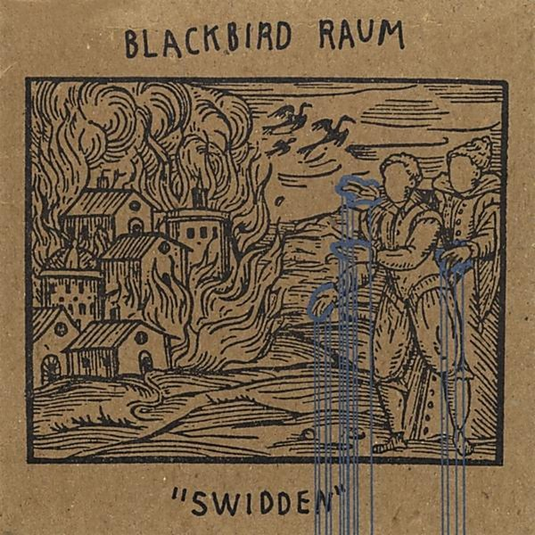

# "Swidden"

By **Blackbird Raum**

## Album Data

- **Catalog:** Beets
- **Format:** Digital, Album
- **Album:** "Swidden"
- **Artist:** Blackbird Raum
- **Albumartist:** Blackbird Raum
- **Genre:** Gypsy Punk
- **MusicBrainz Album Artist ID:** [bac5dcc9-7da7-4274-be82-70e650b82290](https://musicbrainz.org/artist/bac5dcc9-7da7-4274-be82-70e650b82290)
- **MusicBrainz Album ID:** [d22bd0dd-9e9d-41d4-a23a-c34dfd2ca2dd](https://musicbrainz.org/release/d22bd0dd-9e9d-41d4-a23a-c34dfd2ca2dd)
- **MusicBrainz Release Group ID:** [7d276ede-b3c5-456a-88ee-7970176c5e5d](https://musicbrainz.org/release-group/7d276ede-b3c5-456a-88ee-7970176c5e5d)
- **Year:** 2008
- **Catalog #:** 
- **Label:** 
- **Total Tracks:** 16

## Album Tracks

### Track 01 - Valkyrie Horsewhip Reel

- **Artist:** Blackbird Raum
- **Format:** AAC
- **Genre:** Folk Punk
- **Length:** 3:12
- **MusicBrainz Track ID:** [15c75f51-8b46-4338-9fac-f1a14187c5e7](https://musicbrainz.org/recording/15c75f51-8b46-4338-9fac-f1a14187c5e7)
- **Title:** Valkyrie Horsewhip Reel
- **Track:** 01
- **Year:** 2008

### Track 02 - California Fetid Adder's Tongue

- **Artist:** Blackbird Raum
- **Format:** AAC
- **Genre:** Gypsy Punk
- **Length:** 3:33
- **MusicBrainz Track ID:** [766bcaf9-383d-4961-aacc-504e0754f6f1](https://musicbrainz.org/recording/766bcaf9-383d-4961-aacc-504e0754f6f1)
- **Title:** California Fetid Adder's Tongue
- **Track:** 02
- **Year:** 2008

### Track 03 - Rubicon Drawn

- **Artist:** Blackbird Raum
- **Format:** AAC
- **Genre:** Gypsy Punk
- **Length:** 2:31
- **MusicBrainz Track ID:** [b7c9d1a5-a325-4839-b90a-94cf7de2507c](https://musicbrainz.org/recording/b7c9d1a5-a325-4839-b90a-94cf7de2507c)
- **Title:** Rubicon Drawn
- **Track:** 03
- **Year:** 2008

### Track 04 - Silent Spring

- **Artist:** Blackbird Raum
- **Format:** AAC
- **Genre:** Gypsy Punk
- **Length:** 4:21
- **MusicBrainz Track ID:** [5a65c2b4-d697-4ec0-b8ec-e10158ff2b54](https://musicbrainz.org/recording/5a65c2b4-d697-4ec0-b8ec-e10158ff2b54)
- **Title:** Silent Spring
- **Track:** 04
- **Year:** 2008

### Track 05 - Witches

- **Artist:** Blackbird Raum
- **Format:** AAC
- **Genre:** Gypsy Punk
- **Length:** 3:54
- **MusicBrainz Track ID:** [210945fa-4a54-4fbf-9495-c181db39e946](https://musicbrainz.org/recording/210945fa-4a54-4fbf-9495-c181db39e946)
- **Title:** Witches
- **Track:** 05
- **Year:** 2008

### Track 06 - Greymare

- **Artist:** Blackbird Raum
- **Format:** AAC
- **Genre:** Gypsy Punk
- **Length:** 0:30
- **MusicBrainz Track ID:** [4c000609-0175-48be-8eef-c9aec30735f3](https://musicbrainz.org/recording/4c000609-0175-48be-8eef-c9aec30735f3)
- **Title:** Greymare
- **Track:** 06
- **Year:** 2008

### Track 07 - Story from Strawmouth

- **Artist:** Blackbird Raum
- **Format:** AAC
- **Genre:** Gypsy Punk
- **Length:** 2:40
- **MusicBrainz Track ID:** [e7f29c23-9848-403c-8bca-43c47a1981d0](https://musicbrainz.org/recording/e7f29c23-9848-403c-8bca-43c47a1981d0)
- **Title:** Story from Strawmouth
- **Track:** 07
- **Year:** 2008

### Track 08 - Woodwose

- **Artist:** Blackbird Raum
- **Format:** AAC
- **Genre:** Gypsy Punk
- **Length:** 3:05
- **MusicBrainz Track ID:** [4e314e63-bf0e-40c0-9295-bcfffcea35ba](https://musicbrainz.org/recording/4e314e63-bf0e-40c0-9295-bcfffcea35ba)
- **Title:** Woodwose
- **Track:** 08
- **Year:** 2008

### Track 09 - Shot Coplifting

- **Artist:** Blackbird Raum
- **Format:** AAC
- **Genre:** Gypsy Punk
- **Length:** 1:39
- **MusicBrainz Track ID:** [26b0a24a-17b4-467c-9ebf-73679169749e](https://musicbrainz.org/recording/26b0a24a-17b4-467c-9ebf-73679169749e)
- **Title:** Shot Coplifting
- **Track:** 09
- **Year:** 2008

### Track 10 - Unregistered Firearm / Ravachol in Valhalla / Crom

- **Artist:** Blackbird Raum
- **Format:** AAC
- **Genre:** Gypsy Punk
- **Length:** 6:14
- **MusicBrainz Track ID:** [179c8da3-be3d-4167-b7f0-f7d7d4c8b7ec](https://musicbrainz.org/recording/179c8da3-be3d-4167-b7f0-f7d7d4c8b7ec)
- **Title:** Unregistered Firearm / Ravachol in Valhalla / Crom
- **Track:** 10
- **Year:** 2008

### Track 11 - A Rat In My Dream

- **Artist:** Blackbird Raum
- **Format:** AAC
- **Genre:** Gypsy Punk
- **Length:** 1:08
- **MusicBrainz Track ID:** [b51630be-78e6-4c0d-b5e3-20bacc9d7125](https://musicbrainz.org/recording/b51630be-78e6-4c0d-b5e3-20bacc9d7125)
- **Title:** A Rat In My Dream
- **Track:** 11
- **Year:** 2008

### Track 12 - Still Sick (Years After the Draft)

- **Artist:** Blackbird Raum
- **Format:** AAC
- **Genre:** Gypsy Punk
- **Length:** 3:04
- **MusicBrainz Track ID:** [4e4f6aa2-c064-4b77-a3ad-83a3682769c9](https://musicbrainz.org/recording/4e4f6aa2-c064-4b77-a3ad-83a3682769c9)
- **Title:** Still Sick (Years After the Draft)
- **Track:** 12
- **Year:** 2008

### Track 13 - Honey in the Hair

- **Artist:** Blackbird Raum
- **Format:** AAC
- **Genre:** Gypsy Punk
- **Length:** 3:21
- **MusicBrainz Track ID:** [ceea233f-fbc2-48ba-858b-9ace9e5d9e83](https://musicbrainz.org/recording/ceea233f-fbc2-48ba-858b-9ace9e5d9e83)
- **Title:** Honey in the Hair
- **Track:** 13
- **Year:** 2008

### Track 14 - Coal

- **Artist:** Blackbird Raum
- **Format:** AAC
- **Genre:** Gypsy Punk
- **Length:** 4:12
- **MusicBrainz Track ID:** [60ddb206-f59a-49c3-97d4-47a093142958](https://musicbrainz.org/recording/60ddb206-f59a-49c3-97d4-47a093142958)
- **Title:** Coal
- **Track:** 14
- **Year:** 2008

### Track 15 - Germinal

- **Artist:** Blackbird Raum
- **Format:** AAC
- **Genre:** Gypsy Punk
- **Length:** 4:25
- **MusicBrainz Track ID:** [0e0ed350-d122-46db-aadf-37e7e22ab290](https://musicbrainz.org/recording/0e0ed350-d122-46db-aadf-37e7e22ab290)
- **Title:** Germinal
- **Track:** 15
- **Year:** 2008

### Track 16 - Everyone Up to the Wall

- **Artist:** Blackbird Raum
- **Format:** AAC
- **Genre:** Gypsy Punk
- **Length:** 3:09
- **MusicBrainz Track ID:** [6dc101c6-4ddc-4d8b-a143-32c68d39aa96](https://musicbrainz.org/recording/6dc101c6-4ddc-4d8b-a143-32c68d39aa96)
- **Title:** Everyone Up to the Wall
- **Track:** 16
- **Year:** 2008

