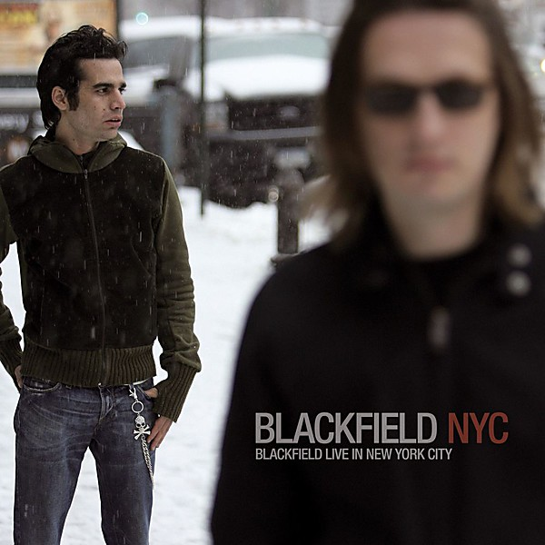

# Live In New York City

By **Blackfield**

## Album Data

- **Catalog:** Beets
- **Format:** Digital, Album
- **Album:** Live In New York City
- **Artist:** Blackfield
- **Albumartist:** Blackfield
- **Genre:** Progressive Rock
- **MusicBrainz Album Artist ID:** 
- **MusicBrainz Album ID:** 
- **MusicBrainz Release Group ID:** 
- **Year:** 2007
- **Catalog #:** 
- **Label:** 
- **Total Tracks:** 00

## Album Tracks

### Track 00 - 00 - 00 - LIVE_NYC07 1

- **Artist:** Blackfield
- **Format:** AAC
- **Genre:** Progressive Rock
- **Length:** 82:07
- **MusicBrainz Track ID:** 
- **Title:** 00 - 00 - LIVE_NYC07 1
- **Track:** 00
- **Year:** 2007

### Track 00 - 00 - 00 - LIVE_NYC07 2

- **Artist:** Blackfield
- **Format:** AAC
- **Genre:** Progressive Rock
- **Length:** 3:14
- **MusicBrainz Track ID:** 
- **Title:** 00 - 00 - LIVE_NYC07 2
- **Track:** 00
- **Year:** 2007

### Track 00 - 00 - 00 - LIVE_NYC07 3

- **Artist:** Blackfield
- **Format:** AAC
- **Genre:** Progressive Rock
- **Length:** 3:59
- **MusicBrainz Track ID:** 
- **Title:** 00 - 00 - LIVE_NYC07 3
- **Track:** 00
- **Year:** 2007

### Track 00 - 00 - 00 - LIVE_NYC07 4

- **Artist:** Blackfield
- **Format:** AAC
- **Genre:** Progressive Rock
- **Length:** 4:02
- **MusicBrainz Track ID:** 
- **Title:** 00 - 00 - LIVE_NYC07 4
- **Track:** 00
- **Year:** 2007

### Track 01 - Once [Live]

- **Artist:** Blackfield
- **Format:** ALAC
- **Genre:** Progressive Rock
- **Length:** 5:11
- **MusicBrainz Track ID:** 
- **Title:** Once [Live]
- **Track:** 01
- **Year:** 2011

### Track 02 - Miss You [Live]

- **Artist:** Blackfield
- **Format:** ALAC
- **Genre:** Progressive Rock
- **Length:** 4:39
- **MusicBrainz Track ID:** 
- **Title:** Miss You [Live]
- **Track:** 02
- **Year:** 2011

### Track 03 - Blackfield

- **Artist:** Blackfield
- **Format:** ALAC
- **Genre:** Progressive Rock
- **Length:** 4:48
- **MusicBrainz Track ID:** 
- **Title:** Blackfield
- **Track:** 03
- **Year:** 2011

### Track 04 - Christenings [Live]

- **Artist:** Blackfield
- **Format:** ALAC
- **Genre:** Progressive Rock
- **Length:** 4:44
- **MusicBrainz Track ID:** 
- **Title:** Christenings [Live]
- **Track:** 04
- **Year:** 2011

### Track 05 - The Hole in Me [Live]

- **Artist:** Blackfield
- **Format:** ALAC
- **Genre:** Progressive Rock
- **Length:** 3:54
- **MusicBrainz Track ID:** 
- **Title:** The Hole in Me [Live]
- **Track:** 05
- **Year:** 2011

### Track 06 - 1000 People [Live]

- **Artist:** Blackfield
- **Format:** ALAC
- **Genre:** Progressive Rock
- **Length:** 4:10
- **MusicBrainz Track ID:** 
- **Title:** 1000 People [Live]
- **Track:** 06
- **Year:** 2011

### Track 07 - Pain [Live]

- **Artist:** Blackfield
- **Format:** ALAC
- **Genre:** Progressive Rock
- **Length:** 4:17
- **MusicBrainz Track ID:** 
- **Title:** Pain [Live]
- **Track:** 07
- **Year:** 2011

### Track 08 - Glow [Live]

- **Artist:** Blackfield
- **Format:** ALAC
- **Genre:** Progressive Rock
- **Length:** 3:33
- **MusicBrainz Track ID:** 
- **Title:** Glow [Live]
- **Track:** 08
- **Year:** 2011

### Track 09 - Thank You [Live]

- **Artist:** Blackfield
- **Format:** ALAC
- **Genre:** Progressive Rock
- **Length:** 4:56
- **MusicBrainz Track ID:** 
- **Title:** Thank You [Live]
- **Track:** 09
- **Year:** 2011

### Track 10 - Epidemic

- **Artist:** Blackfield
- **Format:** ALAC
- **Genre:** Progressive Rock
- **Length:** 5:04
- **MusicBrainz Track ID:** 
- **Title:** Epidemic
- **Track:** 10
- **Year:** 2011

### Track 11 - Someday [Live]

- **Artist:** Blackfield
- **Format:** ALAC
- **Genre:** Progressive Rock
- **Length:** 4:51
- **MusicBrainz Track ID:** 
- **Title:** Someday [Live]
- **Track:** 11
- **Year:** 2011

### Track 12 - Open Mind [Live]

- **Artist:** Blackfield
- **Format:** ALAC
- **Genre:** Progressive Rock
- **Length:** 3:59
- **MusicBrainz Track ID:** 
- **Title:** Open Mind [Live]
- **Track:** 12
- **Year:** 2011

### Track 13 - My Gift of Silence [Live]

- **Artist:** Blackfield
- **Format:** ALAC
- **Genre:** Progressive Rock
- **Length:** 4:11
- **MusicBrainz Track ID:** 
- **Title:** My Gift of Silence [Live]
- **Track:** 13
- **Year:** 2011

### Track 14 - Where Is My Love [Live]

- **Artist:** Blackfield
- **Format:** ALAC
- **Genre:** Progressive Rock
- **Length:** 3:02
- **MusicBrainz Track ID:** 
- **Title:** Where Is My Love [Live]
- **Track:** 14
- **Year:** 2011

### Track 15 - End of the World [Live]

- **Artist:** Blackfield
- **Format:** ALAC
- **Genre:** Progressive Rock
- **Length:** 5:15
- **MusicBrainz Track ID:** 
- **Title:** End of the World [Live]
- **Track:** 15
- **Year:** 2011

### Track 16 - Hello [Live]

- **Artist:** Blackfield
- **Format:** ALAC
- **Genre:** Progressive Rock
- **Length:** 3:41
- **MusicBrainz Track ID:** 
- **Title:** Hello [Live]
- **Track:** 16
- **Year:** 2011

### Track 17 - Once - Encore [Live]

- **Artist:** Blackfield
- **Format:** ALAC
- **Genre:** Progressive Rock
- **Length:** 4:29
- **MusicBrainz Track ID:** 
- **Title:** Once - Encore [Live]
- **Track:** 17
- **Year:** 2011

### Track 18 - Cloudy Now - Encore [Live]

- **Artist:** Blackfield
- **Format:** ALAC
- **Genre:** Progressive Rock
- **Length:** 4:22
- **MusicBrainz Track ID:** 
- **Title:** Cloudy Now - Encore [Live]
- **Track:** 18
- **Year:** 2011

