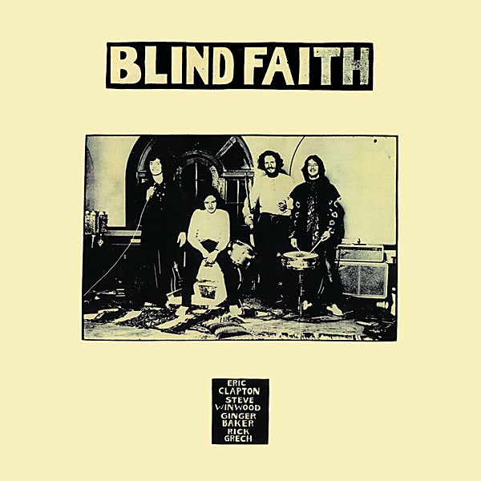

# Blind Faith

By **Blind Faith**

## Album Data

- **Catalog:** Beets
- **Format:** Digital, Album
- **Album:** Blind Faith
- **Artist:** Blind Faith
- **Albumartist:** Blind Faith
- **Genre:** Hard Rock
- **MusicBrainz Album Artist ID:** [53fa91ca-a2b9-463d-b78e-daca9894082a](https://musicbrainz.org/artist/53fa91ca-a2b9-463d-b78e-daca9894082a)
- **MusicBrainz Album ID:** [631ab422-ba98-33e8-a9a1-4241f8b850f5](https://musicbrainz.org/release/631ab422-ba98-33e8-a9a1-4241f8b850f5)
- **MusicBrainz Release Group ID:** [afbf4eae-a722-3236-945a-9f5045976107](https://musicbrainz.org/release-group/afbf4eae-a722-3236-945a-9f5045976107)
- **Year:** 1988
- **Catalog #:** UDCD 507
- **Label:** Mobile Fidelity Sound Lab
- **Total Tracks:** 06

## Album Tracks

### Track 01 - Had to Cry Today

- **Artist:** Blind Faith
- **Format:** MP3
- **Genre:** Rock
- **Length:** 8:48
- **MusicBrainz Track ID:** [a46bb636-5289-4b04-b576-e150a6de6a96](https://musicbrainz.org/recording/a46bb636-5289-4b04-b576-e150a6de6a96)
- **Title:** Had to Cry Today
- **Track:** 01
- **Year:** 1988

### Track 02 - Can’t Find My Way Home

- **Artist:** Blind Faith
- **Format:** MP3
- **Genre:** Hard Rock
- **Length:** 3:16
- **MusicBrainz Track ID:** [56954340-b98c-4b81-82fb-fb768f2d72ff](https://musicbrainz.org/recording/56954340-b98c-4b81-82fb-fb768f2d72ff)
- **Title:** Can’t Find My Way Home
- **Track:** 02
- **Year:** 1988

### Track 03 - Well All Right

- **Artist:** Blind Faith
- **Format:** MP3
- **Genre:** Rock
- **Length:** 4:27
- **MusicBrainz Track ID:** [c0ff6792-b9b3-4567-ad8e-00ec1975acca](https://musicbrainz.org/recording/c0ff6792-b9b3-4567-ad8e-00ec1975acca)
- **Title:** Well All Right
- **Track:** 03
- **Year:** 1988

### Track 04 - Presence of the Lord

- **Artist:** Blind Faith
- **Format:** MP3
- **Genre:** Rock
- **Length:** 4:49
- **MusicBrainz Track ID:** [fa6a987a-db0e-4967-8367-bebe89126ec7](https://musicbrainz.org/recording/fa6a987a-db0e-4967-8367-bebe89126ec7)
- **Title:** Presence of the Lord
- **Track:** 04
- **Year:** 1988

### Track 05 - Sea of Joy

- **Artist:** Blind Faith
- **Format:** MP3
- **Genre:** Psychedelic Rock
- **Length:** 5:22
- **MusicBrainz Track ID:** [6f4e84d3-8c40-4570-be1e-23de7256f26d](https://musicbrainz.org/recording/6f4e84d3-8c40-4570-be1e-23de7256f26d)
- **Title:** Sea of Joy
- **Track:** 05
- **Year:** 1988

### Track 06 - Do What You Like

- **Artist:** Blind Faith
- **Format:** MP3
- **Genre:** Psychedelic Rock
- **Length:** 15:18
- **MusicBrainz Track ID:** [2b4f8639-dfd2-4c05-92b0-a6bd91c01714](https://musicbrainz.org/recording/2b4f8639-dfd2-4c05-92b0-a6bd91c01714)
- **Title:** Do What You Like
- **Track:** 06
- **Year:** 1988

## See also

- [Roon: Blind Faith](../../Roon/Blind_Faith/Blind_Faith.md)
- [Vinyl: ](../../Vinyl/Blind_Faith/Blind_Faith_index.md)
- [Vinyl: Blind Faith](../../Vinyl/Blind_Faith/Blind_Faith.md)
