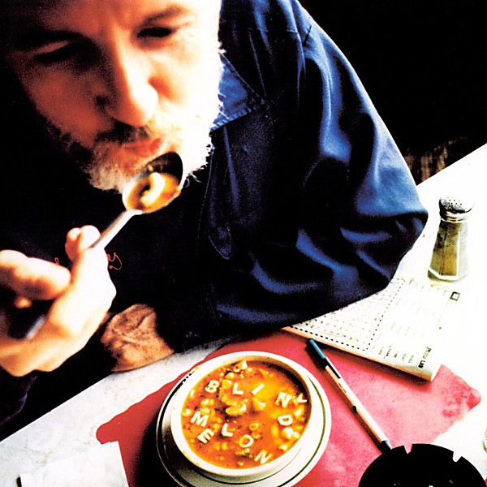

# Soup

By **Blind Melon**

## Album Data

- **Catalog:** Beets
- **Format:** Digital, Album
- **Album:** Soup
- **Artist:** Blind Melon
- **Albumartist:** Blind Melon
- **Genre:** Grunge
- **MusicBrainz Album Artist ID:** [38c5cdab-5d6d-43d1-85b0-dac41bde186e](https://musicbrainz.org/artist/38c5cdab-5d6d-43d1-85b0-dac41bde186e)
- **MusicBrainz Album ID:** [c6f1c90d-58bd-3da6-a033-01eb16f0d25b](https://musicbrainz.org/release/c6f1c90d-58bd-3da6-a033-01eb16f0d25b)
- **MusicBrainz Release Group ID:** [9dba763e-7cff-36b3-af88-b755f237a4c7](https://musicbrainz.org/release-group/9dba763e-7cff-36b3-af88-b755f237a4c7)
- **Year:** 1995
- **Catalog #:** 7243 8 33934 2 8
- **Label:** Capitol Records
- **Total Tracks:** 14

## Album Tracks

### Track 01 - Hello Goodbye / Galaxie

- **Artist:** Blind Melon
- **Format:** ALAC
- **Genre:** Grunge
- **Length:** 3:31
- **MusicBrainz Track ID:** [c43ee188-0049-4eec-ba2e-0385c5edd2db](https://musicbrainz.org/recording/c43ee188-0049-4eec-ba2e-0385c5edd2db)
- **Title:** Hello Goodbye / Galaxie
- **Track:** 01
- **Year:** 1995

### Track 02 - 2 × 4

- **Artist:** Blind Melon
- **Format:** ALAC
- **Genre:** Grunge
- **Length:** 4:00
- **MusicBrainz Track ID:** [c830c239-3f91-4485-9577-4b86f92ad725](https://musicbrainz.org/recording/c830c239-3f91-4485-9577-4b86f92ad725)
- **Title:** 2 × 4
- **Track:** 02
- **Year:** 1995

### Track 03 - Vernie

- **Artist:** Blind Melon
- **Format:** ALAC
- **Genre:** Post-Grunge
- **Length:** 3:15
- **MusicBrainz Track ID:** [573f6f57-f83e-4f74-9c62-401c406cc2e2](https://musicbrainz.org/recording/573f6f57-f83e-4f74-9c62-401c406cc2e2)
- **Title:** Vernie
- **Track:** 03
- **Year:** 1995

### Track 04 - Skinned

- **Artist:** Blind Melon
- **Format:** ALAC
- **Genre:** Grunge
- **Length:** 1:57
- **MusicBrainz Track ID:** [aebcc611-6f96-42e6-a983-ea28aef855be](https://musicbrainz.org/recording/aebcc611-6f96-42e6-a983-ea28aef855be)
- **Title:** Skinned
- **Track:** 04
- **Year:** 1995

### Track 05 - Toes Across the Floor

- **Artist:** Blind Melon
- **Format:** ALAC
- **Genre:** Grunge
- **Length:** 3:07
- **MusicBrainz Track ID:** [78855de4-d65a-422c-92a6-ccf71ccc45c9](https://musicbrainz.org/recording/78855de4-d65a-422c-92a6-ccf71ccc45c9)
- **Title:** Toes Across the Floor
- **Track:** 05
- **Year:** 1995

### Track 06 - Walk

- **Artist:** Blind Melon
- **Format:** ALAC
- **Genre:** Grunge
- **Length:** 2:47
- **MusicBrainz Track ID:** [90feee79-518d-4f24-b43b-af8457e13962](https://musicbrainz.org/recording/90feee79-518d-4f24-b43b-af8457e13962)
- **Title:** Walk
- **Track:** 06
- **Year:** 1995

### Track 07 - Dumptruck

- **Artist:** Blind Melon
- **Format:** ALAC
- **Genre:** Stoner Rock
- **Length:** 3:40
- **MusicBrainz Track ID:** [054a521b-7b6c-40e2-987b-a1968c53d3a6](https://musicbrainz.org/recording/054a521b-7b6c-40e2-987b-a1968c53d3a6)
- **Title:** Dumptruck
- **Track:** 07
- **Year:** 1995

### Track 08 - Car Seat (God’s Presents)

- **Artist:** Blind Melon
- **Format:** ALAC
- **Genre:** Grunge
- **Length:** 2:42
- **MusicBrainz Track ID:** [c192c089-8ab5-4725-bd6a-b9f5d67f69d2](https://musicbrainz.org/recording/c192c089-8ab5-4725-bd6a-b9f5d67f69d2)
- **Title:** Car Seat (God’s Presents)
- **Track:** 08
- **Year:** 1995

### Track 09 - Wilt

- **Artist:** Blind Melon
- **Format:** ALAC
- **Genre:** Indie Rock
- **Length:** 2:30
- **MusicBrainz Track ID:** [3a9490bc-352c-43f7-873d-92bfb66968a7](https://musicbrainz.org/recording/3a9490bc-352c-43f7-873d-92bfb66968a7)
- **Title:** Wilt
- **Track:** 09
- **Year:** 1995

### Track 10 - The Duke

- **Artist:** Blind Melon
- **Format:** ALAC
- **Genre:** Grunge
- **Length:** 3:37
- **MusicBrainz Track ID:** [cade2f23-05e4-4cb6-86b4-30bb67d06e19](https://musicbrainz.org/recording/cade2f23-05e4-4cb6-86b4-30bb67d06e19)
- **Title:** The Duke
- **Track:** 10
- **Year:** 1995

### Track 11 - St. Andrew’s Fall

- **Artist:** Blind Melon
- **Format:** ALAC
- **Genre:** Grunge
- **Length:** 4:12
- **MusicBrainz Track ID:** [8b112607-b13d-4d51-b01b-14f8a886b0a1](https://musicbrainz.org/recording/8b112607-b13d-4d51-b01b-14f8a886b0a1)
- **Title:** St. Andrew’s Fall
- **Track:** 11
- **Year:** 1995

### Track 12 - New Life

- **Artist:** Blind Melon
- **Format:** ALAC
- **Genre:** Grunge
- **Length:** 3:35
- **MusicBrainz Track ID:** [3ada1f7e-7026-47a5-860f-302d2b19a875](https://musicbrainz.org/recording/3ada1f7e-7026-47a5-860f-302d2b19a875)
- **Title:** New Life
- **Track:** 12
- **Year:** 1995

### Track 13 - Mouthful of Cavities

- **Artist:** Blind Melon
- **Format:** ALAC
- **Genre:** Grunge
- **Length:** 3:34
- **MusicBrainz Track ID:** [67f59e70-3261-4d88-955d-51b5fc25f833](https://musicbrainz.org/recording/67f59e70-3261-4d88-955d-51b5fc25f833)
- **Title:** Mouthful of Cavities
- **Track:** 13
- **Year:** 1995

### Track 14 - Lemonade

- **Artist:** Blind Melon
- **Format:** ALAC
- **Genre:** Indie Rock
- **Length:** 3:37
- **MusicBrainz Track ID:** [789c78d6-937d-4da9-b86c-5ef03046d47b](https://musicbrainz.org/recording/789c78d6-937d-4da9-b86c-5ef03046d47b)
- **Title:** Lemonade
- **Track:** 14
- **Year:** 1995

