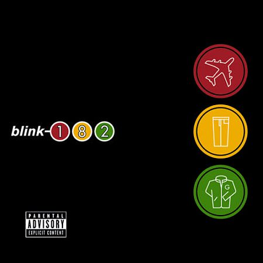

# Take Off Your Pants and Jacket

By **blink‐182**

## Album Data

- **Catalog:** Beets
- **Format:** Digital, Album
- **Album:** Take Off Your Pants and Jacket
- **Artist:** Blink‐182
- **Albumartist:** blink‐182
- **Genre:** Pop Punk
- **MusicBrainz Album Artist ID:** [0743b15a-3c32-48c8-ad58-cb325350befa](https://musicbrainz.org/artist/0743b15a-3c32-48c8-ad58-cb325350befa)
- **MusicBrainz Album ID:** [6474a9fd-0dc6-4e82-ab26-1e7726aeb9c0](https://musicbrainz.org/release/6474a9fd-0dc6-4e82-ab26-1e7726aeb9c0)
- **MusicBrainz Release Group ID:** [e9acecde-4ae1-3430-baf7-eae53cb9d75f](https://musicbrainz.org/release-group/e9acecde-4ae1-3430-baf7-eae53cb9d75f)
- **Year:** 2001
- **Catalog #:** 112 674-2
- **Label:** MCA Records
- **Total Tracks:** 13

## Album Tracks

### Track 01 - Anthem, Part Two

- **Artist:** blink‐182
- **Format:** AAC
- **Genre:** Pop Punk
- **Length:** 3:48
- **MusicBrainz Track ID:** [5c1659a3-ca80-46ed-9d7c-34e45dfa7800](https://musicbrainz.org/recording/5c1659a3-ca80-46ed-9d7c-34e45dfa7800)
- **Title:** Anthem, Part Two
- **Track:** 01
- **Year:** 2001

### Track 02 - Online Songs

- **Artist:** blink‐182
- **Format:** AAC
- **Genre:** Pop Punk
- **Length:** 2:25
- **MusicBrainz Track ID:** [2bdfef17-afe9-404b-b140-8b5df3fe9958](https://musicbrainz.org/recording/2bdfef17-afe9-404b-b140-8b5df3fe9958)
- **Title:** Online Songs
- **Track:** 02
- **Year:** 2001

### Track 03 - First Date

- **Artist:** blink‐182
- **Format:** AAC
- **Genre:** Pop Punk
- **Length:** 2:51
- **MusicBrainz Track ID:** [99bfd38c-6f6d-49a5-8b97-f42b8d5edf89](https://musicbrainz.org/recording/99bfd38c-6f6d-49a5-8b97-f42b8d5edf89)
- **Title:** First Date
- **Track:** 03
- **Year:** 2001

### Track 04 - Happy Holidays, You Bastard

- **Artist:** blink‐182
- **Format:** AAC
- **Genre:** Pop Punk
- **Length:** 0:42
- **MusicBrainz Track ID:** [b0d50cab-4b31-4bb9-87ce-7896a85ad298](https://musicbrainz.org/recording/b0d50cab-4b31-4bb9-87ce-7896a85ad298)
- **Title:** Happy Holidays, You Bastard
- **Track:** 04
- **Year:** 2001

### Track 05 - Story of a Lonely Guy

- **Artist:** blink‐182
- **Format:** AAC
- **Genre:** Pop Punk
- **Length:** 3:39
- **MusicBrainz Track ID:** [bf6f272b-6e33-437f-8c77-691e255b1215](https://musicbrainz.org/recording/bf6f272b-6e33-437f-8c77-691e255b1215)
- **Title:** Story of a Lonely Guy
- **Track:** 05
- **Year:** 2001

### Track 06 - The Rock Show

- **Artist:** blink‐182
- **Format:** AAC
- **Genre:** Pop Punk
- **Length:** 2:51
- **MusicBrainz Track ID:** [94b79343-c276-456f-bfb9-54d491631ab5](https://musicbrainz.org/recording/94b79343-c276-456f-bfb9-54d491631ab5)
- **Title:** The Rock Show
- **Track:** 06
- **Year:** 2001

### Track 07 - Stay Together for the Kids

- **Artist:** blink‐182
- **Format:** AAC
- **Genre:** Emo
- **Length:** 3:59
- **MusicBrainz Track ID:** [a58b04a2-28c1-490c-87bc-ff3844fe9b1c](https://musicbrainz.org/recording/a58b04a2-28c1-490c-87bc-ff3844fe9b1c)
- **Title:** Stay Together for the Kids
- **Track:** 07
- **Year:** 2001

### Track 08 - Roller Coaster

- **Artist:** blink‐182
- **Format:** AAC
- **Genre:** Pop Punk
- **Length:** 2:47
- **MusicBrainz Track ID:** [3acda3b7-ebcf-4a67-ae37-738dd21bfeac](https://musicbrainz.org/recording/3acda3b7-ebcf-4a67-ae37-738dd21bfeac)
- **Title:** Roller Coaster
- **Track:** 08
- **Year:** 2001

### Track 09 - Reckless Abandon

- **Artist:** blink‐182
- **Format:** AAC
- **Genre:** Pop Punk
- **Length:** 3:06
- **MusicBrainz Track ID:** [2671e407-8a1b-424a-b381-c252913c45d1](https://musicbrainz.org/recording/2671e407-8a1b-424a-b381-c252913c45d1)
- **Title:** Reckless Abandon
- **Track:** 09
- **Year:** 2001

### Track 10 - Everytime I Look for You

- **Artist:** blink‐182
- **Format:** AAC
- **Genre:** Pop Punk
- **Length:** 3:05
- **MusicBrainz Track ID:** [743da382-36d6-43b1-88d8-736d5a7e7eaa](https://musicbrainz.org/recording/743da382-36d6-43b1-88d8-736d5a7e7eaa)
- **Title:** Everytime I Look for You
- **Track:** 10
- **Year:** 2001

### Track 11 - Give Me One Good Reason

- **Artist:** blink‐182
- **Format:** AAC
- **Genre:** Pop Punk
- **Length:** 3:18
- **MusicBrainz Track ID:** [390490d2-f497-4113-b57e-ab0d2768dfe7](https://musicbrainz.org/recording/390490d2-f497-4113-b57e-ab0d2768dfe7)
- **Title:** Give Me One Good Reason
- **Track:** 11
- **Year:** 2001

### Track 12 - Shut Up

- **Artist:** blink‐182
- **Format:** AAC
- **Genre:** Pop Punk
- **Length:** 3:20
- **MusicBrainz Track ID:** [15f6c472-f0ae-4e5e-b8ba-e160ab91ab63](https://musicbrainz.org/recording/15f6c472-f0ae-4e5e-b8ba-e160ab91ab63)
- **Title:** Shut Up
- **Track:** 12
- **Year:** 2001

### Track 13 - Please Take Me Home

- **Artist:** blink‐182
- **Format:** AAC
- **Genre:** Emo
- **Length:** 3:05
- **MusicBrainz Track ID:** [97ad65ee-3062-4fae-a1de-5cdfc1289b64](https://musicbrainz.org/recording/97ad65ee-3062-4fae-a1de-5cdfc1289b64)
- **Title:** Please Take Me Home
- **Track:** 13
- **Year:** 2001

## See also

- [Enema of the State](Enema_of_the_State.md)
