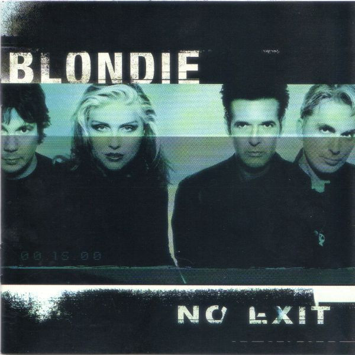

# No Exit

By **Blondie**

## Album Data

- **Catalog:** Beets
- **Format:** Digital, Album
- **Album:** No Exit
- **Artist:** Blondie
- **Albumartist:** Blondie
- **Genre:** Synthpop
- **MusicBrainz Album Artist ID:** [4d2956d1-a3f7-44bb-9a41-67563e1a0c94](https://musicbrainz.org/artist/4d2956d1-a3f7-44bb-9a41-67563e1a0c94)
- **MusicBrainz Album ID:** [54e24ee2-8832-4acb-849e-173c51f984f8](https://musicbrainz.org/release/54e24ee2-8832-4acb-849e-173c51f984f8)
- **MusicBrainz Release Group ID:** [af14217d-d5e3-3367-baef-90cf418ca79d](https://musicbrainz.org/release-group/af14217d-d5e3-3367-baef-90cf418ca79d)
- **Year:** 1999
- **Catalog #:** 63985-78003-2
- **Label:** Beyond Music
- **Total Tracks:** 14

## Album Tracks

### Track 01 - Screaming Skin

- **Artist:** Blondie
- **Format:** ALAC
- **Genre:** Ska
- **Length:** 5:35
- **MusicBrainz Track ID:** [df3844ea-332a-4404-a7e5-fbee10467b3c](https://musicbrainz.org/recording/df3844ea-332a-4404-a7e5-fbee10467b3c)
- **Title:** Screaming Skin
- **Track:** 01
- **Year:** 1999

### Track 02 - Forgive and Forget

- **Artist:** Blondie
- **Format:** ALAC
- **Genre:** Post-Punk
- **Length:** 4:31
- **MusicBrainz Track ID:** [444f4c03-a0e2-4ff0-b2e4-e69ce2a342f7](https://musicbrainz.org/recording/444f4c03-a0e2-4ff0-b2e4-e69ce2a342f7)
- **Title:** Forgive and Forget
- **Track:** 02
- **Year:** 1999

### Track 03 - Maria

- **Artist:** Blondie
- **Format:** ALAC
- **Genre:** Pop Rock
- **Length:** 4:51
- **MusicBrainz Track ID:** [57e001f5-ae95-4e9a-9da2-85de74985c40](https://musicbrainz.org/recording/57e001f5-ae95-4e9a-9da2-85de74985c40)
- **Title:** Maria
- **Track:** 03
- **Year:** 1999

### Track 04 - No Exit

- **Artist:** Blondie
- **Format:** ALAC
- **Genre:** Punk Rock
- **Length:** 4:19
- **MusicBrainz Track ID:** [524a480e-b7c2-4bbb-b7d8-f4430ee139f9](https://musicbrainz.org/recording/524a480e-b7c2-4bbb-b7d8-f4430ee139f9)
- **Title:** No Exit
- **Track:** 04
- **Year:** 1999

### Track 05 - Double Take

- **Artist:** Blondie
- **Format:** ALAC
- **Genre:** Punk Rock
- **Length:** 4:12
- **MusicBrainz Track ID:** [56a64824-e826-482b-a5a9-28aebb700b7d](https://musicbrainz.org/recording/56a64824-e826-482b-a5a9-28aebb700b7d)
- **Title:** Double Take
- **Track:** 05
- **Year:** 1999

### Track 06 - Nothing Is Real but the Girl

- **Artist:** Blondie
- **Format:** ALAC
- **Genre:** Power Pop
- **Length:** 3:13
- **MusicBrainz Track ID:** [36971509-4d67-4458-88f2-a0b48439ab12](https://musicbrainz.org/recording/36971509-4d67-4458-88f2-a0b48439ab12)
- **Title:** Nothing Is Real but the Girl
- **Track:** 06
- **Year:** 1999

### Track 07 - Boom Boom in the Zoom Zoom Room

- **Artist:** Blondie
- **Format:** ALAC
- **Genre:** New Wave
- **Length:** 4:08
- **MusicBrainz Track ID:** [a29435e7-6f3e-441c-be7a-eed7db1ba216](https://musicbrainz.org/recording/a29435e7-6f3e-441c-be7a-eed7db1ba216)
- **Title:** Boom Boom in the Zoom Zoom Room
- **Track:** 07
- **Year:** 1999

### Track 08 - Night Wind Sent

- **Artist:** Blondie
- **Format:** ALAC
- **Genre:** New Wave
- **Length:** 4:40
- **MusicBrainz Track ID:** [334aa355-edcd-49ac-af3b-3f9d850d742e](https://musicbrainz.org/recording/334aa355-edcd-49ac-af3b-3f9d850d742e)
- **Title:** Night Wind Sent
- **Track:** 08
- **Year:** 1999

### Track 09 - Under the Gun (for Jeffery Lee Pierce)

- **Artist:** Blondie
- **Format:** ALAC
- **Genre:** New Wave
- **Length:** 4:09
- **MusicBrainz Track ID:** [173f213d-b645-4b5a-bed7-349815bb58b7](https://musicbrainz.org/recording/173f213d-b645-4b5a-bed7-349815bb58b7)
- **Title:** Under the Gun (for Jeffery Lee Pierce)
- **Track:** 09
- **Year:** 1999

### Track 10 - Out in the Streets

- **Artist:** Blondie
- **Format:** ALAC
- **Genre:** New Wave
- **Length:** 3:03
- **MusicBrainz Track ID:** [7d0ff32b-6442-44a6-b7d7-f23c1aeaf0d9](https://musicbrainz.org/recording/7d0ff32b-6442-44a6-b7d7-f23c1aeaf0d9)
- **Title:** Out in the Streets
- **Track:** 10
- **Year:** 1999

### Track 11 - Happy Dog (for Caggy)

- **Artist:** Blondie
- **Format:** ALAC
- **Genre:** Synthpop
- **Length:** 3:24
- **MusicBrainz Track ID:** [83de7455-6e40-4458-9d1e-ab24a19afe68](https://musicbrainz.org/recording/83de7455-6e40-4458-9d1e-ab24a19afe68)
- **Title:** Happy Dog (for Caggy)
- **Track:** 11
- **Year:** 1999

### Track 12 - The Dream’s Lost on Me

- **Artist:** Blondie
- **Format:** ALAC
- **Genre:** Synthpop
- **Length:** 3:19
- **MusicBrainz Track ID:** [d01f43c3-a617-4808-844c-cf761ee20a34](https://musicbrainz.org/recording/d01f43c3-a617-4808-844c-cf761ee20a34)
- **Title:** The Dream’s Lost on Me
- **Track:** 12
- **Year:** 1999

### Track 13 - Divine

- **Artist:** Blondie
- **Format:** ALAC
- **Genre:** Pop Rock
- **Length:** 4:14
- **MusicBrainz Track ID:** [33c6cd3a-3589-42c7-9dfd-48ccbf74019b](https://musicbrainz.org/recording/33c6cd3a-3589-42c7-9dfd-48ccbf74019b)
- **Title:** Divine
- **Track:** 13
- **Year:** 1999

### Track 14 - Dig Up the Conjo

- **Artist:** Blondie
- **Format:** ALAC
- **Genre:** Punk Rock
- **Length:** 4:55
- **MusicBrainz Track ID:** [e7d72b04-5b9a-4e1c-8310-8f9e0645c0d7](https://musicbrainz.org/recording/e7d72b04-5b9a-4e1c-8310-8f9e0645c0d7)
- **Title:** Dig Up the Conjo
- **Track:** 14
- **Year:** 1999

## See also

- [Roon: Best Of Blondie](../../Roon/Blondie/Best_Of_Blondie.md)
- [Roon: Blondie (Remastered)](../../Roon/Blondie/Blondie_Remastered.md)
- [Roon: Eat To The Beat](../../Roon/Blondie/Eat_To_The_Beat.md)
- [Roon: Parallel Lines](../../Roon/Blondie/Parallel_Lines.md)
- [Vinyl: ](../../Vinyl/Blondie/Blondie.md)
- [Vinyl: Rapture](../../Vinyl/Blondie/Rapture.md)
