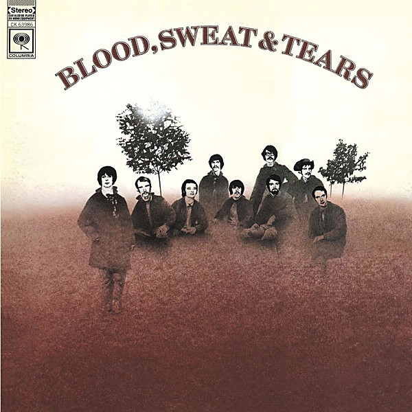

# Blood, Sweat & Tears

By **Blood, Sweat & Tears**

## Album Data

- **Catalog:** Beets
- **Format:** Digital, Album
- **Album:** Blood, Sweat & Tears
- **Artist:** Blood, Sweat & Tears
- **Albumartist:** Blood, Sweat & Tears
- **Genre:** Jazz Fusion
- **MusicBrainz Album Artist ID:** [f81d592c-993f-4693-b53a-57db5a6257b9](https://musicbrainz.org/artist/f81d592c-993f-4693-b53a-57db5a6257b9)
- **MusicBrainz Album ID:** [aa23da2d-0f28-3b37-8f00-2f52dac7ed5b](https://musicbrainz.org/release/aa23da2d-0f28-3b37-8f00-2f52dac7ed5b)
- **MusicBrainz Release Group ID:** [f92e55ef-e35d-3254-a627-191f3b3c9677](https://musicbrainz.org/release-group/f92e55ef-e35d-3254-a627-191f3b3c9677)
- **Year:** 2009
- **Catalog #:** 
- **Label:** Columbia
- **Total Tracks:** 00

## Album Tracks

### Track 06 - And When I Die

- **Artist:** Blood, Sweat & Tears
- **Format:** MP3
- **Genre:** Rock
- **Length:** 4:05
- **MusicBrainz Track ID:** 
- **Title:** And When I Die
- **Track:** 06
- **Year:** 1972

## See also

- [Blood, Sweat & Tears' Greatest Hits](Blood__Sweat_and_Tears_Greatest_Hits.md)
- [Roon: Child Is Father To The Man](../../Roon/Blood__Sweat_and_Tears/Child_Is_Father_To_The_Man.md)
