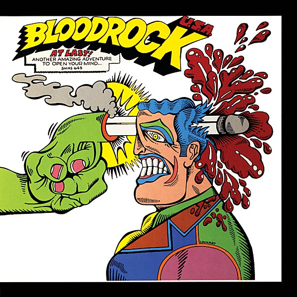

# Bloodrock U.S.A.

By **Bloodrock**

## Album Data

- **Catalog:** Beets
- **Format:** Digital, Album
- **Album:** Bloodrock U.S.A.
- **Artist:** Bloodrock
- **Albumartist:** Bloodrock
- **Genre:** Psychedelic Rock
- **MusicBrainz Album Artist ID:** [a5d9716e-659c-4e04-b911-eb1b7ab2a6cf](https://musicbrainz.org/artist/a5d9716e-659c-4e04-b911-eb1b7ab2a6cf)
- **MusicBrainz Album ID:** [3616b648-f526-4fbe-a895-dea6fca79811](https://musicbrainz.org/release/3616b648-f526-4fbe-a895-dea6fca79811)
- **MusicBrainz Release Group ID:** [0ab60bee-ba1f-38e1-86db-fcb6d2668781](https://musicbrainz.org/release-group/0ab60bee-ba1f-38e1-86db-fcb6d2668781)
- **Year:** 1971
- **Catalog #:** SMAS-645
- **Label:** Capitol Records
- **Total Tracks:** 09

## Album Tracks

### Track 01 - It’s a Sad World

- **Artist:** Bloodrock
- **Format:** MP3
- **Genre:** Psychedelic Rock
- **Length:** 4:26
- **MusicBrainz Track ID:** [b3bad29d-ef21-4081-bf3d-d3dce5f6c789](https://musicbrainz.org/recording/b3bad29d-ef21-4081-bf3d-d3dce5f6c789)
- **Title:** It’s a Sad World
- **Track:** 01
- **Year:** 1971

### Track 02 - Don’t Eat the Children

- **Artist:** Bloodrock
- **Format:** MP3
- **Genre:** Psychedelic Rock
- **Length:** 3:16
- **MusicBrainz Track ID:** [4e5e17da-3bbd-42a2-b690-758052336b3c](https://musicbrainz.org/recording/4e5e17da-3bbd-42a2-b690-758052336b3c)
- **Title:** Don’t Eat the Children
- **Track:** 02
- **Year:** 1971

### Track 03 - Promises

- **Artist:** Bloodrock
- **Format:** MP3
- **Genre:** Psychedelic Rock
- **Length:** 3:10
- **MusicBrainz Track ID:** [7a32e5a2-0734-42cd-bb3f-6794f30009b6](https://musicbrainz.org/recording/7a32e5a2-0734-42cd-bb3f-6794f30009b6)
- **Title:** Promises
- **Track:** 03
- **Year:** 1971

### Track 04 - Crazy ’Bout You Babe

- **Artist:** Bloodrock
- **Format:** MP3
- **Genre:** Psychedelic Rock
- **Length:** 2:41
- **MusicBrainz Track ID:** [e70358e0-7e73-4d16-b687-4fce54da928d](https://musicbrainz.org/recording/e70358e0-7e73-4d16-b687-4fce54da928d)
- **Title:** Crazy ’Bout You Babe
- **Track:** 04
- **Year:** 1971

### Track 05 - Hangman’s Dance

- **Artist:** Bloodrock
- **Format:** MP3
- **Genre:** Psychedelic Rock
- **Length:** 6:03
- **MusicBrainz Track ID:** [99f7ccbf-4b01-4086-bc3c-e7b39a1d0933](https://musicbrainz.org/recording/99f7ccbf-4b01-4086-bc3c-e7b39a1d0933)
- **Title:** Hangman’s Dance
- **Track:** 05
- **Year:** 1971

### Track 06 - American Burn

- **Artist:** Bloodrock
- **Format:** MP3
- **Genre:** Psychedelic Rock
- **Length:** 4:00
- **MusicBrainz Track ID:** [4574c3b2-c39c-4a4a-bdf6-466b49588419](https://musicbrainz.org/recording/4574c3b2-c39c-4a4a-bdf6-466b49588419)
- **Title:** American Burn
- **Track:** 06
- **Year:** 1971

### Track 07 - Rock & Roll Candy Man

- **Artist:** Bloodrock
- **Format:** MP3
- **Genre:** Psychedelic Rock
- **Length:** 3:08
- **MusicBrainz Track ID:** [c6f6cab1-d9ce-46b5-b1c9-cab19049977d](https://musicbrainz.org/recording/c6f6cab1-d9ce-46b5-b1c9-cab19049977d)
- **Title:** Rock & Roll Candy Man
- **Track:** 07
- **Year:** 1971

### Track 08 - Abracadaver

- **Artist:** Bloodrock
- **Format:** MP3
- **Genre:** Psychedelic Rock
- **Length:** 4:10
- **MusicBrainz Track ID:** [77b943ad-6006-4169-a09a-8dc283f27253](https://musicbrainz.org/recording/77b943ad-6006-4169-a09a-8dc283f27253)
- **Title:** Abracadaver
- **Track:** 08
- **Year:** 1971

### Track 09 - Magic Man

- **Artist:** Bloodrock
- **Format:** MP3
- **Genre:** Psychedelic Rock
- **Length:** 7:08
- **MusicBrainz Track ID:** [b612e86b-19be-4254-83af-a9e8aec8bc23](https://musicbrainz.org/recording/b612e86b-19be-4254-83af-a9e8aec8bc23)
- **Title:** Magic Man
- **Track:** 09
- **Year:** 1971

