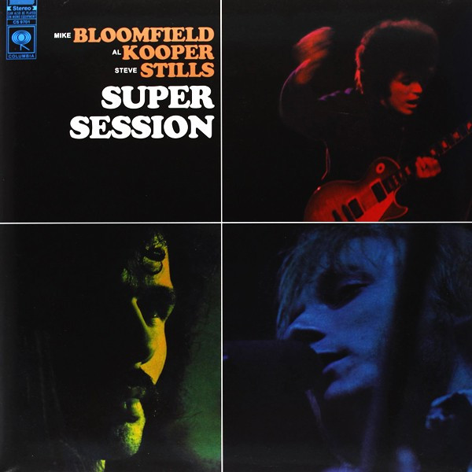

# Super Session

By **Bloomfield Kooper Stills**

## Album Data

- **Catalog:** Beets
- **Format:** Digital, Album
- **Album:** Super Session
- **Artist:** Bloomfield Kooper Stills
- **Albumartist:** Bloomfield Kooper Stills
- **Genre:** Rock
- **MusicBrainz Album Artist ID:** 
- **MusicBrainz Album ID:** 
- **MusicBrainz Release Group ID:** 
- **Year:** 1968
- **Catalog #:** 
- **Label:** 
- **Total Tracks:** 09

## Album Tracks

### Track 01 - Albert's Shuffle

- **Artist:** Bloomfield Kooper Stills
- **Format:** AAC
- **Genre:** Rock
- **Length:** 7:03
- **MusicBrainz Track ID:** 
- **Title:** Albert's Shuffle
- **Track:** 01
- **Year:** 1968

### Track 02 - Season Of The Witch

- **Artist:** Bloomfield Kooper Stills
- **Format:** AAC
- **Genre:** Rock
- **Length:** 11:19
- **MusicBrainz Track ID:** 
- **Title:** Season Of The Witch
- **Track:** 02
- **Year:** 0000

### Track 02 - Stop

- **Artist:** Bloomfield Kooper Stills
- **Format:** AAC
- **Genre:** Rock
- **Length:** 4:27
- **MusicBrainz Track ID:** 
- **Title:** Stop
- **Track:** 02
- **Year:** 1968

### Track 03 - Man's Temptation

- **Artist:** Bloomfield Kooper Stills
- **Format:** AAC
- **Genre:** Rock
- **Length:** 3:29
- **MusicBrainz Track ID:** 
- **Title:** Man's Temptation
- **Track:** 03
- **Year:** 1968

### Track 04 - His Holy Modal Majesty

- **Artist:** Bloomfield Kooper Stills
- **Format:** AAC
- **Genre:** Rock
- **Length:** 9:31
- **MusicBrainz Track ID:** 
- **Title:** His Holy Modal Majesty
- **Track:** 04
- **Year:** 1968

### Track 05 - Really

- **Artist:** Bloomfield Kooper Stills
- **Format:** AAC
- **Genre:** Blues
- **Length:** 5:41
- **MusicBrainz Track ID:** 
- **Title:** Really
- **Track:** 05
- **Year:** 1968

### Track 06 - It Takes A Lot To Laugh It Takes A Lot To Cry

- **Artist:** Bloomfield Kooper Stills
- **Format:** AAC
- **Genre:** Rock
- **Length:** 3:32
- **MusicBrainz Track ID:** 
- **Title:** It Takes A Lot To Laugh It Takes A Lot To Cry
- **Track:** 06
- **Year:** 1968

### Track 08 - Harvey's Tune

- **Artist:** Bloomfield Kooper Stills
- **Format:** AAC
- **Genre:** Rock
- **Length:** 2:14
- **MusicBrainz Track ID:** 
- **Title:** Harvey's Tune
- **Track:** 08
- **Year:** 0000

### Track 08 - You Don't Love Me

- **Artist:** Bloomfield Kooper Stills
- **Format:** AAC
- **Genre:** Rock
- **Length:** 4:07
- **MusicBrainz Track ID:** 
- **Title:** You Don't Love Me
- **Track:** 08
- **Year:** 1968

