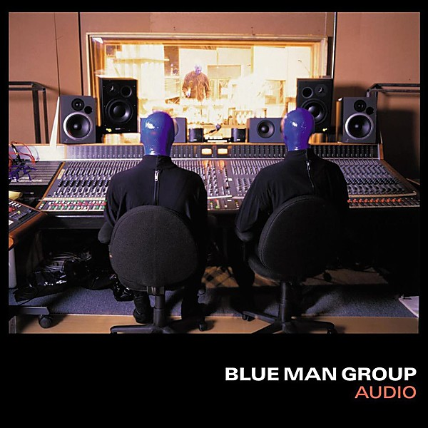

# Audio

By **Blue Man Group**

## Album Data

- **Catalog:** Beets
- **Format:** Digital, Album
- **Album:** Audio
- **Artist:** Blue Man Group
- **Albumartist:** Blue Man Group
- **Genre:** Progressive Rock
- **MusicBrainz Album Artist ID:** 
- **MusicBrainz Album ID:** 
- **MusicBrainz Release Group ID:** 
- **Year:** 0000
- **Catalog #:** 
- **Label:** 
- **Total Tracks:** 00

## Album Tracks

### Track 00 - Mandelgroove

- **Artist:** Blue Man Group
- **Format:** ALAC
- **Genre:** Electronica
- **Length:** 5:49
- **MusicBrainz Track ID:** 
- **Title:** Mandelgroove
- **Track:** 00
- **Year:** 0000

### Track 00 - Shadows

- **Artist:** Blue Man Group
- **Format:** ALAC
- **Genre:** Uplifting Trance
- **Length:** 2:06
- **MusicBrainz Track ID:** 
- **Title:** Shadows
- **Track:** 00
- **Year:** 0000

