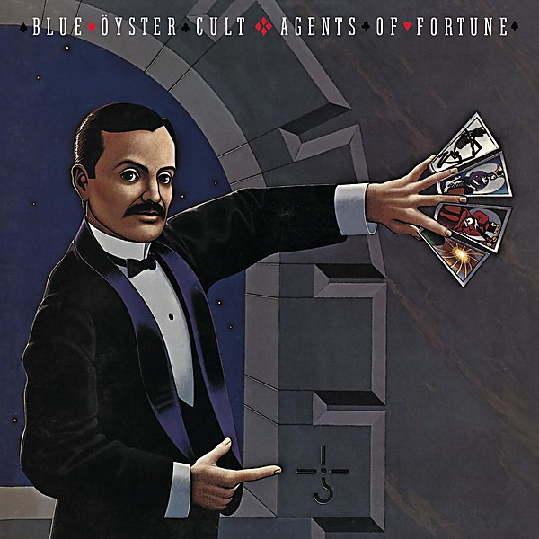

# Agents of Fortune

By **Blue Öyster Cult**

## Album Data

- **Catalog:** Beets
- **Format:** Digital, Album
- **Album:** Agents of Fortune
- **Artist:** Blue Öyster Cult
- **Albumartist:** Blue Öyster Cult
- **Genre:** Psychedelic Rock
- **MusicBrainz Album Artist ID:** [c7423e0c-ab3e-4ab4-be10-cdff5a9d3062](https://musicbrainz.org/artist/c7423e0c-ab3e-4ab4-be10-cdff5a9d3062)
- **MusicBrainz Album ID:** [8a3ace19-d464-450e-be2c-9c08300d9e66](https://musicbrainz.org/release/8a3ace19-d464-450e-be2c-9c08300d9e66)
- **MusicBrainz Release Group ID:** [ec282fb2-4fc7-3bee-99ab-f11c6b821b55](https://musicbrainz.org/release-group/ec282fb2-4fc7-3bee-99ab-f11c6b821b55)
- **Year:** 2001
- **Catalog #:** COL 502234 2
- **Label:** Legacy
- **Total Tracks:** 14

## Album Tracks

### Track 01 - Transmaniacon MC

- **Artist:** Blue Öyster Cult
- **Format:** ALAC
- **Genre:** Psychedelic Rock
- **Length:** 3:20
- **MusicBrainz Track ID:** [a5fdaca0-3cb6-4d8e-b673-998bcd40ad01](https://musicbrainz.org/recording/a5fdaca0-3cb6-4d8e-b673-998bcd40ad01)
- **Title:** Transmaniacon MC
- **Track:** 01
- **Year:** 2001

### Track 02 - I’m on the Lamb but I Ain’t No Sheep

- **Artist:** Blue Öyster Cult
- **Format:** ALAC
- **Genre:** Psychedelic Rock
- **Length:** 3:10
- **MusicBrainz Track ID:** [8e48b49e-b4d0-4a9a-9fe5-7b6fbb414f22](https://musicbrainz.org/recording/8e48b49e-b4d0-4a9a-9fe5-7b6fbb414f22)
- **Title:** I’m on the Lamb but I Ain’t No Sheep
- **Track:** 02
- **Year:** 2001

### Track 03 - Then Came the Last Days of May

- **Artist:** Blue Öyster Cult
- **Format:** ALAC
- **Genre:** Progressive Rock
- **Length:** 3:30
- **MusicBrainz Track ID:** [b01fe22a-9dd8-4464-8456-136207258191](https://musicbrainz.org/recording/b01fe22a-9dd8-4464-8456-136207258191)
- **Title:** Then Came the Last Days of May
- **Track:** 03
- **Year:** 2001

### Track 04 - Stairway to the Stars

- **Artist:** Blue Öyster Cult
- **Format:** ALAC
- **Genre:** Psychedelic Rock
- **Length:** 3:43
- **MusicBrainz Track ID:** [b6a2c3dc-9cbc-4775-b6db-c2988e94102e](https://musicbrainz.org/recording/b6a2c3dc-9cbc-4775-b6db-c2988e94102e)
- **Title:** Stairway to the Stars
- **Track:** 04
- **Year:** 2001

### Track 05 - Before the Kiss, a Redcap

- **Artist:** Blue Öyster Cult
- **Format:** ALAC
- **Genre:** Psychedelic Rock
- **Length:** 4:59
- **MusicBrainz Track ID:** [ef9b9998-34c9-4cdd-ac28-ee3dda17c47c](https://musicbrainz.org/recording/ef9b9998-34c9-4cdd-ac28-ee3dda17c47c)
- **Title:** Before the Kiss, a Redcap
- **Track:** 05
- **Year:** 2001

### Track 06 - Screams

- **Artist:** Blue Öyster Cult
- **Format:** ALAC
- **Genre:** Psychedelic Rock
- **Length:** 3:09
- **MusicBrainz Track ID:** [d218b568-b21b-4504-ae42-2748e356f071](https://musicbrainz.org/recording/d218b568-b21b-4504-ae42-2748e356f071)
- **Title:** Screams
- **Track:** 06
- **Year:** 2001

### Track 07 - She’s as Beautiful as a Foot

- **Artist:** Blue Öyster Cult
- **Format:** ALAC
- **Genre:** Psychedelic Rock
- **Length:** 2:57
- **MusicBrainz Track ID:** [bcd0a9a2-7516-4f96-b025-41e151535a41](https://musicbrainz.org/recording/bcd0a9a2-7516-4f96-b025-41e151535a41)
- **Title:** She’s as Beautiful as a Foot
- **Track:** 07
- **Year:** 2001

### Track 08 - Cities on Flame With Rock and Roll

- **Artist:** Blue Öyster Cult
- **Format:** ALAC
- **Genre:** Progressive Rock
- **Length:** 4:03
- **MusicBrainz Track ID:** [80d51005-a544-4eb5-b63e-2d07c1f20da0](https://musicbrainz.org/recording/80d51005-a544-4eb5-b63e-2d07c1f20da0)
- **Title:** Cities on Flame With Rock and Roll
- **Track:** 08
- **Year:** 2001

### Track 09 - Workshop of the Telescopes

- **Artist:** Blue Öyster Cult
- **Format:** ALAC
- **Genre:** Psychedelic Rock
- **Length:** 4:01
- **MusicBrainz Track ID:** [dbc4754f-d178-46b1-9bbd-ec132fca87ff](https://musicbrainz.org/recording/dbc4754f-d178-46b1-9bbd-ec132fca87ff)
- **Title:** Workshop of the Telescopes
- **Track:** 09
- **Year:** 2001

### Track 10 - Redeemed

- **Artist:** Blue Öyster Cult
- **Format:** ALAC
- **Genre:** Progressive Rock
- **Length:** 3:51
- **MusicBrainz Track ID:** [d8732986-af64-4b06-b27f-53065654a82f](https://musicbrainz.org/recording/d8732986-af64-4b06-b27f-53065654a82f)
- **Title:** Redeemed
- **Track:** 10
- **Year:** 2001

### Track 11 - Donovan’s Monkey (demo)

- **Artist:** Blue Öyster Cult
- **Format:** ALAC
- **Genre:** Psychedelic Rock
- **Length:** 3:49
- **MusicBrainz Track ID:** [660ba09c-eef2-444f-a01e-ab151e17524c](https://musicbrainz.org/recording/660ba09c-eef2-444f-a01e-ab151e17524c)
- **Title:** Donovan’s Monkey (demo)
- **Track:** 11
- **Year:** 2001

### Track 12 - What Is Quicksand (demo)

- **Artist:** Blue Öyster Cult
- **Format:** ALAC
- **Genre:** Hard Rock
- **Length:** 3:40
- **MusicBrainz Track ID:** [c8f58e45-716c-4670-996e-31d2b95018ee](https://musicbrainz.org/recording/c8f58e45-716c-4670-996e-31d2b95018ee)
- **Title:** What Is Quicksand (demo)
- **Track:** 12
- **Year:** 2001

### Track 13 - A Fact About Sneakers (demo)

- **Artist:** Blue Öyster Cult
- **Format:** ALAC
- **Genre:** Hard Rock
- **Length:** 2:51
- **MusicBrainz Track ID:** [bad67651-8fb7-47bf-8797-e23a32957dfd](https://musicbrainz.org/recording/bad67651-8fb7-47bf-8797-e23a32957dfd)
- **Title:** A Fact About Sneakers (demo)
- **Track:** 13
- **Year:** 2001

### Track 14 - Betty Lou’s Got a New Pair of Shoes (demo)

- **Artist:** Blue Öyster Cult
- **Format:** ALAC
- **Genre:** Psychedelic Rock
- **Length:** 2:33
- **MusicBrainz Track ID:** [2d7d8f97-dff9-4bc7-bbef-ba4ba72ad574](https://musicbrainz.org/recording/2d7d8f97-dff9-4bc7-bbef-ba4ba72ad574)
- **Title:** Betty Lou’s Got a New Pair of Shoes (demo)
- **Track:** 14
- **Year:** 2001

## See also

- [Blue Öyster Cult](Blue_Öyster_Cult.md)
- [Club Ninja](Club_Ninja.md)
- [Cultösaurus Erectus](Cultösaurus_Erectus.md)
- [Extraterrestrial Live](Extraterrestrial_Live.md)
- [Fire of Unknown Origin](Fire_of_Unknown_Origin.md)
- [Harvester of Lives](Harvester_of_Lives.md)
- [Imaginos](Imaginos.md)
- [Mirrors](Mirrors.md)
- [On Your Feet or on Your Knees](On_Your_Feet_or_on_Your_Knees.md)
- [Radios Appear](Radios_Appear.md)
- [Rarities](Rarities.md)
- [Secret Treaties](Secret_Treaties.md)
- [Some Enchanted Evening](Some_Enchanted_Evening.md)
- [Spectres](Spectres.md)
- [The Revölution by Night](The_Revölution_by_Night.md)
- [Tyranny and Mutation](Tyranny_and_Mutation.md)
- [CD: Agents Of Fortune](../../CD/Blue_Öyster_Cult/Agents_Of_Fortune.md)
- [CD: ](../../CD/Blue_Öyster_Cult/Blue_Öyster_Cult_index.md)
- [CD: Blue Öyster Cult](../../CD/Blue_Öyster_Cult/Blue_Öyster_Cult.md)
- [CD: Club Ninja](../../CD/Blue_Öyster_Cult/Club_Ninja.md)
- [CD: Extraterrestrial Live](../../CD/Blue_Öyster_Cult/Extraterrestrial_Live.md)
- [CD: Imaginos](../../CD/Blue_Öyster_Cult/Imaginos.md)
- [CD: Radios Appear](../../CD/Blue_Öyster_Cult/Radios_Appear-_The_Best_Of_Broadcasts.md)
- [CD: Rarities](../../CD/Blue_Öyster_Cult/Rarities.md)
- [CD: Secret Treaties](../../CD/Blue_Öyster_Cult/Secret_Treaties.md)
- [CD: Some Enchanted Evening](../../CD/Blue_Öyster_Cult/Some_Enchanted_Evening.md)
- [CD: Spectres](../../CD/Blue_Öyster_Cult/Spectres.md)
- [CD: The Columbia Albums Collection (Disc 10)](../../CD/Blue_Öyster_Cult/The_Columbia_Albums_Collection_Disc_10.md)
- [CD: The Columbia Albums Collection (Disc 12)](../../CD/Blue_Öyster_Cult/The_Columbia_Albums_Collection_Disc_12.md)
- [CD: The Columbia Albums Collection (Disc 4)](../../CD/Blue_Öyster_Cult/The_Columbia_Albums_Collection_Disc_4.md)
- [CD: The Columbia Albums Collection (Disc 8)](../../CD/Blue_Öyster_Cult/The_Columbia_Albums_Collection_Disc_8.md)
- [CD: The Columbia Albums Collection (Disc 9)](../../CD/Blue_Öyster_Cult/The_Columbia_Albums_Collection_Disc_9.md)
- [CD: Tyranny & Mutation](../../CD/Blue_Öyster_Cult/Tyranny_and_Mutation.md)
- [Roon: 40th Anniversary - Agents Of Fortune - Live 2016 (Live)](../../Roon/Blue_Öyster_Cult/40th_Anniversary_-_Agents_Of_Fortune_-_Live_2016_Live.md)
- [Roon: Blue Oyster Cult](../../Roon/Blue_Öyster_Cult/Blue_Oyster_Cult.md)
- [Roon: Cultosaurus Erectus](../../Roon/Blue_Öyster_Cult/Cultosaurus_Erectus.md)
- [Roon: Fire Of Unknown Origin](../../Roon/Blue_Öyster_Cult/Fire_Of_Unknown_Origin.md)
- [Roon: Imaginos](../../Roon/Blue_Öyster_Cult/Imaginos.md)
- [Roon: Mirrors](../../Roon/Blue_Öyster_Cult/Mirrors.md)
- [Roon: On Your Feet Or On Your Knees (Live)](../../Roon/Blue_Öyster_Cult/On_Your_Feet_Or_On_Your_Knees_Live.md)
- [Roon: Rarities](../../Roon/Blue_Öyster_Cult/Rarities.md)
- [Roon: Secret Treaties](../../Roon/Blue_Öyster_Cult/Secret_Treaties.md)
- [Roon: Some Enchanted Evening (Live)](../../Roon/Blue_Öyster_Cult/Some_Enchanted_Evening_Live.md)
- [Roon: Spectres](../../Roon/Blue_Öyster_Cult/Spectres.md)
- [Roon: The Revolution By Night](../../Roon/Blue_Öyster_Cult/The_Revolution_By_Night.md)
- [Roon: Tyranny And Mutation](../../Roon/Blue_Öyster_Cult/Tyranny_And_Mutation.md)
- [Vinyl: Agents Of Fortune](../../Vinyl/Blue_Öyster_Cult/Agents_Of_Fortune.md)
- [Vinyl: ](../../Vinyl/Blue_Öyster_Cult/Blue_Öyster_Cult.md)
- [Vinyl: Secret Treaties](../../Vinyl/Blue_Öyster_Cult/Secret_Treaties.md)
- [Vinyl: Tyranny And Mutation](../../Vinyl/Blue_Öyster_Cult/Tyranny_And_Mutation.md)
