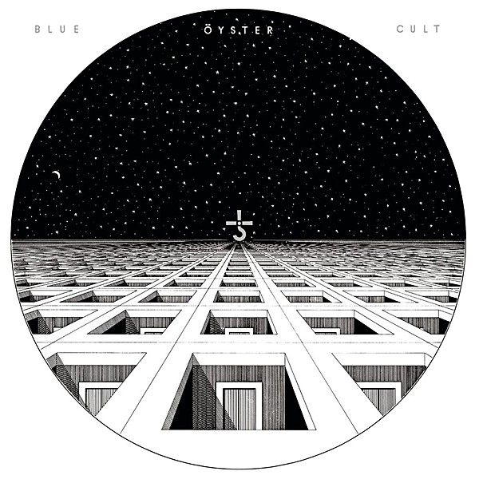

# Blue Öyster Cult

By **Blue Öyster Cult**

## Album Data

- **Catalog:** Beets
- **Format:** Digital, Album
- **Album:** Blue Öyster Cult
- **Artist:** Blue Öyster Cult
- **Albumartist:** Blue Öyster Cult
- **Genre:** Psychedelic Rock
- **MusicBrainz Album Artist ID:** [c7423e0c-ab3e-4ab4-be10-cdff5a9d3062](https://musicbrainz.org/artist/c7423e0c-ab3e-4ab4-be10-cdff5a9d3062)
- **MusicBrainz Album ID:** [d962dbb6-a033-38a4-a112-fe90531c68ff](https://musicbrainz.org/release/d962dbb6-a033-38a4-a112-fe90531c68ff)
- **MusicBrainz Release Group ID:** [4756061c-110f-381b-a2f0-6dc0588d01f2](https://musicbrainz.org/release-group/4756061c-110f-381b-a2f0-6dc0588d01f2)
- **Year:** 2001
- **Catalog #:** CK 39979
- **Label:** Columbia
- **Total Tracks:** 09

## Album Tracks

### Track 01 - White Flags

- **Artist:** Blue Öyster Cult
- **Format:** ALAC
- **Genre:** Psychedelic Rock
- **Length:** 4:43
- **MusicBrainz Track ID:** [e1831427-2be8-4ccb-8308-fab5b6d84491](https://musicbrainz.org/recording/e1831427-2be8-4ccb-8308-fab5b6d84491)
- **Title:** White Flags
- **Track:** 01
- **Year:** 1986

### Track 02 - Dancin’ in the Ruins

- **Artist:** Blue Öyster Cult
- **Format:** ALAC
- **Genre:** Rock And Roll
- **Length:** 4:01
- **MusicBrainz Track ID:** [60e27794-4c37-4e8c-8be7-0a2e83b5040f](https://musicbrainz.org/recording/60e27794-4c37-4e8c-8be7-0a2e83b5040f)
- **Title:** Dancin’ in the Ruins
- **Track:** 02
- **Year:** 1986

### Track 03 - Make Rock Not War

- **Artist:** Blue Öyster Cult
- **Format:** ALAC
- **Genre:** Hard Rock
- **Length:** 3:57
- **MusicBrainz Track ID:** [890d2ca5-7c5b-4e6c-b040-f1d9315473fa](https://musicbrainz.org/recording/890d2ca5-7c5b-4e6c-b040-f1d9315473fa)
- **Title:** Make Rock Not War
- **Track:** 03
- **Year:** 1986

### Track 04 - Perfect Water

- **Artist:** Blue Öyster Cult
- **Format:** ALAC
- **Genre:** Hard Rock
- **Length:** 5:32
- **MusicBrainz Track ID:** [7835f85d-7557-471e-ba31-f3017992a8c9](https://musicbrainz.org/recording/7835f85d-7557-471e-ba31-f3017992a8c9)
- **Title:** Perfect Water
- **Track:** 04
- **Year:** 1986

### Track 05 - Spy in the House of the Night

- **Artist:** Blue Öyster Cult
- **Format:** ALAC
- **Genre:** Hard Rock
- **Length:** 4:22
- **MusicBrainz Track ID:** [347e9b89-88b3-463b-aecf-b472127ce2be](https://musicbrainz.org/recording/347e9b89-88b3-463b-aecf-b472127ce2be)
- **Title:** Spy in the House of the Night
- **Track:** 05
- **Year:** 1986

### Track 06 - Beat ’Em Up

- **Artist:** Blue Öyster Cult
- **Format:** ALAC
- **Genre:** Rock And Roll
- **Length:** 3:24
- **MusicBrainz Track ID:** [6c316116-afaa-484c-83d8-1582c49efcac](https://musicbrainz.org/recording/6c316116-afaa-484c-83d8-1582c49efcac)
- **Title:** Beat ’Em Up
- **Track:** 06
- **Year:** 1986

### Track 07 - When the War Comes

- **Artist:** Blue Öyster Cult
- **Format:** ALAC
- **Genre:** Hard Rock
- **Length:** 6:05
- **MusicBrainz Track ID:** [c12b6995-e83e-4b3d-8844-ebf7ee1ff071](https://musicbrainz.org/recording/c12b6995-e83e-4b3d-8844-ebf7ee1ff071)
- **Title:** When the War Comes
- **Track:** 07
- **Year:** 1986

### Track 08 - Shadow Warrior

- **Artist:** Blue Öyster Cult
- **Format:** ALAC
- **Genre:** Hard Rock
- **Length:** 5:42
- **MusicBrainz Track ID:** [638e78da-a197-4f5d-8a07-6cee8b16113e](https://musicbrainz.org/recording/638e78da-a197-4f5d-8a07-6cee8b16113e)
- **Title:** Shadow Warrior
- **Track:** 08
- **Year:** 1986

### Track 09 - Madness to the Method

- **Artist:** Blue Öyster Cult
- **Format:** ALAC
- **Genre:** Psychedelic Rock
- **Length:** 7:27
- **MusicBrainz Track ID:** [0a9f03d9-7d40-408c-a364-65b7c86e3fa7](https://musicbrainz.org/recording/0a9f03d9-7d40-408c-a364-65b7c86e3fa7)
- **Title:** Madness to the Method
- **Track:** 09
- **Year:** 1986

## See also

- [Agents of Fortune](Agents_of_Fortune.md)
- [Club Ninja](Club_Ninja.md)
- [Cultösaurus Erectus](Cultösaurus_Erectus.md)
- [Extraterrestrial Live](Extraterrestrial_Live.md)
- [Fire of Unknown Origin](Fire_of_Unknown_Origin.md)
- [Harvester of Lives](Harvester_of_Lives.md)
- [Imaginos](Imaginos.md)
- [Mirrors](Mirrors.md)
- [On Your Feet or on Your Knees](On_Your_Feet_or_on_Your_Knees.md)
- [Radios Appear](Radios_Appear.md)
- [Rarities](Rarities.md)
- [Secret Treaties](Secret_Treaties.md)
- [Some Enchanted Evening](Some_Enchanted_Evening.md)
- [Spectres](Spectres.md)
- [The Revölution by Night](The_Revölution_by_Night.md)
- [Tyranny and Mutation](Tyranny_and_Mutation.md)
- [CD: Agents Of Fortune](../../CD/Blue_Öyster_Cult/Agents_Of_Fortune.md)
- [CD: ](../../CD/Blue_Öyster_Cult/Blue_Öyster_Cult_index.md)
- [CD: Blue Öyster Cult](../../CD/Blue_Öyster_Cult/Blue_Öyster_Cult.md)
- [CD: Club Ninja](../../CD/Blue_Öyster_Cult/Club_Ninja.md)
- [CD: Extraterrestrial Live](../../CD/Blue_Öyster_Cult/Extraterrestrial_Live.md)
- [CD: Imaginos](../../CD/Blue_Öyster_Cult/Imaginos.md)
- [CD: Radios Appear](../../CD/Blue_Öyster_Cult/Radios_Appear-_The_Best_Of_Broadcasts.md)
- [CD: Rarities](../../CD/Blue_Öyster_Cult/Rarities.md)
- [CD: Secret Treaties](../../CD/Blue_Öyster_Cult/Secret_Treaties.md)
- [CD: Some Enchanted Evening](../../CD/Blue_Öyster_Cult/Some_Enchanted_Evening.md)
- [CD: Spectres](../../CD/Blue_Öyster_Cult/Spectres.md)
- [CD: The Columbia Albums Collection (Disc 10)](../../CD/Blue_Öyster_Cult/The_Columbia_Albums_Collection_Disc_10.md)
- [CD: The Columbia Albums Collection (Disc 12)](../../CD/Blue_Öyster_Cult/The_Columbia_Albums_Collection_Disc_12.md)
- [CD: The Columbia Albums Collection (Disc 4)](../../CD/Blue_Öyster_Cult/The_Columbia_Albums_Collection_Disc_4.md)
- [CD: The Columbia Albums Collection (Disc 8)](../../CD/Blue_Öyster_Cult/The_Columbia_Albums_Collection_Disc_8.md)
- [CD: The Columbia Albums Collection (Disc 9)](../../CD/Blue_Öyster_Cult/The_Columbia_Albums_Collection_Disc_9.md)
- [CD: Tyranny & Mutation](../../CD/Blue_Öyster_Cult/Tyranny_and_Mutation.md)
- [Roon: 40th Anniversary - Agents Of Fortune - Live 2016 (Live)](../../Roon/Blue_Öyster_Cult/40th_Anniversary_-_Agents_Of_Fortune_-_Live_2016_Live.md)
- [Roon: Blue Oyster Cult](../../Roon/Blue_Öyster_Cult/Blue_Oyster_Cult.md)
- [Roon: Cultosaurus Erectus](../../Roon/Blue_Öyster_Cult/Cultosaurus_Erectus.md)
- [Roon: Fire Of Unknown Origin](../../Roon/Blue_Öyster_Cult/Fire_Of_Unknown_Origin.md)
- [Roon: Imaginos](../../Roon/Blue_Öyster_Cult/Imaginos.md)
- [Roon: Mirrors](../../Roon/Blue_Öyster_Cult/Mirrors.md)
- [Roon: On Your Feet Or On Your Knees (Live)](../../Roon/Blue_Öyster_Cult/On_Your_Feet_Or_On_Your_Knees_Live.md)
- [Roon: Rarities](../../Roon/Blue_Öyster_Cult/Rarities.md)
- [Roon: Secret Treaties](../../Roon/Blue_Öyster_Cult/Secret_Treaties.md)
- [Roon: Some Enchanted Evening (Live)](../../Roon/Blue_Öyster_Cult/Some_Enchanted_Evening_Live.md)
- [Roon: Spectres](../../Roon/Blue_Öyster_Cult/Spectres.md)
- [Roon: The Revolution By Night](../../Roon/Blue_Öyster_Cult/The_Revolution_By_Night.md)
- [Roon: Tyranny And Mutation](../../Roon/Blue_Öyster_Cult/Tyranny_And_Mutation.md)
- [Vinyl: Agents Of Fortune](../../Vinyl/Blue_Öyster_Cult/Agents_Of_Fortune.md)
- [Vinyl: ](../../Vinyl/Blue_Öyster_Cult/Blue_Öyster_Cult.md)
- [Vinyl: Secret Treaties](../../Vinyl/Blue_Öyster_Cult/Secret_Treaties.md)
- [Vinyl: Tyranny And Mutation](../../Vinyl/Blue_Öyster_Cult/Tyranny_And_Mutation.md)
