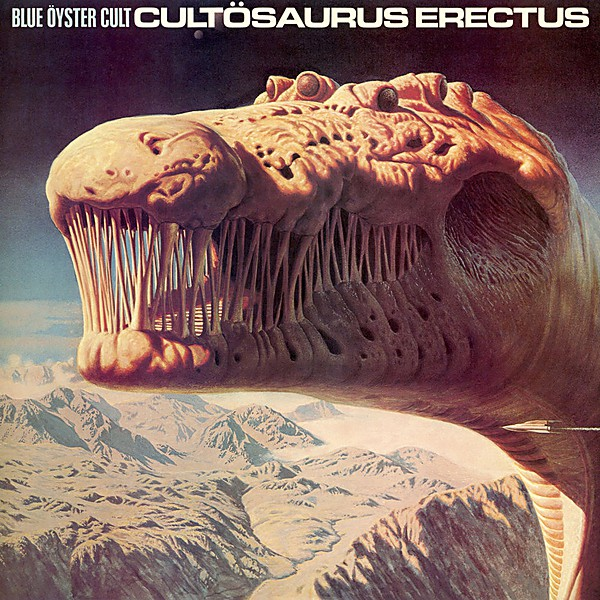

# Cultösaurus Erectus

By **Blue Öyster Cult**

## Album Data

- **Catalog:** Beets
- **Format:** Digital, Album
- **Album:** Cultösaurus Erectus
- **Artist:** Blue Öyster Cult
- **Albumartist:** Blue Öyster Cult
- **Genre:** Rock And Roll
- **MusicBrainz Album Artist ID:** 
- **MusicBrainz Album ID:** 
- **MusicBrainz Release Group ID:** 
- **Year:** 0000
- **Catalog #:** CGK 37946
- **Label:** Columbia
- **Total Tracks:** 13

## Album Tracks

### Track 01 - Dominance and Submission

- **Artist:** Blue Öyster Cult
- **Format:** ALAC
- **Genre:** Progressive Rock
- **Length:** 5:54
- **MusicBrainz Track ID:** [f01d81c4-cd35-4a05-aee8-efa645cc5571](https://musicbrainz.org/recording/f01d81c4-cd35-4a05-aee8-efa645cc5571)
- **Title:** Dominance and Submission
- **Track:** 01
- **Year:** 1982

### Track 02 - Cities on Flame

- **Artist:** Blue Öyster Cult
- **Format:** ALAC
- **Genre:** Heavy Metal
- **Length:** 5:15
- **MusicBrainz Track ID:** [5b9c9e8c-1ad0-4894-aba0-fac8ace99799](https://musicbrainz.org/recording/5b9c9e8c-1ad0-4894-aba0-fac8ace99799)
- **Title:** Cities on Flame
- **Track:** 02
- **Year:** 1982

### Track 03 - Dr. Music

- **Artist:** Blue Öyster Cult
- **Format:** ALAC
- **Genre:** Heavy Metal
- **Length:** 3:38
- **MusicBrainz Track ID:** [871bf4a3-d1c2-4783-9c71-bbf3d8a3a61c](https://musicbrainz.org/recording/871bf4a3-d1c2-4783-9c71-bbf3d8a3a61c)
- **Title:** Dr. Music
- **Track:** 03
- **Year:** 1982

### Track 04 - The Red and the Black

- **Artist:** Blue Öyster Cult
- **Format:** ALAC
- **Genre:** Heavy Metal
- **Length:** 4:36
- **MusicBrainz Track ID:** [5cc0cbf9-4c1f-4a78-9ef8-9f8c0e442674](https://musicbrainz.org/recording/5cc0cbf9-4c1f-4a78-9ef8-9f8c0e442674)
- **Title:** The Red and the Black
- **Track:** 04
- **Year:** 1982

### Track 05 - Joan Crawford

- **Artist:** Blue Öyster Cult
- **Format:** ALAC
- **Genre:** Psychedelic Rock
- **Length:** 5:17
- **MusicBrainz Track ID:** [20fcc768-0a9d-46db-a6f2-09bc5e56f7f4](https://musicbrainz.org/recording/20fcc768-0a9d-46db-a6f2-09bc5e56f7f4)
- **Title:** Joan Crawford
- **Track:** 05
- **Year:** 1982

### Track 06 - Burnin’ for You

- **Artist:** Blue Öyster Cult
- **Format:** ALAC
- **Genre:** Heavy Metal
- **Length:** 4:51
- **MusicBrainz Track ID:** [b3c7b9a2-f09e-47b1-984d-55fdf637d9bb](https://musicbrainz.org/recording/b3c7b9a2-f09e-47b1-984d-55fdf637d9bb)
- **Title:** Burnin’ for You
- **Track:** 06
- **Year:** 1982

### Track 08 - Black Blade

- **Artist:** Blue Öyster Cult
- **Format:** ALAC
- **Genre:** Psychedelic Rock
- **Length:** 6:15
- **MusicBrainz Track ID:** [86732c59-4012-4296-9bcd-62271d416ef8](https://musicbrainz.org/recording/86732c59-4012-4296-9bcd-62271d416ef8)
- **Title:** Black Blade
- **Track:** 08
- **Year:** 1982

### Track 09 - Hot Rails to Hell

- **Artist:** Blue Öyster Cult
- **Format:** ALAC
- **Genre:** Heavy Metal
- **Length:** 5:02
- **MusicBrainz Track ID:** [60380c42-12c7-4bd3-841b-c3f354474a7f](https://musicbrainz.org/recording/60380c42-12c7-4bd3-841b-c3f354474a7f)
- **Title:** Hot Rails to Hell
- **Track:** 09
- **Year:** 1982

### Track 10 - Godzilla

- **Artist:** Blue Öyster Cult
- **Format:** ALAC
- **Genre:** Progressive Rock
- **Length:** 7:48
- **MusicBrainz Track ID:** [30e7eb67-2941-464f-8c0e-f35def911c8a](https://musicbrainz.org/recording/30e7eb67-2941-464f-8c0e-f35def911c8a)
- **Title:** Godzilla
- **Track:** 10
- **Year:** 1982

### Track 11 - Veteran of the Psychic Wars

- **Artist:** Blue Öyster Cult
- **Format:** ALAC
- **Genre:** Progressive Rock
- **Length:** 8:07
- **MusicBrainz Track ID:** [a76f7700-5f0f-4910-a36a-751da6cb736d](https://musicbrainz.org/recording/a76f7700-5f0f-4910-a36a-751da6cb736d)
- **Title:** Veteran of the Psychic Wars
- **Track:** 11
- **Year:** 1982

### Track 12 - E.T.I. (Extra Terrestrial Intelligence)

- **Artist:** Blue Öyster Cult
- **Format:** ALAC
- **Genre:** Heavy Metal
- **Length:** 5:21
- **MusicBrainz Track ID:** [62570c2b-89bc-4c69-9d79-fb98eef7f5e1](https://musicbrainz.org/recording/62570c2b-89bc-4c69-9d79-fb98eef7f5e1)
- **Title:** E.T.I. (Extra Terrestrial Intelligence)
- **Track:** 12
- **Year:** 1982

### Track 13 - (Don’t Fear) The Reaper

- **Artist:** Blue Öyster Cult
- **Format:** ALAC
- **Genre:** Heavy Metal
- **Length:** 6:35
- **MusicBrainz Track ID:** [c4970aaf-0198-4194-9b89-d68bf9f0de6a](https://musicbrainz.org/recording/c4970aaf-0198-4194-9b89-d68bf9f0de6a)
- **Title:** (Don’t Fear) The Reaper
- **Track:** 13
- **Year:** 1982

### Track 07 - Roadhouse Blues

- **Artist:** Blue Öyster Cult feat. Robby Krieger
- **Format:** ALAC
- **Genre:** Heavy Metal
- **Length:** 9:04
- **MusicBrainz Track ID:** [bb19a12b-7c49-4b91-8c20-3bcecdb8d30c](https://musicbrainz.org/recording/bb19a12b-7c49-4b91-8c20-3bcecdb8d30c)
- **Title:** Roadhouse Blues
- **Track:** 07
- **Year:** 1982

## See also

- [Agents of Fortune](Agents_of_Fortune.md)
- [Blue Öyster Cult](Blue_Öyster_Cult.md)
- [Club Ninja](Club_Ninja.md)
- [Extraterrestrial Live](Extraterrestrial_Live.md)
- [Fire of Unknown Origin](Fire_of_Unknown_Origin.md)
- [Harvester of Lives](Harvester_of_Lives.md)
- [Imaginos](Imaginos.md)
- [Mirrors](Mirrors.md)
- [On Your Feet or on Your Knees](On_Your_Feet_or_on_Your_Knees.md)
- [Radios Appear](Radios_Appear.md)
- [Rarities](Rarities.md)
- [Secret Treaties](Secret_Treaties.md)
- [Some Enchanted Evening](Some_Enchanted_Evening.md)
- [Spectres](Spectres.md)
- [The Revölution by Night](The_Revölution_by_Night.md)
- [Tyranny and Mutation](Tyranny_and_Mutation.md)
- [CD: Agents Of Fortune](../../CD/Blue_Öyster_Cult/Agents_Of_Fortune.md)
- [CD: ](../../CD/Blue_Öyster_Cult/Blue_Öyster_Cult_index.md)
- [CD: Blue Öyster Cult](../../CD/Blue_Öyster_Cult/Blue_Öyster_Cult.md)
- [CD: Club Ninja](../../CD/Blue_Öyster_Cult/Club_Ninja.md)
- [CD: Extraterrestrial Live](../../CD/Blue_Öyster_Cult/Extraterrestrial_Live.md)
- [CD: Imaginos](../../CD/Blue_Öyster_Cult/Imaginos.md)
- [CD: Radios Appear](../../CD/Blue_Öyster_Cult/Radios_Appear-_The_Best_Of_Broadcasts.md)
- [CD: Rarities](../../CD/Blue_Öyster_Cult/Rarities.md)
- [CD: Secret Treaties](../../CD/Blue_Öyster_Cult/Secret_Treaties.md)
- [CD: Some Enchanted Evening](../../CD/Blue_Öyster_Cult/Some_Enchanted_Evening.md)
- [CD: Spectres](../../CD/Blue_Öyster_Cult/Spectres.md)
- [CD: The Columbia Albums Collection (Disc 10)](../../CD/Blue_Öyster_Cult/The_Columbia_Albums_Collection_Disc_10.md)
- [CD: The Columbia Albums Collection (Disc 12)](../../CD/Blue_Öyster_Cult/The_Columbia_Albums_Collection_Disc_12.md)
- [CD: The Columbia Albums Collection (Disc 4)](../../CD/Blue_Öyster_Cult/The_Columbia_Albums_Collection_Disc_4.md)
- [CD: The Columbia Albums Collection (Disc 8)](../../CD/Blue_Öyster_Cult/The_Columbia_Albums_Collection_Disc_8.md)
- [CD: The Columbia Albums Collection (Disc 9)](../../CD/Blue_Öyster_Cult/The_Columbia_Albums_Collection_Disc_9.md)
- [CD: Tyranny & Mutation](../../CD/Blue_Öyster_Cult/Tyranny_and_Mutation.md)
- [Roon: 40th Anniversary - Agents Of Fortune - Live 2016 (Live)](../../Roon/Blue_Öyster_Cult/40th_Anniversary_-_Agents_Of_Fortune_-_Live_2016_Live.md)
- [Roon: Blue Oyster Cult](../../Roon/Blue_Öyster_Cult/Blue_Oyster_Cult.md)
- [Roon: Cultosaurus Erectus](../../Roon/Blue_Öyster_Cult/Cultosaurus_Erectus.md)
- [Roon: Fire Of Unknown Origin](../../Roon/Blue_Öyster_Cult/Fire_Of_Unknown_Origin.md)
- [Roon: Imaginos](../../Roon/Blue_Öyster_Cult/Imaginos.md)
- [Roon: Mirrors](../../Roon/Blue_Öyster_Cult/Mirrors.md)
- [Roon: On Your Feet Or On Your Knees (Live)](../../Roon/Blue_Öyster_Cult/On_Your_Feet_Or_On_Your_Knees_Live.md)
- [Roon: Rarities](../../Roon/Blue_Öyster_Cult/Rarities.md)
- [Roon: Secret Treaties](../../Roon/Blue_Öyster_Cult/Secret_Treaties.md)
- [Roon: Some Enchanted Evening (Live)](../../Roon/Blue_Öyster_Cult/Some_Enchanted_Evening_Live.md)
- [Roon: Spectres](../../Roon/Blue_Öyster_Cult/Spectres.md)
- [Roon: The Revolution By Night](../../Roon/Blue_Öyster_Cult/The_Revolution_By_Night.md)
- [Roon: Tyranny And Mutation](../../Roon/Blue_Öyster_Cult/Tyranny_And_Mutation.md)
- [Vinyl: Agents Of Fortune](../../Vinyl/Blue_Öyster_Cult/Agents_Of_Fortune.md)
- [Vinyl: ](../../Vinyl/Blue_Öyster_Cult/Blue_Öyster_Cult.md)
- [Vinyl: Secret Treaties](../../Vinyl/Blue_Öyster_Cult/Secret_Treaties.md)
- [Vinyl: Tyranny And Mutation](../../Vinyl/Blue_Öyster_Cult/Tyranny_And_Mutation.md)
