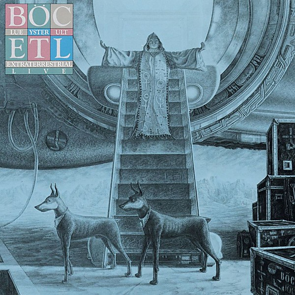

# Extraterrestrial Live

By **Blue Öyster Cult**

## Album Data

- **Catalog:** Beets
- **Format:** Digital, Album
- **Album:** Extraterrestrial Live
- **Artist:** Blue Öyster Cult
- **Albumartist:** Blue Öyster Cult
- **Genre:** Heavy Metal
- **MusicBrainz Album Artist ID:** [c7423e0c-ab3e-4ab4-be10-cdff5a9d3062](https://musicbrainz.org/artist/c7423e0c-ab3e-4ab4-be10-cdff5a9d3062)
- **MusicBrainz Album ID:** [cfdb9394-3fe3-491b-aa9d-065ab9ff2ddf](https://musicbrainz.org/release/cfdb9394-3fe3-491b-aa9d-065ab9ff2ddf)
- **MusicBrainz Release Group ID:** [e9010d1e-480b-30a1-9865-813813f96cab](https://musicbrainz.org/release-group/e9010d1e-480b-30a1-9865-813813f96cab)
- **Year:** 1982
- **Catalog #:** CK 37389
- **Label:** Columbia
- **Total Tracks:** 09

## Album Tracks

### Track 01 - Fire of Unknown Origin

- **Artist:** Blue Öyster Cult
- **Format:** ALAC
- **Genre:** Heavy Metal
- **Length:** 4:11
- **MusicBrainz Track ID:** [45bc061f-5dcd-4f9b-9772-5bff9646586d](https://musicbrainz.org/recording/45bc061f-5dcd-4f9b-9772-5bff9646586d)
- **Title:** Fire of Unknown Origin
- **Track:** 01
- **Year:** 1985

### Track 02 - Burnin' for You

- **Artist:** Blue Öyster Cult
- **Format:** ALAC
- **Genre:** Heavy Metal
- **Length:** 4:31
- **MusicBrainz Track ID:** [07fafa30-e1e4-4893-8935-4522a663ec12](https://musicbrainz.org/recording/07fafa30-e1e4-4893-8935-4522a663ec12)
- **Title:** Burnin' for You
- **Track:** 02
- **Year:** 1985

### Track 03 - Veteran of the Psychic Wars

- **Artist:** Blue Öyster Cult
- **Format:** ALAC
- **Genre:** Progressive Rock
- **Length:** 4:49
- **MusicBrainz Track ID:** [72b425c9-fac6-40bf-aa39-5f309229c021](https://musicbrainz.org/recording/72b425c9-fac6-40bf-aa39-5f309229c021)
- **Title:** Veteran of the Psychic Wars
- **Track:** 03
- **Year:** 1985

### Track 04 - Sole Survivor

- **Artist:** Blue Öyster Cult
- **Format:** ALAC
- **Genre:** Heavy Metal
- **Length:** 4:06
- **MusicBrainz Track ID:** [6f7c1ad1-8609-4ba2-9110-a6bbd229e224](https://musicbrainz.org/recording/6f7c1ad1-8609-4ba2-9110-a6bbd229e224)
- **Title:** Sole Survivor
- **Track:** 04
- **Year:** 1985

### Track 05 - Heavy Metal

- **Artist:** Blue Öyster Cult
- **Format:** ALAC
- **Genre:** Heavy Metal
- **Length:** 3:18
- **MusicBrainz Track ID:** [00adee97-70f1-4ad4-9fbb-ef4538830dfd](https://musicbrainz.org/recording/00adee97-70f1-4ad4-9fbb-ef4538830dfd)
- **Title:** Heavy Metal
- **Track:** 05
- **Year:** 1985

### Track 06 - Vengeance (The Pact)

- **Artist:** Blue Öyster Cult
- **Format:** ALAC
- **Genre:** Progressive Rock
- **Length:** 4:40
- **MusicBrainz Track ID:** [5eedde44-74a8-404b-a618-94f8407aae34](https://musicbrainz.org/recording/5eedde44-74a8-404b-a618-94f8407aae34)
- **Title:** Vengeance (The Pact)
- **Track:** 06
- **Year:** 1985

### Track 07 - After Dark

- **Artist:** Blue Öyster Cult
- **Format:** ALAC
- **Genre:** Progressive Rock
- **Length:** 4:25
- **MusicBrainz Track ID:** [783d14c5-25a6-4c61-be64-ca204896946a](https://musicbrainz.org/recording/783d14c5-25a6-4c61-be64-ca204896946a)
- **Title:** After Dark
- **Track:** 07
- **Year:** 1985

### Track 08 - Joan Crawford

- **Artist:** Blue Öyster Cult
- **Format:** ALAC
- **Genre:** Psychedelic Rock
- **Length:** 4:54
- **MusicBrainz Track ID:** [15ded6c4-5794-4677-8786-8a114b321011](https://musicbrainz.org/recording/15ded6c4-5794-4677-8786-8a114b321011)
- **Title:** Joan Crawford
- **Track:** 08
- **Year:** 1985

### Track 09 - Don't Turn Your Back

- **Artist:** Blue Öyster Cult
- **Format:** ALAC
- **Genre:** Progressive Rock
- **Length:** 4:08
- **MusicBrainz Track ID:** [e4358658-ccd3-4b28-8f03-f6874b35bf13](https://musicbrainz.org/recording/e4358658-ccd3-4b28-8f03-f6874b35bf13)
- **Title:** Don't Turn Your Back
- **Track:** 09
- **Year:** 1985

## See also

- [Agents of Fortune](Agents_of_Fortune.md)
- [Blue Öyster Cult](Blue_Öyster_Cult.md)
- [Club Ninja](Club_Ninja.md)
- [Cultösaurus Erectus](Cultösaurus_Erectus.md)
- [Fire of Unknown Origin](Fire_of_Unknown_Origin.md)
- [Harvester of Lives](Harvester_of_Lives.md)
- [Imaginos](Imaginos.md)
- [Mirrors](Mirrors.md)
- [On Your Feet or on Your Knees](On_Your_Feet_or_on_Your_Knees.md)
- [Radios Appear](Radios_Appear.md)
- [Rarities](Rarities.md)
- [Secret Treaties](Secret_Treaties.md)
- [Some Enchanted Evening](Some_Enchanted_Evening.md)
- [Spectres](Spectres.md)
- [The Revölution by Night](The_Revölution_by_Night.md)
- [Tyranny and Mutation](Tyranny_and_Mutation.md)
- [CD: Agents Of Fortune](../../CD/Blue_Öyster_Cult/Agents_Of_Fortune.md)
- [CD: ](../../CD/Blue_Öyster_Cult/Blue_Öyster_Cult_index.md)
- [CD: Blue Öyster Cult](../../CD/Blue_Öyster_Cult/Blue_Öyster_Cult.md)
- [CD: Club Ninja](../../CD/Blue_Öyster_Cult/Club_Ninja.md)
- [CD: Extraterrestrial Live](../../CD/Blue_Öyster_Cult/Extraterrestrial_Live.md)
- [CD: Imaginos](../../CD/Blue_Öyster_Cult/Imaginos.md)
- [CD: Radios Appear](../../CD/Blue_Öyster_Cult/Radios_Appear-_The_Best_Of_Broadcasts.md)
- [CD: Rarities](../../CD/Blue_Öyster_Cult/Rarities.md)
- [CD: Secret Treaties](../../CD/Blue_Öyster_Cult/Secret_Treaties.md)
- [CD: Some Enchanted Evening](../../CD/Blue_Öyster_Cult/Some_Enchanted_Evening.md)
- [CD: Spectres](../../CD/Blue_Öyster_Cult/Spectres.md)
- [CD: The Columbia Albums Collection (Disc 10)](../../CD/Blue_Öyster_Cult/The_Columbia_Albums_Collection_Disc_10.md)
- [CD: The Columbia Albums Collection (Disc 12)](../../CD/Blue_Öyster_Cult/The_Columbia_Albums_Collection_Disc_12.md)
- [CD: The Columbia Albums Collection (Disc 4)](../../CD/Blue_Öyster_Cult/The_Columbia_Albums_Collection_Disc_4.md)
- [CD: The Columbia Albums Collection (Disc 8)](../../CD/Blue_Öyster_Cult/The_Columbia_Albums_Collection_Disc_8.md)
- [CD: The Columbia Albums Collection (Disc 9)](../../CD/Blue_Öyster_Cult/The_Columbia_Albums_Collection_Disc_9.md)
- [CD: Tyranny & Mutation](../../CD/Blue_Öyster_Cult/Tyranny_and_Mutation.md)
- [Roon: 40th Anniversary - Agents Of Fortune - Live 2016 (Live)](../../Roon/Blue_Öyster_Cult/40th_Anniversary_-_Agents_Of_Fortune_-_Live_2016_Live.md)
- [Roon: Blue Oyster Cult](../../Roon/Blue_Öyster_Cult/Blue_Oyster_Cult.md)
- [Roon: Cultosaurus Erectus](../../Roon/Blue_Öyster_Cult/Cultosaurus_Erectus.md)
- [Roon: Fire Of Unknown Origin](../../Roon/Blue_Öyster_Cult/Fire_Of_Unknown_Origin.md)
- [Roon: Imaginos](../../Roon/Blue_Öyster_Cult/Imaginos.md)
- [Roon: Mirrors](../../Roon/Blue_Öyster_Cult/Mirrors.md)
- [Roon: On Your Feet Or On Your Knees (Live)](../../Roon/Blue_Öyster_Cult/On_Your_Feet_Or_On_Your_Knees_Live.md)
- [Roon: Rarities](../../Roon/Blue_Öyster_Cult/Rarities.md)
- [Roon: Secret Treaties](../../Roon/Blue_Öyster_Cult/Secret_Treaties.md)
- [Roon: Some Enchanted Evening (Live)](../../Roon/Blue_Öyster_Cult/Some_Enchanted_Evening_Live.md)
- [Roon: Spectres](../../Roon/Blue_Öyster_Cult/Spectres.md)
- [Roon: The Revolution By Night](../../Roon/Blue_Öyster_Cult/The_Revolution_By_Night.md)
- [Roon: Tyranny And Mutation](../../Roon/Blue_Öyster_Cult/Tyranny_And_Mutation.md)
- [Vinyl: Agents Of Fortune](../../Vinyl/Blue_Öyster_Cult/Agents_Of_Fortune.md)
- [Vinyl: ](../../Vinyl/Blue_Öyster_Cult/Blue_Öyster_Cult.md)
- [Vinyl: Secret Treaties](../../Vinyl/Blue_Öyster_Cult/Secret_Treaties.md)
- [Vinyl: Tyranny And Mutation](../../Vinyl/Blue_Öyster_Cult/Tyranny_And_Mutation.md)
