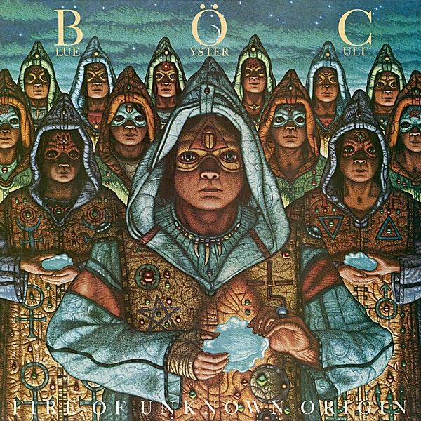

# Fire of Unknown Origin

By **Blue Öyster Cult**

## Album Data

- **Catalog:** Beets
- **Format:** Digital, Album
- **Album:** Fire of Unknown Origin
- **Artist:** Blue Öyster Cult
- **Albumartist:** Blue Öyster Cult
- **Genre:** Progressive Rock
- **MusicBrainz Album Artist ID:** [c7423e0c-ab3e-4ab4-be10-cdff5a9d3062](https://musicbrainz.org/artist/c7423e0c-ab3e-4ab4-be10-cdff5a9d3062)
- **MusicBrainz Album ID:** [6f8489c3-a47c-38da-b936-75cca2e9b9ca](https://musicbrainz.org/release/6f8489c3-a47c-38da-b936-75cca2e9b9ca)
- **MusicBrainz Release Group ID:** [cf3efe8c-3963-30c2-a9ba-a1b1117a5b1a](https://musicbrainz.org/release-group/cf3efe8c-3963-30c2-a9ba-a1b1117a5b1a)
- **Year:** 1985
- **Catalog #:** 
- **Label:** Columbia
- **Total Tracks:** 52

## Album Tracks

### Track 01 - Intro / Dr. Music (live at The Old Waldorf, San Francisco, CA - September 1980)

- **Artist:** Blue Öyster Cult
- **Format:** MP3
- **Genre:** Progressive Rock
- **Length:** 4:25
- **MusicBrainz Track ID:** [a2b3fd4a-f82c-449d-8c84-d41da6acdf71](https://musicbrainz.org/recording/a2b3fd4a-f82c-449d-8c84-d41da6acdf71)
- **Title:** Intro / Dr. Music (live at The Old Waldorf, San Francisco, CA - September 1980)
- **Track:** 01
- **Year:** 2016

### Track 02 - Lips in the Hills (live at The Old Waldorf, San Francisco, CA - September 1980)

- **Artist:** Blue Öyster Cult
- **Format:** MP3
- **Genre:** Progressive Rock
- **Length:** 5:09
- **MusicBrainz Track ID:** [77806c9c-6ecb-402d-992a-51f8907e5896](https://musicbrainz.org/recording/77806c9c-6ecb-402d-992a-51f8907e5896)
- **Title:** Lips in the Hills (live at The Old Waldorf, San Francisco, CA - September 1980)
- **Track:** 02
- **Year:** 2016

### Track 03 - Unknown Tongue (live at The Old Waldorf, San Francisco, CA - September 1980)

- **Artist:** Blue Öyster Cult
- **Format:** MP3
- **Genre:** Progressive Rock
- **Length:** 5:29
- **MusicBrainz Track ID:** [ff3a27b6-837a-4cfb-bdfc-711a648a1391](https://musicbrainz.org/recording/ff3a27b6-837a-4cfb-bdfc-711a648a1391)
- **Title:** Unknown Tongue (live at The Old Waldorf, San Francisco, CA - September 1980)
- **Track:** 03
- **Year:** 2016

### Track 04 - Cities on Flame With Rock and Roll (live at The Old Waldorf, San Francisco, CA - September 1980)

- **Artist:** Blue Öyster Cult
- **Format:** MP3
- **Genre:** Progressive Rock
- **Length:** 6:05
- **MusicBrainz Track ID:** [f53cfb87-f4f9-46c1-8e44-eee4ac81fcbe](https://musicbrainz.org/recording/f53cfb87-f4f9-46c1-8e44-eee4ac81fcbe)
- **Title:** Cities on Flame With Rock and Roll (live at The Old Waldorf, San Francisco, CA - September 1980)
- **Track:** 04
- **Year:** 2016

### Track 05 - The Marshall Plan (live at The Old Waldorf, San Francisco, CA - September 1980)

- **Artist:** Blue Öyster Cult
- **Format:** MP3
- **Genre:** Progressive Rock
- **Length:** 6:12
- **MusicBrainz Track ID:** [087bf8a1-97b9-4e17-8cb1-08861e99ab2a](https://musicbrainz.org/recording/087bf8a1-97b9-4e17-8cb1-08861e99ab2a)
- **Title:** The Marshall Plan (live at The Old Waldorf, San Francisco, CA - September 1980)
- **Track:** 05
- **Year:** 2016

### Track 06 - Divine Wind (live at The Old Waldorf, San Francisco, CA - September 1980)

- **Artist:** Blue Öyster Cult
- **Format:** MP3
- **Genre:** Progressive Rock
- **Length:** 6:05
- **MusicBrainz Track ID:** [6b000633-528b-40ce-ad5d-6b15f797275f](https://musicbrainz.org/recording/6b000633-528b-40ce-ad5d-6b15f797275f)
- **Title:** Divine Wind (live at The Old Waldorf, San Francisco, CA - September 1980)
- **Track:** 06
- **Year:** 2016

### Track 07 - Then Came the Last Days of May (live at The Old Waldorf, San Francisco, CA - September 1980)

- **Artist:** Blue Öyster Cult
- **Format:** MP3
- **Genre:** Progressive Rock
- **Length:** 8:06
- **MusicBrainz Track ID:** [4b57e583-10ca-4c8b-819a-8934c9d1e10c](https://musicbrainz.org/recording/4b57e583-10ca-4c8b-819a-8934c9d1e10c)
- **Title:** Then Came the Last Days of May (live at The Old Waldorf, San Francisco, CA - September 1980)
- **Track:** 07
- **Year:** 2016

### Track 08 - It’s Not Easy (live at Rhe Old Waldorf, San Francisco, CA - September 1980)

- **Artist:** Blue Öyster Cult
- **Format:** MP3
- **Genre:** Progressive Rock
- **Length:** 8:29
- **MusicBrainz Track ID:** [a6f429d9-a4ec-4b81-b1f3-094cfb5003be](https://musicbrainz.org/recording/a6f429d9-a4ec-4b81-b1f3-094cfb5003be)
- **Title:** It’s Not Easy (live at Rhe Old Waldorf, San Francisco, CA - September 1980)
- **Track:** 08
- **Year:** 2016

### Track 09 - ME 262 (live at The Old Waldorf, San Francisco, CA - September 1980)

- **Artist:** Blue Öyster Cult
- **Format:** MP3
- **Genre:** Progressive Rock
- **Length:** 3:25
- **MusicBrainz Track ID:** [bb8e53fb-c76a-4e4d-bdd7-f4a3ed0636f1](https://musicbrainz.org/recording/bb8e53fb-c76a-4e4d-bdd7-f4a3ed0636f1)
- **Title:** ME 262 (live at The Old Waldorf, San Francisco, CA - September 1980)
- **Track:** 09
- **Year:** 2016

### Track 10 - Black Blade (live at The Old Waldorf, San Francisco, CA - September 1980)

- **Artist:** Blue Öyster Cult
- **Format:** MP3
- **Genre:** Progressive Rock
- **Length:** 8:49
- **MusicBrainz Track ID:** [3579dff0-b93e-41bc-918c-e7fd36a53343](https://musicbrainz.org/recording/3579dff0-b93e-41bc-918c-e7fd36a53343)
- **Title:** Black Blade (live at The Old Waldorf, San Francisco, CA - September 1980)
- **Track:** 10
- **Year:** 2016

### Track 11 - Godzilla (live at The Old Waldorf, San Francisco, CA - September 1980)

- **Artist:** Blue Öyster Cult
- **Format:** MP3
- **Genre:** Progressive Rock
- **Length:** 6:26
- **MusicBrainz Track ID:** [1468a274-6d76-47d4-9b40-4d158726f561](https://musicbrainz.org/recording/1468a274-6d76-47d4-9b40-4d158726f561)
- **Title:** Godzilla (live at The Old Waldorf, San Francisco, CA - September 1980)
- **Track:** 11
- **Year:** 2016

### Track 12 - The Five Guitars (Golden Age version) (live at The Old Waldorf, San Francisco, CA - September 1980)

- **Artist:** Blue Öyster Cult
- **Format:** MP3
- **Genre:** Progressive Rock
- **Length:** 6:01
- **MusicBrainz Track ID:** [55489c6a-249a-439d-b117-072f3895d09d](https://musicbrainz.org/recording/55489c6a-249a-439d-b117-072f3895d09d)
- **Title:** The Five Guitars (Golden Age version) (live at The Old Waldorf, San Francisco, CA - September 1980)
- **Track:** 12
- **Year:** 2016

### Track 13 - Born to Be Wild (live at The Old Waldorf, San Francisco, CA - September 1980)

- **Artist:** Blue Öyster Cult
- **Format:** MP3
- **Genre:** Progressive Rock
- **Length:** 7:42
- **MusicBrainz Track ID:** [a4db0072-0e69-4c19-9d7b-a33bd84ecb8e](https://musicbrainz.org/recording/a4db0072-0e69-4c19-9d7b-a33bd84ecb8e)
- **Title:** Born to Be Wild (live at The Old Waldorf, San Francisco, CA - September 1980)
- **Track:** 13
- **Year:** 2016

### Track 14 - Arthur Comics (live at The Old Waldorf, San Francisco, CA - September 1980)

- **Artist:** Blue Öyster Cult
- **Format:** MP3
- **Genre:** Progressive Rock
- **Length:** 3:16
- **MusicBrainz Track ID:** [4df0f8f0-23ab-4e41-88be-0a916de54872](https://musicbrainz.org/recording/4df0f8f0-23ab-4e41-88be-0a916de54872)
- **Title:** Arthur Comics (live at The Old Waldorf, San Francisco, CA - September 1980)
- **Track:** 14
- **Year:** 2016

### Track 15 - Roadhouse Blues (live at The Old Waldorf, San Francisco, CA - September 1980)

- **Artist:** Blue Öyster Cult
- **Format:** MP3
- **Genre:** Progressive Rock
- **Length:** 3:56
- **MusicBrainz Track ID:** [a4c943be-8357-45b6-95a0-bb2c143a3fde](https://musicbrainz.org/recording/a4c943be-8357-45b6-95a0-bb2c143a3fde)
- **Title:** Roadhouse Blues (live at The Old Waldorf, San Francisco, CA - September 1980)
- **Track:** 15
- **Year:** 2016

### Track 16 - (Don’t Fear) The Reaper (live at The Old Waldorf, San Francisco, CA - September 1980)

- **Artist:** Blue Öyster Cult
- **Format:** MP3
- **Genre:** Progressive Rock
- **Length:** 7:36
- **MusicBrainz Track ID:** [a7fbee58-a8c1-4f29-bb60-c3917329d30b](https://musicbrainz.org/recording/a7fbee58-a8c1-4f29-bb60-c3917329d30b)
- **Title:** (Don’t Fear) The Reaper (live at The Old Waldorf, San Francisco, CA - September 1980)
- **Track:** 16
- **Year:** 2016

### Track 17 - Dr. Music (live at Bond’s International Casino, New York City, NY - June 1981)

- **Artist:** Blue Öyster Cult
- **Format:** MP3
- **Genre:** Progressive Rock
- **Length:** 3:40
- **MusicBrainz Track ID:** [1f7fe484-38f0-4490-9989-8446b798f107](https://musicbrainz.org/recording/1f7fe484-38f0-4490-9989-8446b798f107)
- **Title:** Dr. Music (live at Bond’s International Casino, New York City, NY - June 1981)
- **Track:** 17
- **Year:** 2016

### Track 18 - Burnin’ for You (live at Bond’s International Casino, New York City, NY - June 1981)

- **Artist:** Blue Öyster Cult
- **Format:** MP3
- **Genre:** Progressive Rock
- **Length:** 4:18
- **MusicBrainz Track ID:** [3ae8b36c-23a5-4a76-be62-86b02a10dc1a](https://musicbrainz.org/recording/3ae8b36c-23a5-4a76-be62-86b02a10dc1a)
- **Title:** Burnin’ for You (live at Bond’s International Casino, New York City, NY - June 1981)
- **Track:** 18
- **Year:** 2016

### Track 19 - Fire of Unknown Origin (live at Bond’s International Casino, New York City, NY - June 1981)

- **Artist:** Blue Öyster Cult
- **Format:** MP3
- **Genre:** Progressive Rock
- **Length:** 3:59
- **MusicBrainz Track ID:** [69c98a13-a7a9-444e-901f-6bd677ab64e8](https://musicbrainz.org/recording/69c98a13-a7a9-444e-901f-6bd677ab64e8)
- **Title:** Fire of Unknown Origin (live at Bond’s International Casino, New York City, NY - June 1981)
- **Track:** 19
- **Year:** 2016

### Track 20 - Joan Crawford (live at Bond’s International Casino, New York City, NY - June 1981)

- **Artist:** Blue Öyster Cult
- **Format:** MP3
- **Genre:** Progressive Rock
- **Length:** 5:02
- **MusicBrainz Track ID:** [4553e602-489f-480d-b831-24991c6da743](https://musicbrainz.org/recording/4553e602-489f-480d-b831-24991c6da743)
- **Title:** Joan Crawford (live at Bond’s International Casino, New York City, NY - June 1981)
- **Track:** 20
- **Year:** 2016

### Track 21 - Veteran of the Psychic Wars (live at Bond’s International Casino, New York City, NY - June 1981)

- **Artist:** Blue Öyster Cult
- **Format:** MP3
- **Genre:** Progressive Rock
- **Length:** 4:37
- **MusicBrainz Track ID:** [250f81ff-e767-4d89-8351-40e11957b6d7](https://musicbrainz.org/recording/250f81ff-e767-4d89-8351-40e11957b6d7)
- **Title:** Veteran of the Psychic Wars (live at Bond’s International Casino, New York City, NY - June 1981)
- **Track:** 21
- **Year:** 2016

### Track 22 - Hot Rails to Hell (live at Bond’s International Casino, New York City, NY - June 1981)

- **Artist:** Blue Öyster Cult
- **Format:** MP3
- **Genre:** Progressive Rock
- **Length:** 4:58
- **MusicBrainz Track ID:** [711d55a0-008f-4dbb-b667-226bd4bf54a8](https://musicbrainz.org/recording/711d55a0-008f-4dbb-b667-226bd4bf54a8)
- **Title:** Hot Rails to Hell (live at Bond’s International Casino, New York City, NY - June 1981)
- **Track:** 22
- **Year:** 2016

### Track 23 - ME 262 (live at Bond’s International Casino, New York City, NY - June 1981)

- **Artist:** Blue Öyster Cult
- **Format:** MP3
- **Genre:** Progressive Rock
- **Length:** 3:11
- **MusicBrainz Track ID:** [da05ab58-e278-4711-ab71-5013c5e4c2ca](https://musicbrainz.org/recording/da05ab58-e278-4711-ab71-5013c5e4c2ca)
- **Title:** ME 262 (live at Bond’s International Casino, New York City, NY - June 1981)
- **Track:** 23
- **Year:** 2016

### Track 24 - (Don’t Fear) The Reaper (live at Bond’s International Casino, New York City, NY - June 1981)

- **Artist:** Blue Öyster Cult
- **Format:** MP3
- **Genre:** Progressive Rock
- **Length:** 6:51
- **MusicBrainz Track ID:** [bd592032-9c20-4002-a5a0-607f6a9128af](https://musicbrainz.org/recording/bd592032-9c20-4002-a5a0-607f6a9128af)
- **Title:** (Don’t Fear) The Reaper (live at Bond’s International Casino, New York City, NY - June 1981)
- **Track:** 24
- **Year:** 2016

### Track 25 - Godzilla (live at Bond’s International Casino, New York City, NY - June 1981)

- **Artist:** Blue Öyster Cult
- **Format:** MP3
- **Genre:** Progressive Rock
- **Length:** 10:24
- **MusicBrainz Track ID:** [3809af6e-cc7f-40bf-bfee-93ba8e75fed8](https://musicbrainz.org/recording/3809af6e-cc7f-40bf-bfee-93ba8e75fed8)
- **Title:** Godzilla (live at Bond’s International Casino, New York City, NY - June 1981)
- **Track:** 25
- **Year:** 2016

### Track 26 - Born to Be Wild (live at Bond’s International Casino, New York City, NY - June 1981)

- **Artist:** Blue Öyster Cult
- **Format:** MP3
- **Genre:** Progressive Rock
- **Length:** 6:15
- **MusicBrainz Track ID:** [3476fa3f-1905-4be2-98df-4501719152ed](https://musicbrainz.org/recording/3476fa3f-1905-4be2-98df-4501719152ed)
- **Title:** Born to Be Wild (live at Bond’s International Casino, New York City, NY - June 1981)
- **Track:** 26
- **Year:** 2016

### Track 27 - 5 Guitars (live at Bond’s International Casino, New York City, NY - June 1981)

- **Artist:** Blue Öyster Cult
- **Format:** MP3
- **Genre:** Progressive Rock
- **Length:** 5:16
- **MusicBrainz Track ID:** [c06e9a01-fab2-4c2f-9d20-9e3b28111dc5](https://musicbrainz.org/recording/c06e9a01-fab2-4c2f-9d20-9e3b28111dc5)
- **Title:** 5 Guitars (live at Bond’s International Casino, New York City, NY - June 1981)
- **Track:** 27
- **Year:** 2016

### Track 28 - Roadhouse Blues (live at Bond’s International Casino, New York City, NY - June 1981)

- **Artist:** Blue Öyster Cult
- **Format:** MP3
- **Genre:** Progressive Rock
- **Length:** 6:24
- **MusicBrainz Track ID:** [69231da2-4bda-41e5-9ec2-abd61b0a3675](https://musicbrainz.org/recording/69231da2-4bda-41e5-9ec2-abd61b0a3675)
- **Title:** Roadhouse Blues (live at Bond’s International Casino, New York City, NY - June 1981)
- **Track:** 28
- **Year:** 2016

### Track 29 - Stairway to the Stars (live at Perkins Palace, Pasadena, CA - July 1983)

- **Artist:** Blue Öyster Cult
- **Format:** MP3
- **Genre:** Progressive Rock
- **Length:** 4:29
- **MusicBrainz Track ID:** [630d3459-a330-438f-b72e-bbb6132dd67e](https://musicbrainz.org/recording/630d3459-a330-438f-b72e-bbb6132dd67e)
- **Title:** Stairway to the Stars (live at Perkins Palace, Pasadena, CA - July 1983)
- **Track:** 29
- **Year:** 2016

### Track 30 - Harvester of Eyes (live at Perkins Palace, Pasadena, CA - July 1983)

- **Artist:** Blue Öyster Cult
- **Format:** MP3
- **Genre:** Progressive Rock
- **Length:** 3:38
- **MusicBrainz Track ID:** [6ed50c11-0510-4e11-bd91-2a39760fba25](https://musicbrainz.org/recording/6ed50c11-0510-4e11-bd91-2a39760fba25)
- **Title:** Harvester of Eyes (live at Perkins Palace, Pasadena, CA - July 1983)
- **Track:** 30
- **Year:** 2016

### Track 31 - Workshop of the Telescopes (live at Perkins Palace, Pasadena, CA - July 1983)

- **Artist:** Blue Öyster Cult
- **Format:** MP3
- **Genre:** Progressive Rock
- **Length:** 3:30
- **MusicBrainz Track ID:** [a04f3f09-bb9e-4bab-81ec-adf2f76bb2fa](https://musicbrainz.org/recording/a04f3f09-bb9e-4bab-81ec-adf2f76bb2fa)
- **Title:** Workshop of the Telescopes (live at Perkins Palace, Pasadena, CA - July 1983)
- **Track:** 31
- **Year:** 2016

### Track 32 - Before the Kiss, a Red Cap (live at Perkins Palace, Pasadena, CA - July 1983)

- **Artist:** Blue Öyster Cult
- **Format:** MP3
- **Genre:** Progressive Rock
- **Length:** 6:30
- **MusicBrainz Track ID:** [06d7a7c9-a694-462c-95d1-e2e144a2abdf](https://musicbrainz.org/recording/06d7a7c9-a694-462c-95d1-e2e144a2abdf)
- **Title:** Before the Kiss, a Red Cap (live at Perkins Palace, Pasadena, CA - July 1983)
- **Track:** 32
- **Year:** 2016

### Track 33 - Born to Rock (live at Perkins Palace, Pasadena, CA - July 1983)

- **Artist:** Blue Öyster Cult
- **Format:** MP3
- **Genre:** Progressive Rock
- **Length:** 3:41
- **MusicBrainz Track ID:** [911ee802-9ea6-4fc1-842f-19fc798f6d5c](https://musicbrainz.org/recording/911ee802-9ea6-4fc1-842f-19fc798f6d5c)
- **Title:** Born to Rock (live at Perkins Palace, Pasadena, CA - July 1983)
- **Track:** 33
- **Year:** 2016

### Track 34 - Hot Rails to Hell (live at Perkins Palace, Pasadena, CA - July 1983)

- **Artist:** Blue Öyster Cult
- **Format:** MP3
- **Genre:** Progressive Rock
- **Length:** 4:53
- **MusicBrainz Track ID:** [5ba789a6-df5e-4be1-a001-9a423aae97dc](https://musicbrainz.org/recording/5ba789a6-df5e-4be1-a001-9a423aae97dc)
- **Title:** Hot Rails to Hell (live at Perkins Palace, Pasadena, CA - July 1983)
- **Track:** 34
- **Year:** 2016

### Track 35 - 7 Screaming Dizbusters (live at Perkins Palace, Pasadena, CA - July 1983)

- **Artist:** Blue Öyster Cult
- **Format:** MP3
- **Genre:** Progressive Rock
- **Length:** 10:45
- **MusicBrainz Track ID:** [eebfa843-5a6e-4902-8b74-37d5b0b12a28](https://musicbrainz.org/recording/eebfa843-5a6e-4902-8b74-37d5b0b12a28)
- **Title:** 7 Screaming Dizbusters (live at Perkins Palace, Pasadena, CA - July 1983)
- **Track:** 35
- **Year:** 2016

### Track 36 - Cities on Flame With Rock and Roll (live at Perkins Palace, Pasadena, CA - July 1983)

- **Artist:** Blue Öyster Cult
- **Format:** MP3
- **Genre:** Progressive Rock
- **Length:** 5:57
- **MusicBrainz Track ID:** [470a097c-feef-41c4-be57-4c5df953799b](https://musicbrainz.org/recording/470a097c-feef-41c4-be57-4c5df953799b)
- **Title:** Cities on Flame With Rock and Roll (live at Perkins Palace, Pasadena, CA - July 1983)
- **Track:** 36
- **Year:** 2016

### Track 37 - Burnin’ for You (live at Perkins Palace, Pasadena, CA - July 1983)

- **Artist:** Blue Öyster Cult
- **Format:** MP3
- **Genre:** Progressive Rock
- **Length:** 4:55
- **MusicBrainz Track ID:** [6734757d-0011-46e3-a4ed-23950c808e74](https://musicbrainz.org/recording/6734757d-0011-46e3-a4ed-23950c808e74)
- **Title:** Burnin’ for You (live at Perkins Palace, Pasadena, CA - July 1983)
- **Track:** 37
- **Year:** 2016

### Track 38 - Joan Crawford (live at Perkins Palace, Pasadena, CA - July 1983)

- **Artist:** Blue Öyster Cult
- **Format:** MP3
- **Genre:** Progressive Rock
- **Length:** 5:53
- **MusicBrainz Track ID:** [f341e832-92a5-43f8-b18e-c1f9310713f3](https://musicbrainz.org/recording/f341e832-92a5-43f8-b18e-c1f9310713f3)
- **Title:** Joan Crawford (live at Perkins Palace, Pasadena, CA - July 1983)
- **Track:** 38
- **Year:** 2016

### Track 39 - Born to Be Wild (live at Perkins Palace, Pasadena, CA - July 1983)

- **Artist:** Blue Öyster Cult
- **Format:** MP3
- **Genre:** Progressive Rock
- **Length:** 7:04
- **MusicBrainz Track ID:** [3ad7f209-6642-4b4f-a3a1-413a61215134](https://musicbrainz.org/recording/3ad7f209-6642-4b4f-a3a1-413a61215134)
- **Title:** Born to Be Wild (live at Perkins Palace, Pasadena, CA - July 1983)
- **Track:** 39
- **Year:** 2016

### Track 40 - (Don’t Fear) The Reaper (live at Perkins Palace, Pasadena, CA - July 1983)

- **Artist:** Blue Öyster Cult
- **Format:** MP3
- **Genre:** Progressive Rock
- **Length:** 6:30
- **MusicBrainz Track ID:** [75918520-0623-4788-af30-4d01a58d6cd1](https://musicbrainz.org/recording/75918520-0623-4788-af30-4d01a58d6cd1)
- **Title:** (Don’t Fear) The Reaper (live at Perkins Palace, Pasadena, CA - July 1983)
- **Track:** 40
- **Year:** 2016

### Track 41 - Roadhouse Blues (live at Perkins Palace, Pasadena, CA - July 1983)

- **Artist:** Blue Öyster Cult
- **Format:** MP3
- **Genre:** Progressive Rock
- **Length:** 10:40
- **MusicBrainz Track ID:** [f72f732e-0c38-4c00-8a5e-c82337ca1ce8](https://musicbrainz.org/recording/f72f732e-0c38-4c00-8a5e-c82337ca1ce8)
- **Title:** Roadhouse Blues (live at Perkins Palace, Pasadena, CA - July 1983)
- **Track:** 41
- **Year:** 2016

### Track 42 - R.U. Ready 2 Rock (live at Santa Monica Civic Auditorium, Santa Monica, CA - March 1986)

- **Artist:** Blue Öyster Cult
- **Format:** MP3
- **Genre:** Progressive Rock
- **Length:** 5:54
- **MusicBrainz Track ID:** [35295b81-4225-47b0-a227-28490a80a665](https://musicbrainz.org/recording/35295b81-4225-47b0-a227-28490a80a665)
- **Title:** R.U. Ready 2 Rock (live at Santa Monica Civic Auditorium, Santa Monica, CA - March 1986)
- **Track:** 42
- **Year:** 2016

### Track 43 - Dominance and Submission (live at Santa Monica Civic Auditorium, Santa Monica, CA - March 1986)

- **Artist:** Blue Öyster Cult
- **Format:** MP3
- **Genre:** Progressive Rock
- **Length:** 5:49
- **MusicBrainz Track ID:** [c9021126-053a-401c-9c61-d1e613059064](https://musicbrainz.org/recording/c9021126-053a-401c-9c61-d1e613059064)
- **Title:** Dominance and Submission (live at Santa Monica Civic Auditorium, Santa Monica, CA - March 1986)
- **Track:** 43
- **Year:** 2016

### Track 44 - White Flags (live at Santa Monica Civic Auditorium, Santa Monica, CA - March 1986)

- **Artist:** Blue Öyster Cult
- **Format:** MP3
- **Genre:** Progressive Rock
- **Length:** 4:55
- **MusicBrainz Track ID:** [1f154fdc-0e76-4a2b-9a79-a9c642b2c346](https://musicbrainz.org/recording/1f154fdc-0e76-4a2b-9a79-a9c642b2c346)
- **Title:** White Flags (live at Santa Monica Civic Auditorium, Santa Monica, CA - March 1986)
- **Track:** 44
- **Year:** 2016

### Track 45 - Take Me Away (live at Santa Monica Civic Auditorium, Santa Monica, CA - March 1986)

- **Artist:** Blue Öyster Cult
- **Format:** MP3
- **Genre:** Progressive Rock
- **Length:** 7:19
- **MusicBrainz Track ID:** [7d7b6e06-cd78-4be4-be5f-ffb37ff8778b](https://musicbrainz.org/recording/7d7b6e06-cd78-4be4-be5f-ffb37ff8778b)
- **Title:** Take Me Away (live at Santa Monica Civic Auditorium, Santa Monica, CA - March 1986)
- **Track:** 45
- **Year:** 2016

### Track 46 - Dancin’ in the Ruins (live at Santa Monica Civic Auditorium, Santa Monica, CA - March 1986)

- **Artist:** Blue Öyster Cult
- **Format:** MP3
- **Genre:** Progressive Rock
- **Length:** 4:19
- **MusicBrainz Track ID:** [8f299281-becb-4ff2-ab6a-d93ef24f5963](https://musicbrainz.org/recording/8f299281-becb-4ff2-ab6a-d93ef24f5963)
- **Title:** Dancin’ in the Ruins (live at Santa Monica Civic Auditorium, Santa Monica, CA - March 1986)
- **Track:** 46
- **Year:** 2016

### Track 47 - The Shadow Warrior (live at Santa Monica Civic Auditorium, Santa Monica, CA - March 1986)

- **Artist:** Blue Öyster Cult
- **Format:** MP3
- **Genre:** Progressive Rock
- **Length:** 5:44
- **MusicBrainz Track ID:** [c98a67ce-3aea-4e20-859b-bacb8dacbc21](https://musicbrainz.org/recording/c98a67ce-3aea-4e20-859b-bacb8dacbc21)
- **Title:** The Shadow Warrior (live at Santa Monica Civic Auditorium, Santa Monica, CA - March 1986)
- **Track:** 47
- **Year:** 2016

### Track 48 - Burnin’ for You (live at Santa Monica Civic Auditorium, Santa Monica, CA - March 1986)

- **Artist:** Blue Öyster Cult
- **Format:** MP3
- **Genre:** Progressive Rock
- **Length:** 5:18
- **MusicBrainz Track ID:** [6a95ccd1-9309-485e-aa9b-a7bbfac5b564](https://musicbrainz.org/recording/6a95ccd1-9309-485e-aa9b-a7bbfac5b564)
- **Title:** Burnin’ for You (live at Santa Monica Civic Auditorium, Santa Monica, CA - March 1986)
- **Track:** 48
- **Year:** 2016

### Track 49 - Godzilla (live at Santa Monica Civic Auditorium, Santa Monica, CA - March 1986)

- **Artist:** Blue Öyster Cult
- **Format:** MP3
- **Genre:** Progressive Rock
- **Length:** 10:56
- **MusicBrainz Track ID:** [e468e5f4-8ac3-4a8b-a379-dfa44b64ca96](https://musicbrainz.org/recording/e468e5f4-8ac3-4a8b-a379-dfa44b64ca96)
- **Title:** Godzilla (live at Santa Monica Civic Auditorium, Santa Monica, CA - March 1986)
- **Track:** 49
- **Year:** 2016

### Track 50 - (Don’t Fear) The Reaper (live at Santa Monica Civic Auditorium, Santa Monica, CA - March 1986)

- **Artist:** Blue Öyster Cult
- **Format:** MP3
- **Genre:** Progressive Rock
- **Length:** 8:09
- **MusicBrainz Track ID:** [58e02dfc-a375-40bd-b9f6-1df5572d8eeb](https://musicbrainz.org/recording/58e02dfc-a375-40bd-b9f6-1df5572d8eeb)
- **Title:** (Don’t Fear) The Reaper (live at Santa Monica Civic Auditorium, Santa Monica, CA - March 1986)
- **Track:** 50
- **Year:** 2016

### Track 51 - Crowd (live at Santa Monica Civic Auditorium, Santa Monica, CA - March 1986)

- **Artist:** Blue Öyster Cult
- **Format:** MP3
- **Genre:** Progressive Rock
- **Length:** 0:41
- **MusicBrainz Track ID:** [e9963206-63ed-44fe-8e1c-b31883cdc335](https://musicbrainz.org/recording/e9963206-63ed-44fe-8e1c-b31883cdc335)
- **Title:** Crowd (live at Santa Monica Civic Auditorium, Santa Monica, CA - March 1986)
- **Track:** 51
- **Year:** 2016

### Track 52 - Wings of Mercury (live at Santa Monica Civic Auditorium, Santa Monica, CA - March 1986)

- **Artist:** Blue Öyster Cult
- **Format:** MP3
- **Genre:** Progressive Rock
- **Length:** 4:52
- **MusicBrainz Track ID:** [739b587f-35c9-49cd-ba0c-2b2515887984](https://musicbrainz.org/recording/739b587f-35c9-49cd-ba0c-2b2515887984)
- **Title:** Wings of Mercury (live at Santa Monica Civic Auditorium, Santa Monica, CA - March 1986)
- **Track:** 52
- **Year:** 2016

## See also

- [Agents of Fortune](Agents_of_Fortune.md)
- [Blue Öyster Cult](Blue_Öyster_Cult.md)
- [Club Ninja](Club_Ninja.md)
- [Cultösaurus Erectus](Cultösaurus_Erectus.md)
- [Extraterrestrial Live](Extraterrestrial_Live.md)
- [Harvester of Lives](Harvester_of_Lives.md)
- [Imaginos](Imaginos.md)
- [Mirrors](Mirrors.md)
- [On Your Feet or on Your Knees](On_Your_Feet_or_on_Your_Knees.md)
- [Radios Appear](Radios_Appear.md)
- [Rarities](Rarities.md)
- [Secret Treaties](Secret_Treaties.md)
- [Some Enchanted Evening](Some_Enchanted_Evening.md)
- [Spectres](Spectres.md)
- [The Revölution by Night](The_Revölution_by_Night.md)
- [Tyranny and Mutation](Tyranny_and_Mutation.md)
- [CD: Agents Of Fortune](../../CD/Blue_Öyster_Cult/Agents_Of_Fortune.md)
- [CD: ](../../CD/Blue_Öyster_Cult/Blue_Öyster_Cult_index.md)
- [CD: Blue Öyster Cult](../../CD/Blue_Öyster_Cult/Blue_Öyster_Cult.md)
- [CD: Club Ninja](../../CD/Blue_Öyster_Cult/Club_Ninja.md)
- [CD: Extraterrestrial Live](../../CD/Blue_Öyster_Cult/Extraterrestrial_Live.md)
- [CD: Imaginos](../../CD/Blue_Öyster_Cult/Imaginos.md)
- [CD: Radios Appear](../../CD/Blue_Öyster_Cult/Radios_Appear-_The_Best_Of_Broadcasts.md)
- [CD: Rarities](../../CD/Blue_Öyster_Cult/Rarities.md)
- [CD: Secret Treaties](../../CD/Blue_Öyster_Cult/Secret_Treaties.md)
- [CD: Some Enchanted Evening](../../CD/Blue_Öyster_Cult/Some_Enchanted_Evening.md)
- [CD: Spectres](../../CD/Blue_Öyster_Cult/Spectres.md)
- [CD: The Columbia Albums Collection (Disc 10)](../../CD/Blue_Öyster_Cult/The_Columbia_Albums_Collection_Disc_10.md)
- [CD: The Columbia Albums Collection (Disc 12)](../../CD/Blue_Öyster_Cult/The_Columbia_Albums_Collection_Disc_12.md)
- [CD: The Columbia Albums Collection (Disc 4)](../../CD/Blue_Öyster_Cult/The_Columbia_Albums_Collection_Disc_4.md)
- [CD: The Columbia Albums Collection (Disc 8)](../../CD/Blue_Öyster_Cult/The_Columbia_Albums_Collection_Disc_8.md)
- [CD: The Columbia Albums Collection (Disc 9)](../../CD/Blue_Öyster_Cult/The_Columbia_Albums_Collection_Disc_9.md)
- [CD: Tyranny & Mutation](../../CD/Blue_Öyster_Cult/Tyranny_and_Mutation.md)
- [Roon: 40th Anniversary - Agents Of Fortune - Live 2016 (Live)](../../Roon/Blue_Öyster_Cult/40th_Anniversary_-_Agents_Of_Fortune_-_Live_2016_Live.md)
- [Roon: Blue Oyster Cult](../../Roon/Blue_Öyster_Cult/Blue_Oyster_Cult.md)
- [Roon: Cultosaurus Erectus](../../Roon/Blue_Öyster_Cult/Cultosaurus_Erectus.md)
- [Roon: Fire Of Unknown Origin](../../Roon/Blue_Öyster_Cult/Fire_Of_Unknown_Origin.md)
- [Roon: Imaginos](../../Roon/Blue_Öyster_Cult/Imaginos.md)
- [Roon: Mirrors](../../Roon/Blue_Öyster_Cult/Mirrors.md)
- [Roon: On Your Feet Or On Your Knees (Live)](../../Roon/Blue_Öyster_Cult/On_Your_Feet_Or_On_Your_Knees_Live.md)
- [Roon: Rarities](../../Roon/Blue_Öyster_Cult/Rarities.md)
- [Roon: Secret Treaties](../../Roon/Blue_Öyster_Cult/Secret_Treaties.md)
- [Roon: Some Enchanted Evening (Live)](../../Roon/Blue_Öyster_Cult/Some_Enchanted_Evening_Live.md)
- [Roon: Spectres](../../Roon/Blue_Öyster_Cult/Spectres.md)
- [Roon: The Revolution By Night](../../Roon/Blue_Öyster_Cult/The_Revolution_By_Night.md)
- [Roon: Tyranny And Mutation](../../Roon/Blue_Öyster_Cult/Tyranny_And_Mutation.md)
- [Vinyl: Agents Of Fortune](../../Vinyl/Blue_Öyster_Cult/Agents_Of_Fortune.md)
- [Vinyl: ](../../Vinyl/Blue_Öyster_Cult/Blue_Öyster_Cult.md)
- [Vinyl: Secret Treaties](../../Vinyl/Blue_Öyster_Cult/Secret_Treaties.md)
- [Vinyl: Tyranny And Mutation](../../Vinyl/Blue_Öyster_Cult/Tyranny_And_Mutation.md)
