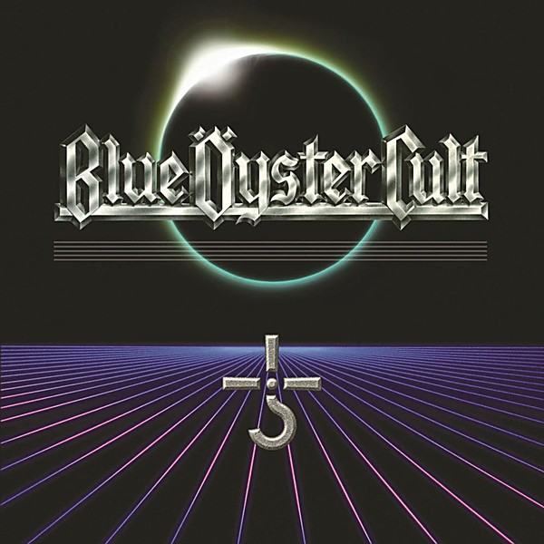

# Harvester of Lives

By **Blue Öyster Cult**

## Album Data

- **Catalog:** Beets
- **Format:** Digital, Album
- **Album:** Harvester of Lives
- **Artist:** Blue Öyster Cult
- **Albumartist:** Blue Öyster Cult
- **Genre:** Progressive Rock
- **MusicBrainz Album Artist ID:** [c7423e0c-ab3e-4ab4-be10-cdff5a9d3062](https://musicbrainz.org/artist/c7423e0c-ab3e-4ab4-be10-cdff5a9d3062)
- **MusicBrainz Album ID:** [c43dc6a3-1739-4f62-8f09-a1edda69a848](https://musicbrainz.org/release/c43dc6a3-1739-4f62-8f09-a1edda69a848)
- **MusicBrainz Release Group ID:** [146e5b14-2e0a-4047-816a-46255fb0521e](https://musicbrainz.org/release-group/146e5b14-2e0a-4047-816a-46255fb0521e)
- **Year:** 2016
- **Catalog #:** 
- **Label:** 
- **Total Tracks:** 09

## Album Tracks

### Track 01 - I Am The One You Warned Me Of

- **Artist:** Blue Öyster Cult
- **Format:** ALAC
- **Genre:** Heavy Metal
- **Length:** 5:05
- **MusicBrainz Track ID:** 
- **Title:** I Am The One You Warned Me Of
- **Track:** 01
- **Year:** 1988

### Track 02 - Les Invisibles

- **Artist:** Blue Öyster Cult
- **Format:** ALAC
- **Genre:** Psychedelic Rock
- **Length:** 5:34
- **MusicBrainz Track ID:** 
- **Title:** Les Invisibles
- **Track:** 02
- **Year:** 1988

### Track 03 - In The Presence of Another World

- **Artist:** Blue Öyster Cult
- **Format:** ALAC
- **Genre:** Psychedelic Rock
- **Length:** 6:28
- **MusicBrainz Track ID:** 
- **Title:** In The Presence of Another World
- **Track:** 03
- **Year:** 1988

### Track 04 - Del Rio's Song

- **Artist:** Blue Öyster Cult
- **Format:** ALAC
- **Genre:** Heavy Metal
- **Length:** 5:36
- **MusicBrainz Track ID:** 
- **Title:** Del Rio's Song
- **Track:** 04
- **Year:** 1988

### Track 05 - The Siege And Investiture of Baron Von Frankenstein's Castle At Weisseria

- **Artist:** Blue Öyster Cult
- **Format:** ALAC
- **Genre:** Progressive Rock
- **Length:** 6:44
- **MusicBrainz Track ID:** 
- **Title:** The Siege And Investiture of Baron Von Frankenstein's Castle At Weisseria
- **Track:** 05
- **Year:** 1988

### Track 06 - Astronomy

- **Artist:** Blue Öyster Cult
- **Format:** ALAC
- **Genre:** Progressive Rock
- **Length:** 6:55
- **MusicBrainz Track ID:** 
- **Title:** Astronomy
- **Track:** 06
- **Year:** 1988

### Track 07 - Magna of Illusion

- **Artist:** Blue Öyster Cult
- **Format:** ALAC
- **Genre:** Heavy Metal
- **Length:** 5:58
- **MusicBrainz Track ID:** 
- **Title:** Magna of Illusion
- **Track:** 07
- **Year:** 1988

### Track 08 - Blue Öyster Cult

- **Artist:** Blue Öyster Cult
- **Format:** ALAC
- **Genre:** Psychedelic Rock
- **Length:** 7:18
- **MusicBrainz Track ID:** 
- **Title:** Blue Öyster Cult
- **Track:** 08
- **Year:** 1988

### Track 09 - Imaginos

- **Artist:** Blue Öyster Cult
- **Format:** ALAC
- **Genre:** Heavy Metal
- **Length:** 5:46
- **MusicBrainz Track ID:** 
- **Title:** Imaginos
- **Track:** 09
- **Year:** 1988

