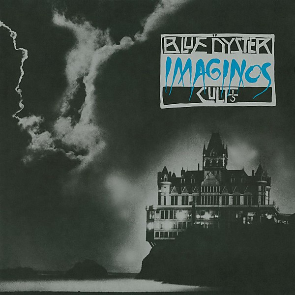

# Imaginos

By **Blue Öyster Cult**

## Album Data

- **Catalog:** Beets
- **Format:** Digital, Album
- **Album:** Imaginos
- **Artist:** Blue Öyster Cult
- **Albumartist:** Blue Öyster Cult
- **Genre:** Rock And Roll
- **MusicBrainz Album Artist ID:** 
- **MusicBrainz Album ID:** 
- **MusicBrainz Release Group ID:** 
- **Year:** 1988
- **Catalog #:** 
- **Label:** 
- **Total Tracks:** 09

## Album Tracks

### Track 01 - Dr. Music

- **Artist:** Blue Öyster Cult
- **Format:** ALAC
- **Genre:** Heavy Metal
- **Length:** 3:13
- **MusicBrainz Track ID:** 
- **Title:** Dr. Music
- **Track:** 01
- **Year:** 1979

### Track 02 - The Great Sun Jester

- **Artist:** Blue Öyster Cult
- **Format:** ALAC
- **Genre:** Heavy Metal
- **Length:** 4:50
- **MusicBrainz Track ID:** 
- **Title:** The Great Sun Jester
- **Track:** 02
- **Year:** 1979

### Track 03 - In Thee

- **Artist:** Blue Öyster Cult
- **Format:** ALAC
- **Genre:** Psychedelic Rock
- **Length:** 3:50
- **MusicBrainz Track ID:** 
- **Title:** In Thee
- **Track:** 03
- **Year:** 1979

### Track 04 - Mirrors

- **Artist:** Blue Öyster Cult
- **Format:** ALAC
- **Genre:** Progressive Rock
- **Length:** 3:47
- **MusicBrainz Track ID:** 
- **Title:** Mirrors
- **Track:** 04
- **Year:** 1979

### Track 05 - Moon Crazy

- **Artist:** Blue Öyster Cult
- **Format:** ALAC
- **Genre:** Heavy Metal
- **Length:** 4:07
- **MusicBrainz Track ID:** 
- **Title:** Moon Crazy
- **Track:** 05
- **Year:** 1979

### Track 06 - The Vigil

- **Artist:** Blue Öyster Cult
- **Format:** ALAC
- **Genre:** Progressive Rock
- **Length:** 6:28
- **MusicBrainz Track ID:** 
- **Title:** The Vigil
- **Track:** 06
- **Year:** 1979

### Track 07 - I Am The Storm

- **Artist:** Blue Öyster Cult
- **Format:** ALAC
- **Genre:** Progressive Rock
- **Length:** 3:44
- **MusicBrainz Track ID:** 
- **Title:** I Am The Storm
- **Track:** 07
- **Year:** 1979

### Track 08 - You're Not The One (I Was Looking For)

- **Artist:** Blue Öyster Cult
- **Format:** ALAC
- **Genre:** Soft Rock
- **Length:** 3:16
- **MusicBrainz Track ID:** 
- **Title:** You're Not The One (I Was Looking For)
- **Track:** 08
- **Year:** 1979

### Track 09 - Lonely Teardrops

- **Artist:** Blue Öyster Cult
- **Format:** ALAC
- **Genre:** Heavy Metal
- **Length:** 3:41
- **MusicBrainz Track ID:** 
- **Title:** Lonely Teardrops
- **Track:** 09
- **Year:** 1979

## See also

- [Agents of Fortune](Agents_of_Fortune.md)
- [Blue Öyster Cult](Blue_Öyster_Cult.md)
- [Club Ninja](Club_Ninja.md)
- [Cultösaurus Erectus](Cultösaurus_Erectus.md)
- [Extraterrestrial Live](Extraterrestrial_Live.md)
- [Fire of Unknown Origin](Fire_of_Unknown_Origin.md)
- [Harvester of Lives](Harvester_of_Lives.md)
- [Mirrors](Mirrors.md)
- [On Your Feet or on Your Knees](On_Your_Feet_or_on_Your_Knees.md)
- [Radios Appear](Radios_Appear.md)
- [Rarities](Rarities.md)
- [Secret Treaties](Secret_Treaties.md)
- [Some Enchanted Evening](Some_Enchanted_Evening.md)
- [Spectres](Spectres.md)
- [The Revölution by Night](The_Revölution_by_Night.md)
- [Tyranny and Mutation](Tyranny_and_Mutation.md)
- [CD: Agents Of Fortune](../../CD/Blue_Öyster_Cult/Agents_Of_Fortune.md)
- [CD: ](../../CD/Blue_Öyster_Cult/Blue_Öyster_Cult_index.md)
- [CD: Blue Öyster Cult](../../CD/Blue_Öyster_Cult/Blue_Öyster_Cult.md)
- [CD: Club Ninja](../../CD/Blue_Öyster_Cult/Club_Ninja.md)
- [CD: Extraterrestrial Live](../../CD/Blue_Öyster_Cult/Extraterrestrial_Live.md)
- [CD: Imaginos](../../CD/Blue_Öyster_Cult/Imaginos.md)
- [CD: Radios Appear](../../CD/Blue_Öyster_Cult/Radios_Appear-_The_Best_Of_Broadcasts.md)
- [CD: Rarities](../../CD/Blue_Öyster_Cult/Rarities.md)
- [CD: Secret Treaties](../../CD/Blue_Öyster_Cult/Secret_Treaties.md)
- [CD: Some Enchanted Evening](../../CD/Blue_Öyster_Cult/Some_Enchanted_Evening.md)
- [CD: Spectres](../../CD/Blue_Öyster_Cult/Spectres.md)
- [CD: The Columbia Albums Collection (Disc 10)](../../CD/Blue_Öyster_Cult/The_Columbia_Albums_Collection_Disc_10.md)
- [CD: The Columbia Albums Collection (Disc 12)](../../CD/Blue_Öyster_Cult/The_Columbia_Albums_Collection_Disc_12.md)
- [CD: The Columbia Albums Collection (Disc 4)](../../CD/Blue_Öyster_Cult/The_Columbia_Albums_Collection_Disc_4.md)
- [CD: The Columbia Albums Collection (Disc 8)](../../CD/Blue_Öyster_Cult/The_Columbia_Albums_Collection_Disc_8.md)
- [CD: The Columbia Albums Collection (Disc 9)](../../CD/Blue_Öyster_Cult/The_Columbia_Albums_Collection_Disc_9.md)
- [CD: Tyranny & Mutation](../../CD/Blue_Öyster_Cult/Tyranny_and_Mutation.md)
- [Roon: 40th Anniversary - Agents Of Fortune - Live 2016 (Live)](../../Roon/Blue_Öyster_Cult/40th_Anniversary_-_Agents_Of_Fortune_-_Live_2016_Live.md)
- [Roon: Blue Oyster Cult](../../Roon/Blue_Öyster_Cult/Blue_Oyster_Cult.md)
- [Roon: Cultosaurus Erectus](../../Roon/Blue_Öyster_Cult/Cultosaurus_Erectus.md)
- [Roon: Fire Of Unknown Origin](../../Roon/Blue_Öyster_Cult/Fire_Of_Unknown_Origin.md)
- [Roon: Imaginos](../../Roon/Blue_Öyster_Cult/Imaginos.md)
- [Roon: Mirrors](../../Roon/Blue_Öyster_Cult/Mirrors.md)
- [Roon: On Your Feet Or On Your Knees (Live)](../../Roon/Blue_Öyster_Cult/On_Your_Feet_Or_On_Your_Knees_Live.md)
- [Roon: Rarities](../../Roon/Blue_Öyster_Cult/Rarities.md)
- [Roon: Secret Treaties](../../Roon/Blue_Öyster_Cult/Secret_Treaties.md)
- [Roon: Some Enchanted Evening (Live)](../../Roon/Blue_Öyster_Cult/Some_Enchanted_Evening_Live.md)
- [Roon: Spectres](../../Roon/Blue_Öyster_Cult/Spectres.md)
- [Roon: The Revolution By Night](../../Roon/Blue_Öyster_Cult/The_Revolution_By_Night.md)
- [Roon: Tyranny And Mutation](../../Roon/Blue_Öyster_Cult/Tyranny_And_Mutation.md)
- [Vinyl: Agents Of Fortune](../../Vinyl/Blue_Öyster_Cult/Agents_Of_Fortune.md)
- [Vinyl: ](../../Vinyl/Blue_Öyster_Cult/Blue_Öyster_Cult.md)
- [Vinyl: Secret Treaties](../../Vinyl/Blue_Öyster_Cult/Secret_Treaties.md)
- [Vinyl: Tyranny And Mutation](../../Vinyl/Blue_Öyster_Cult/Tyranny_And_Mutation.md)
