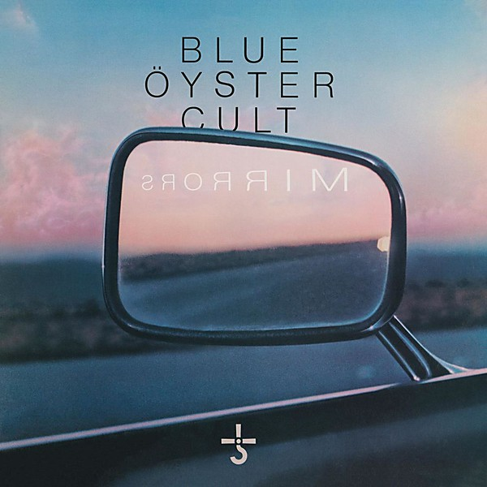

# Mirrors

By **Blue Öyster Cult**

## Album Data

- **Catalog:** Beets
- **Format:** Digital, Album
- **Album:** Mirrors
- **Artist:** Blue Öyster Cult
- **Albumartist:** Blue Öyster Cult
- **Genre:** Rock And Roll
- **MusicBrainz Album Artist ID:** 
- **MusicBrainz Album ID:** 
- **MusicBrainz Release Group ID:** 
- **Year:** 1979
- **Catalog #:** 
- **Label:** SMCMG
- **Total Tracks:** 12

## Album Tracks

### Track 01 - The Subhuman

- **Artist:** Blue Öyster Cult
- **Format:** ALAC
- **Genre:** Progressive Rock
- **Length:** 7:29
- **MusicBrainz Track ID:** [1d681529-df4b-49e1-99e4-f0eb7c6c86ff](https://musicbrainz.org/recording/1d681529-df4b-49e1-99e4-f0eb7c6c86ff)
- **Title:** The Subhuman
- **Track:** 01
- **Year:** 2016

### Track 02 - Harvester of Eyes

- **Artist:** Blue Öyster Cult
- **Format:** ALAC
- **Genre:** Progressive Rock
- **Length:** 4:56
- **MusicBrainz Track ID:** [6f0d7b40-3cab-42a9-a563-180caa6ba42e](https://musicbrainz.org/recording/6f0d7b40-3cab-42a9-a563-180caa6ba42e)
- **Title:** Harvester of Eyes
- **Track:** 02
- **Year:** 2016

### Track 03 - Hot Rails to Hell

- **Artist:** Blue Öyster Cult
- **Format:** ALAC
- **Genre:** Heavy Metal
- **Length:** 5:39
- **MusicBrainz Track ID:** [e5559e34-7473-4a75-bafd-35664ca7b8d7](https://musicbrainz.org/recording/e5559e34-7473-4a75-bafd-35664ca7b8d7)
- **Title:** Hot Rails to Hell
- **Track:** 03
- **Year:** 2016

### Track 04 - The Red & The Black

- **Artist:** Blue Öyster Cult
- **Format:** ALAC
- **Genre:** Psychedelic Rock
- **Length:** 4:32
- **MusicBrainz Track ID:** [7aac019a-a824-409e-acec-c430dafcfe4d](https://musicbrainz.org/recording/7aac019a-a824-409e-acec-c430dafcfe4d)
- **Title:** The Red & The Black
- **Track:** 04
- **Year:** 2016

### Track 05 - Seven Screaming Diz-Busters

- **Artist:** Blue Öyster Cult
- **Format:** ALAC
- **Genre:** Heavy Metal
- **Length:** 8:48
- **MusicBrainz Track ID:** [222c90b4-4bfe-4b18-8eae-0809f1c0db2c](https://musicbrainz.org/recording/222c90b4-4bfe-4b18-8eae-0809f1c0db2c)
- **Title:** Seven Screaming Diz-Busters
- **Track:** 05
- **Year:** 2016

### Track 06 - Buck’s Boogie

- **Artist:** Blue Öyster Cult
- **Format:** ALAC
- **Genre:** Heavy Metal
- **Length:** 7:13
- **MusicBrainz Track ID:** [e807afaf-3c3d-4d00-bf81-49637c114379](https://musicbrainz.org/recording/e807afaf-3c3d-4d00-bf81-49637c114379)
- **Title:** Buck’s Boogie
- **Track:** 06
- **Year:** 2016

### Track 07 - Last Days of May

- **Artist:** Blue Öyster Cult
- **Format:** ALAC
- **Genre:** Heavy Metal
- **Length:** 4:37
- **MusicBrainz Track ID:** [2d7eacfb-12a3-4bcf-8f88-1c6fa0ea9731](https://musicbrainz.org/recording/2d7eacfb-12a3-4bcf-8f88-1c6fa0ea9731)
- **Title:** Last Days of May
- **Track:** 07
- **Year:** 2016

### Track 08 - Cities on Flame

- **Artist:** Blue Öyster Cult
- **Format:** ALAC
- **Genre:** Heavy Metal
- **Length:** 4:05
- **MusicBrainz Track ID:** [edf63ead-5bba-4699-a498-29e36733ae18](https://musicbrainz.org/recording/edf63ead-5bba-4699-a498-29e36733ae18)
- **Title:** Cities on Flame
- **Track:** 08
- **Year:** 2016

### Track 09 - ME 262

- **Artist:** Blue Öyster Cult
- **Format:** ALAC
- **Genre:** Space Rock
- **Length:** 8:22
- **MusicBrainz Track ID:** [da1c15ab-9054-4b5c-8b07-5298c275f4f7](https://musicbrainz.org/recording/da1c15ab-9054-4b5c-8b07-5298c275f4f7)
- **Title:** ME 262
- **Track:** 09
- **Year:** 2016

### Track 10 - Before the Kiss (A Redcap)

- **Artist:** Blue Öyster Cult
- **Format:** ALAC
- **Genre:** Heavy Metal
- **Length:** 5:11
- **MusicBrainz Track ID:** [941d3a50-158c-44be-9f61-33bee1875f57](https://musicbrainz.org/recording/941d3a50-158c-44be-9f61-33bee1875f57)
- **Title:** Before the Kiss (A Redcap)
- **Track:** 10
- **Year:** 2016

### Track 11 - Maserati GT (I Ain’t Got You)

- **Artist:** Blue Öyster Cult
- **Format:** ALAC
- **Genre:** Heavy Metal
- **Length:** 8:58
- **MusicBrainz Track ID:** [88faf6f4-dab1-413e-baff-ad3314e0bbf3](https://musicbrainz.org/recording/88faf6f4-dab1-413e-baff-ad3314e0bbf3)
- **Title:** Maserati GT (I Ain’t Got You)
- **Track:** 11
- **Year:** 2016

### Track 12 - Born to Be Wild

- **Artist:** Blue Öyster Cult
- **Format:** ALAC
- **Genre:** Stoner Rock
- **Length:** 6:28
- **MusicBrainz Track ID:** [ee61b64b-3fa4-4bc4-9172-43d849e40a40](https://musicbrainz.org/recording/ee61b64b-3fa4-4bc4-9172-43d849e40a40)
- **Title:** Born to Be Wild
- **Track:** 12
- **Year:** 2016

## See also

- [Agents of Fortune](Agents_of_Fortune.md)
- [Blue Öyster Cult](Blue_Öyster_Cult.md)
- [Club Ninja](Club_Ninja.md)
- [Cultösaurus Erectus](Cultösaurus_Erectus.md)
- [Extraterrestrial Live](Extraterrestrial_Live.md)
- [Fire of Unknown Origin](Fire_of_Unknown_Origin.md)
- [Harvester of Lives](Harvester_of_Lives.md)
- [Imaginos](Imaginos.md)
- [On Your Feet or on Your Knees](On_Your_Feet_or_on_Your_Knees.md)
- [Radios Appear](Radios_Appear.md)
- [Rarities](Rarities.md)
- [Secret Treaties](Secret_Treaties.md)
- [Some Enchanted Evening](Some_Enchanted_Evening.md)
- [Spectres](Spectres.md)
- [The Revölution by Night](The_Revölution_by_Night.md)
- [Tyranny and Mutation](Tyranny_and_Mutation.md)
- [CD: Agents Of Fortune](../../CD/Blue_Öyster_Cult/Agents_Of_Fortune.md)
- [CD: ](../../CD/Blue_Öyster_Cult/Blue_Öyster_Cult_index.md)
- [CD: Blue Öyster Cult](../../CD/Blue_Öyster_Cult/Blue_Öyster_Cult.md)
- [CD: Club Ninja](../../CD/Blue_Öyster_Cult/Club_Ninja.md)
- [CD: Extraterrestrial Live](../../CD/Blue_Öyster_Cult/Extraterrestrial_Live.md)
- [CD: Imaginos](../../CD/Blue_Öyster_Cult/Imaginos.md)
- [CD: Radios Appear](../../CD/Blue_Öyster_Cult/Radios_Appear-_The_Best_Of_Broadcasts.md)
- [CD: Rarities](../../CD/Blue_Öyster_Cult/Rarities.md)
- [CD: Secret Treaties](../../CD/Blue_Öyster_Cult/Secret_Treaties.md)
- [CD: Some Enchanted Evening](../../CD/Blue_Öyster_Cult/Some_Enchanted_Evening.md)
- [CD: Spectres](../../CD/Blue_Öyster_Cult/Spectres.md)
- [CD: The Columbia Albums Collection (Disc 10)](../../CD/Blue_Öyster_Cult/The_Columbia_Albums_Collection_Disc_10.md)
- [CD: The Columbia Albums Collection (Disc 12)](../../CD/Blue_Öyster_Cult/The_Columbia_Albums_Collection_Disc_12.md)
- [CD: The Columbia Albums Collection (Disc 4)](../../CD/Blue_Öyster_Cult/The_Columbia_Albums_Collection_Disc_4.md)
- [CD: The Columbia Albums Collection (Disc 8)](../../CD/Blue_Öyster_Cult/The_Columbia_Albums_Collection_Disc_8.md)
- [CD: The Columbia Albums Collection (Disc 9)](../../CD/Blue_Öyster_Cult/The_Columbia_Albums_Collection_Disc_9.md)
- [CD: Tyranny & Mutation](../../CD/Blue_Öyster_Cult/Tyranny_and_Mutation.md)
- [Roon: 40th Anniversary - Agents Of Fortune - Live 2016 (Live)](../../Roon/Blue_Öyster_Cult/40th_Anniversary_-_Agents_Of_Fortune_-_Live_2016_Live.md)
- [Roon: Blue Oyster Cult](../../Roon/Blue_Öyster_Cult/Blue_Oyster_Cult.md)
- [Roon: Cultosaurus Erectus](../../Roon/Blue_Öyster_Cult/Cultosaurus_Erectus.md)
- [Roon: Fire Of Unknown Origin](../../Roon/Blue_Öyster_Cult/Fire_Of_Unknown_Origin.md)
- [Roon: Imaginos](../../Roon/Blue_Öyster_Cult/Imaginos.md)
- [Roon: Mirrors](../../Roon/Blue_Öyster_Cult/Mirrors.md)
- [Roon: On Your Feet Or On Your Knees (Live)](../../Roon/Blue_Öyster_Cult/On_Your_Feet_Or_On_Your_Knees_Live.md)
- [Roon: Rarities](../../Roon/Blue_Öyster_Cult/Rarities.md)
- [Roon: Secret Treaties](../../Roon/Blue_Öyster_Cult/Secret_Treaties.md)
- [Roon: Some Enchanted Evening (Live)](../../Roon/Blue_Öyster_Cult/Some_Enchanted_Evening_Live.md)
- [Roon: Spectres](../../Roon/Blue_Öyster_Cult/Spectres.md)
- [Roon: The Revolution By Night](../../Roon/Blue_Öyster_Cult/The_Revolution_By_Night.md)
- [Roon: Tyranny And Mutation](../../Roon/Blue_Öyster_Cult/Tyranny_And_Mutation.md)
- [Vinyl: Agents Of Fortune](../../Vinyl/Blue_Öyster_Cult/Agents_Of_Fortune.md)
- [Vinyl: ](../../Vinyl/Blue_Öyster_Cult/Blue_Öyster_Cult.md)
- [Vinyl: Secret Treaties](../../Vinyl/Blue_Öyster_Cult/Secret_Treaties.md)
- [Vinyl: Tyranny And Mutation](../../Vinyl/Blue_Öyster_Cult/Tyranny_And_Mutation.md)
