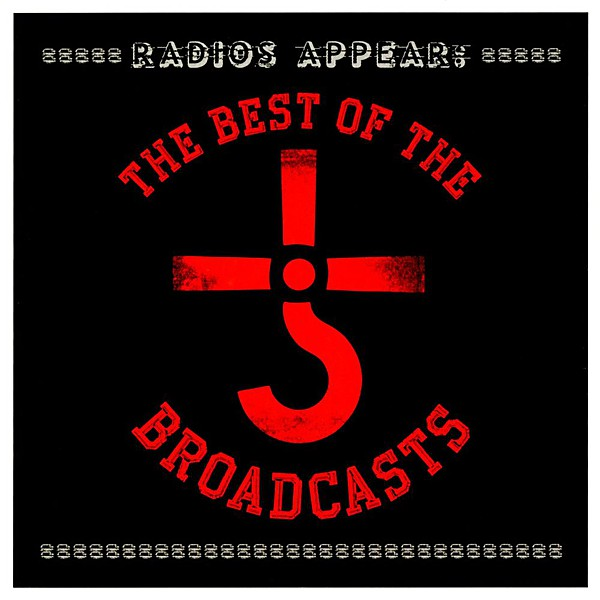

# Radios Appear

By **Blue Öyster Cult**

## Album Data

- **Catalog:** Beets
- **Format:** Digital, Album
- **Album:** Radios Appear
- **Artist:** Blue Öyster Cult
- **Albumartist:** Blue Öyster Cult
- **Genre:** Progressive Rock
- **MusicBrainz Album Artist ID:** [c7423e0c-ab3e-4ab4-be10-cdff5a9d3062](https://musicbrainz.org/artist/c7423e0c-ab3e-4ab4-be10-cdff5a9d3062)
- **MusicBrainz Album ID:** [48d2e9b0-1be9-4c27-a8f7-2d0ef34a975f](https://musicbrainz.org/release/48d2e9b0-1be9-4c27-a8f7-2d0ef34a975f)
- **MusicBrainz Release Group ID:** [c40e0465-da83-492e-a92e-c533487b88e5](https://musicbrainz.org/release-group/c40e0465-da83-492e-a92e-c533487b88e5)
- **Year:** 2012
- **Catalog #:** 
- **Label:** 
- **Total Tracks:** 19

## Album Tracks

### Track 01 - Stairway To The Stars [Live in Commack, Long Island, NY, 17/05/1975]

- **Artist:** Blue Öyster Cult
- **Format:** ALAC
- **Genre:** Progressive Rock
- **Length:** 4:06
- **MusicBrainz Track ID:** 
- **Title:** Stairway To The Stars [Live in Commack, Long Island, NY, 17/05/1975]
- **Track:** 01
- **Year:** 1975

### Track 02 - The Red & The Black [Live in Rochester, NY, 03/04/1972]

- **Artist:** Blue Öyster Cult
- **Format:** ALAC
- **Genre:** Progressive Rock
- **Length:** 4:36
- **MusicBrainz Track ID:** 
- **Title:** The Red & The Black [Live in Rochester, NY, 03/04/1972]
- **Track:** 02
- **Year:** 1972

### Track 03 - Buck's Boogie [Live in Rochester, NY, 03/04/1972]

- **Artist:** Blue Öyster Cult
- **Format:** ALAC
- **Genre:** Progressive Rock
- **Length:** 5:19
- **MusicBrainz Track ID:** 
- **Title:** Buck's Boogie [Live in Rochester, NY, 03/04/1972]
- **Track:** 03
- **Year:** 1972

### Track 04 - Cities On Flame With Rock And Roll [Live in Rochester, NY, 03/04/1972]

- **Artist:** Blue Öyster Cult
- **Format:** ALAC
- **Genre:** Progressive Rock
- **Length:** 4:44
- **MusicBrainz Track ID:** 
- **Title:** Cities On Flame With Rock And Roll [Live in Rochester, NY, 03/04/1972]
- **Track:** 04
- **Year:** 1972

### Track 05 - Workshop Of The Telescopes [Live in Rochester, NY, 03/04/1972]

- **Artist:** Blue Öyster Cult
- **Format:** ALAC
- **Genre:** Progressive Rock
- **Length:** 3:48
- **MusicBrainz Track ID:** 
- **Title:** Workshop Of The Telescopes [Live in Rochester, NY, 03/04/1972]
- **Track:** 05
- **Year:** 1972

### Track 06 - Dr. Music [Live at Zellerbach Auditorium, Berkeley, CA, 22/08/1979]

- **Artist:** Blue Öyster Cult
- **Format:** ALAC
- **Genre:** Progressive Rock
- **Length:** 4:08
- **MusicBrainz Track ID:** 
- **Title:** Dr. Music [Live at Zellerbach Auditorium, Berkeley, CA, 22/08/1979]
- **Track:** 06
- **Year:** 1979

### Track 07 - The Vigil [Live at Zellerbach Auditorium, Berkeley, CA, 22/08/1979]

- **Artist:** Blue Öyster Cult
- **Format:** ALAC
- **Genre:** Progressive Rock
- **Length:** 7:22
- **MusicBrainz Track ID:** 
- **Title:** The Vigil [Live at Zellerbach Auditorium, Berkeley, CA, 22/08/1979]
- **Track:** 07
- **Year:** 1979

### Track 08 - The Great Sun Jester [Live at Zellerbach Auditorium, Berkeley, CA, 22/08/1979]

- **Artist:** Blue Öyster Cult
- **Format:** ALAC
- **Genre:** Progressive Rock
- **Length:** 5:48
- **MusicBrainz Track ID:** 
- **Title:** The Great Sun Jester [Live at Zellerbach Auditorium, Berkeley, CA, 22/08/1979]
- **Track:** 08
- **Year:** 1979

### Track 09 - In Thee [Live at Zellerbach Auditorium, Berkeley, CA, 22/08/1979]

- **Artist:** Blue Öyster Cult
- **Format:** ALAC
- **Genre:** Progressive Rock
- **Length:** 3:51
- **MusicBrainz Track ID:** 
- **Title:** In Thee [Live at Zellerbach Auditorium, Berkeley, CA, 22/08/1979]
- **Track:** 09
- **Year:** 1979

### Track 10 - Mirrors [Live at Zellerbach Auditorium, Berkeley, CA, 22/08/1979]

- **Artist:** Blue Öyster Cult
- **Format:** ALAC
- **Genre:** Progressive Rock
- **Length:** 4:43
- **MusicBrainz Track ID:** 
- **Title:** Mirrors [Live at Zellerbach Auditorium, Berkeley, CA, 22/08/1979]
- **Track:** 10
- **Year:** 1979

### Track 11 - Steppin' Razor [Demo]

- **Artist:** Blue Öyster Cult
- **Format:** ALAC
- **Genre:** Progressive Rock
- **Length:** 2:50
- **MusicBrainz Track ID:** 
- **Title:** Steppin' Razor [Demo]
- **Track:** 11
- **Year:** 1975

### Track 12 - Godzilla [Live Mono]

- **Artist:** Blue Öyster Cult
- **Format:** ALAC
- **Genre:** Progressive Rock
- **Length:** 3:55
- **MusicBrainz Track ID:** 
- **Title:** Godzilla [Live Mono]
- **Track:** 12
- **Year:** 1977

### Track 13 - Double Talk [Demo]

- **Artist:** Blue Öyster Cult
- **Format:** ALAC
- **Genre:** Progressive Rock
- **Length:** 3:49
- **MusicBrainz Track ID:** 
- **Title:** Double Talk [Demo]
- **Track:** 13
- **Year:** 1984

### Track 14 - Rebel [Demo]

- **Artist:** Blue Öyster Cult
- **Format:** ALAC
- **Genre:** Progressive Rock
- **Length:** 3:55
- **MusicBrainz Track ID:** 
- **Title:** Rebel [Demo]
- **Track:** 14
- **Year:** 1984

### Track 15 - Summa Cum Laude [Demo]

- **Artist:** Blue Öyster Cult
- **Format:** ALAC
- **Genre:** Progressive Rock
- **Length:** 4:22
- **MusicBrainz Track ID:** 
- **Title:** Summa Cum Laude [Demo]
- **Track:** 15
- **Year:** 1984

### Track 18 - I Want You (She's So Heavy) [Live in Dothan, AL, 28/12/1980]

- **Artist:** Blue Öyster Cult
- **Format:** ALAC
- **Genre:** Progressive Rock
- **Length:** 5:54
- **MusicBrainz Track ID:** 
- **Title:** I Want You (She's So Heavy) [Live in Dothan, AL, 28/12/1980]
- **Track:** 18
- **Year:** 1980

### Track 16 - I'm On The Lamb But I Ain't No Sheep [Demo]

- **Artist:** Soft White Underbelly
- **Format:** ALAC
- **Genre:** Psychedelic Rock
- **Length:** 2:58
- **MusicBrainz Track ID:** 
- **Title:** I'm On The Lamb But I Ain't No Sheep [Demo]
- **Track:** 16
- **Year:** 1969

### Track 17 - John L. Sullivan [Demo]

- **Artist:** Soft White Underbelly
- **Format:** ALAC
- **Genre:** Psychedelic Rock
- **Length:** 1:36
- **MusicBrainz Track ID:** 
- **Title:** John L. Sullivan [Demo]
- **Track:** 17
- **Year:** 1969

### Track 19 - Stephen King Spoken Intro

- **Artist:** Stephen King
- **Format:** ALAC
- **Genre:** Progressive Rock
- **Length:** 0:48
- **MusicBrainz Track ID:** 
- **Title:** Stephen King Spoken Intro
- **Track:** 19
- **Year:** 1988

## See also

- [Agents of Fortune](Agents_of_Fortune.md)
- [Blue Öyster Cult](Blue_Öyster_Cult.md)
- [Club Ninja](Club_Ninja.md)
- [Cultösaurus Erectus](Cultösaurus_Erectus.md)
- [Extraterrestrial Live](Extraterrestrial_Live.md)
- [Fire of Unknown Origin](Fire_of_Unknown_Origin.md)
- [Harvester of Lives](Harvester_of_Lives.md)
- [Imaginos](Imaginos.md)
- [Mirrors](Mirrors.md)
- [On Your Feet or on Your Knees](On_Your_Feet_or_on_Your_Knees.md)
- [Rarities](Rarities.md)
- [Secret Treaties](Secret_Treaties.md)
- [Some Enchanted Evening](Some_Enchanted_Evening.md)
- [Spectres](Spectres.md)
- [The Revölution by Night](The_Revölution_by_Night.md)
- [Tyranny and Mutation](Tyranny_and_Mutation.md)
- [CD: Agents Of Fortune](../../CD/Blue_Öyster_Cult/Agents_Of_Fortune.md)
- [CD: ](../../CD/Blue_Öyster_Cult/Blue_Öyster_Cult_index.md)
- [CD: Blue Öyster Cult](../../CD/Blue_Öyster_Cult/Blue_Öyster_Cult.md)
- [CD: Club Ninja](../../CD/Blue_Öyster_Cult/Club_Ninja.md)
- [CD: Extraterrestrial Live](../../CD/Blue_Öyster_Cult/Extraterrestrial_Live.md)
- [CD: Imaginos](../../CD/Blue_Öyster_Cult/Imaginos.md)
- [CD: Radios Appear](../../CD/Blue_Öyster_Cult/Radios_Appear-_The_Best_Of_Broadcasts.md)
- [CD: Rarities](../../CD/Blue_Öyster_Cult/Rarities.md)
- [CD: Secret Treaties](../../CD/Blue_Öyster_Cult/Secret_Treaties.md)
- [CD: Some Enchanted Evening](../../CD/Blue_Öyster_Cult/Some_Enchanted_Evening.md)
- [CD: Spectres](../../CD/Blue_Öyster_Cult/Spectres.md)
- [CD: The Columbia Albums Collection (Disc 10)](../../CD/Blue_Öyster_Cult/The_Columbia_Albums_Collection_Disc_10.md)
- [CD: The Columbia Albums Collection (Disc 12)](../../CD/Blue_Öyster_Cult/The_Columbia_Albums_Collection_Disc_12.md)
- [CD: The Columbia Albums Collection (Disc 4)](../../CD/Blue_Öyster_Cult/The_Columbia_Albums_Collection_Disc_4.md)
- [CD: The Columbia Albums Collection (Disc 8)](../../CD/Blue_Öyster_Cult/The_Columbia_Albums_Collection_Disc_8.md)
- [CD: The Columbia Albums Collection (Disc 9)](../../CD/Blue_Öyster_Cult/The_Columbia_Albums_Collection_Disc_9.md)
- [CD: Tyranny & Mutation](../../CD/Blue_Öyster_Cult/Tyranny_and_Mutation.md)
- [Roon: 40th Anniversary - Agents Of Fortune - Live 2016 (Live)](../../Roon/Blue_Öyster_Cult/40th_Anniversary_-_Agents_Of_Fortune_-_Live_2016_Live.md)
- [Roon: Blue Oyster Cult](../../Roon/Blue_Öyster_Cult/Blue_Oyster_Cult.md)
- [Roon: Cultosaurus Erectus](../../Roon/Blue_Öyster_Cult/Cultosaurus_Erectus.md)
- [Roon: Fire Of Unknown Origin](../../Roon/Blue_Öyster_Cult/Fire_Of_Unknown_Origin.md)
- [Roon: Imaginos](../../Roon/Blue_Öyster_Cult/Imaginos.md)
- [Roon: Mirrors](../../Roon/Blue_Öyster_Cult/Mirrors.md)
- [Roon: On Your Feet Or On Your Knees (Live)](../../Roon/Blue_Öyster_Cult/On_Your_Feet_Or_On_Your_Knees_Live.md)
- [Roon: Rarities](../../Roon/Blue_Öyster_Cult/Rarities.md)
- [Roon: Secret Treaties](../../Roon/Blue_Öyster_Cult/Secret_Treaties.md)
- [Roon: Some Enchanted Evening (Live)](../../Roon/Blue_Öyster_Cult/Some_Enchanted_Evening_Live.md)
- [Roon: Spectres](../../Roon/Blue_Öyster_Cult/Spectres.md)
- [Roon: The Revolution By Night](../../Roon/Blue_Öyster_Cult/The_Revolution_By_Night.md)
- [Roon: Tyranny And Mutation](../../Roon/Blue_Öyster_Cult/Tyranny_And_Mutation.md)
- [Vinyl: Agents Of Fortune](../../Vinyl/Blue_Öyster_Cult/Agents_Of_Fortune.md)
- [Vinyl: ](../../Vinyl/Blue_Öyster_Cult/Blue_Öyster_Cult.md)
- [Vinyl: Secret Treaties](../../Vinyl/Blue_Öyster_Cult/Secret_Treaties.md)
- [Vinyl: Tyranny And Mutation](../../Vinyl/Blue_Öyster_Cult/Tyranny_And_Mutation.md)
