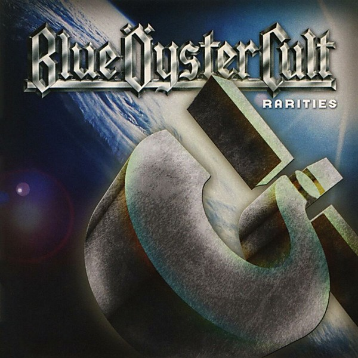

# Rarities

By **Blue Öyster Cult**

## Album Data

- **Catalog:** Beets
- **Format:** Digital, Album
- **Album:** Rarities
- **Artist:** Blue Öyster Cult
- **Albumartist:** Blue Öyster Cult
- **Genre:** Progressive Rock
- **MusicBrainz Album Artist ID:** 
- **MusicBrainz Album ID:** 
- **MusicBrainz Release Group ID:** 
- **Year:** 1975
- **Catalog #:** CK 85480
- **Label:** Columbia
- **Total Tracks:** 13

## Album Tracks

### Track 01 - Career of Evil

- **Artist:** Blue Öyster Cult
- **Format:** ALAC
- **Genre:** Progressive Rock
- **Length:** 3:59
- **MusicBrainz Track ID:** [7e4902df-bb41-4cac-a064-9792c180b786](https://musicbrainz.org/recording/7e4902df-bb41-4cac-a064-9792c180b786)
- **Title:** Career of Evil
- **Track:** 01
- **Year:** 2001

### Track 02 - Subhuman

- **Artist:** Blue Öyster Cult
- **Format:** ALAC
- **Genre:** Progressive Rock
- **Length:** 4:38
- **MusicBrainz Track ID:** [c2442d48-6452-494b-94d7-91c5ecb797e1](https://musicbrainz.org/recording/c2442d48-6452-494b-94d7-91c5ecb797e1)
- **Title:** Subhuman
- **Track:** 02
- **Year:** 2001

### Track 03 - Dominance and Submission

- **Artist:** Blue Öyster Cult
- **Format:** ALAC
- **Genre:** Progressive Rock
- **Length:** 5:22
- **MusicBrainz Track ID:** [986e5d93-52fb-4bb0-a82c-513c9ef565ab](https://musicbrainz.org/recording/986e5d93-52fb-4bb0-a82c-513c9ef565ab)
- **Title:** Dominance and Submission
- **Track:** 03
- **Year:** 2001

### Track 04 - ME 262

- **Artist:** Blue Öyster Cult
- **Format:** ALAC
- **Genre:** Space Rock
- **Length:** 4:47
- **MusicBrainz Track ID:** [19d7e550-24c6-4214-a9de-aeca06cb60b0](https://musicbrainz.org/recording/19d7e550-24c6-4214-a9de-aeca06cb60b0)
- **Title:** ME 262
- **Track:** 04
- **Year:** 2001

### Track 05 - Cagey Cretins

- **Artist:** Blue Öyster Cult
- **Format:** ALAC
- **Genre:** Hard Rock
- **Length:** 3:16
- **MusicBrainz Track ID:** [f92553f4-7a4b-482c-8619-9b157467a779](https://musicbrainz.org/recording/f92553f4-7a4b-482c-8619-9b157467a779)
- **Title:** Cagey Cretins
- **Track:** 05
- **Year:** 2001

### Track 06 - Harvester of Eyes

- **Artist:** Blue Öyster Cult
- **Format:** ALAC
- **Genre:** Progressive Rock
- **Length:** 4:41
- **MusicBrainz Track ID:** [e3f15138-eecc-4da4-8937-b9446976314c](https://musicbrainz.org/recording/e3f15138-eecc-4da4-8937-b9446976314c)
- **Title:** Harvester of Eyes
- **Track:** 06
- **Year:** 2001

### Track 07 - Flaming Telepaths

- **Artist:** Blue Öyster Cult
- **Format:** ALAC
- **Genre:** Psychedelic Rock
- **Length:** 5:19
- **MusicBrainz Track ID:** [3b0122f2-3f7b-4ec3-be4d-1a9b569cc4bd](https://musicbrainz.org/recording/3b0122f2-3f7b-4ec3-be4d-1a9b569cc4bd)
- **Title:** Flaming Telepaths
- **Track:** 07
- **Year:** 2001

### Track 08 - Astronomy

- **Artist:** Blue Öyster Cult
- **Format:** ALAC
- **Genre:** Progressive Rock
- **Length:** 6:28
- **MusicBrainz Track ID:** [8bd710a4-022a-44e1-8d45-b5ff7e552050](https://musicbrainz.org/recording/8bd710a4-022a-44e1-8d45-b5ff7e552050)
- **Title:** Astronomy
- **Track:** 08
- **Year:** 2001

### Track 09 - Boorman the Chauffer

- **Artist:** Blue Öyster Cult
- **Format:** ALAC
- **Genre:** Acid Rock
- **Length:** 3:12
- **MusicBrainz Track ID:** [afcced1b-b337-40a7-8c97-4a0e0e59cf00](https://musicbrainz.org/recording/afcced1b-b337-40a7-8c97-4a0e0e59cf00)
- **Title:** Boorman the Chauffer
- **Track:** 09
- **Year:** 2001

### Track 10 - Mommy

- **Artist:** Blue Öyster Cult
- **Format:** ALAC
- **Genre:** Psychedelic Rock
- **Length:** 3:32
- **MusicBrainz Track ID:** [da2efc74-333e-4b68-b1d0-66b0d1759fb9](https://musicbrainz.org/recording/da2efc74-333e-4b68-b1d0-66b0d1759fb9)
- **Title:** Mommy
- **Track:** 10
- **Year:** 2001

### Track 11 - Mes Dames Sarat

- **Artist:** Blue Öyster Cult
- **Format:** ALAC
- **Genre:** Progressive Rock
- **Length:** 4:06
- **MusicBrainz Track ID:** [f22ab46f-69b9-4004-aefe-ccf43364eb99](https://musicbrainz.org/recording/f22ab46f-69b9-4004-aefe-ccf43364eb99)
- **Title:** Mes Dames Sarat
- **Track:** 11
- **Year:** 2001

### Track 12 - Born to Be Wild (studio version)

- **Artist:** Blue Öyster Cult
- **Format:** ALAC
- **Genre:** Rock And Roll
- **Length:** 3:40
- **MusicBrainz Track ID:** [11bef7b9-f836-46d6-ad26-123ecfdb9dc6](https://musicbrainz.org/recording/11bef7b9-f836-46d6-ad26-123ecfdb9dc6)
- **Title:** Born to Be Wild (studio version)
- **Track:** 12
- **Year:** 2001

### Track 13 - Career of Evil (single version)

- **Artist:** Blue Öyster Cult
- **Format:** ALAC
- **Genre:** Progressive Rock
- **Length:** 3:00
- **MusicBrainz Track ID:** [206c6767-618e-4b12-a34a-2c0920d8e3bd](https://musicbrainz.org/recording/206c6767-618e-4b12-a34a-2c0920d8e3bd)
- **Title:** Career of Evil (single version)
- **Track:** 13
- **Year:** 2001

## See also

- [Agents of Fortune](Agents_of_Fortune.md)
- [Blue Öyster Cult](Blue_Öyster_Cult.md)
- [Club Ninja](Club_Ninja.md)
- [Cultösaurus Erectus](Cultösaurus_Erectus.md)
- [Extraterrestrial Live](Extraterrestrial_Live.md)
- [Fire of Unknown Origin](Fire_of_Unknown_Origin.md)
- [Harvester of Lives](Harvester_of_Lives.md)
- [Imaginos](Imaginos.md)
- [Mirrors](Mirrors.md)
- [On Your Feet or on Your Knees](On_Your_Feet_or_on_Your_Knees.md)
- [Radios Appear](Radios_Appear.md)
- [Secret Treaties](Secret_Treaties.md)
- [Some Enchanted Evening](Some_Enchanted_Evening.md)
- [Spectres](Spectres.md)
- [The Revölution by Night](The_Revölution_by_Night.md)
- [Tyranny and Mutation](Tyranny_and_Mutation.md)
- [CD: Agents Of Fortune](../../CD/Blue_Öyster_Cult/Agents_Of_Fortune.md)
- [CD: ](../../CD/Blue_Öyster_Cult/Blue_Öyster_Cult_index.md)
- [CD: Blue Öyster Cult](../../CD/Blue_Öyster_Cult/Blue_Öyster_Cult.md)
- [CD: Club Ninja](../../CD/Blue_Öyster_Cult/Club_Ninja.md)
- [CD: Extraterrestrial Live](../../CD/Blue_Öyster_Cult/Extraterrestrial_Live.md)
- [CD: Imaginos](../../CD/Blue_Öyster_Cult/Imaginos.md)
- [CD: Radios Appear](../../CD/Blue_Öyster_Cult/Radios_Appear-_The_Best_Of_Broadcasts.md)
- [CD: Rarities](../../CD/Blue_Öyster_Cult/Rarities.md)
- [CD: Secret Treaties](../../CD/Blue_Öyster_Cult/Secret_Treaties.md)
- [CD: Some Enchanted Evening](../../CD/Blue_Öyster_Cult/Some_Enchanted_Evening.md)
- [CD: Spectres](../../CD/Blue_Öyster_Cult/Spectres.md)
- [CD: The Columbia Albums Collection (Disc 10)](../../CD/Blue_Öyster_Cult/The_Columbia_Albums_Collection_Disc_10.md)
- [CD: The Columbia Albums Collection (Disc 12)](../../CD/Blue_Öyster_Cult/The_Columbia_Albums_Collection_Disc_12.md)
- [CD: The Columbia Albums Collection (Disc 4)](../../CD/Blue_Öyster_Cult/The_Columbia_Albums_Collection_Disc_4.md)
- [CD: The Columbia Albums Collection (Disc 8)](../../CD/Blue_Öyster_Cult/The_Columbia_Albums_Collection_Disc_8.md)
- [CD: The Columbia Albums Collection (Disc 9)](../../CD/Blue_Öyster_Cult/The_Columbia_Albums_Collection_Disc_9.md)
- [CD: Tyranny & Mutation](../../CD/Blue_Öyster_Cult/Tyranny_and_Mutation.md)
- [Roon: 40th Anniversary - Agents Of Fortune - Live 2016 (Live)](../../Roon/Blue_Öyster_Cult/40th_Anniversary_-_Agents_Of_Fortune_-_Live_2016_Live.md)
- [Roon: Blue Oyster Cult](../../Roon/Blue_Öyster_Cult/Blue_Oyster_Cult.md)
- [Roon: Cultosaurus Erectus](../../Roon/Blue_Öyster_Cult/Cultosaurus_Erectus.md)
- [Roon: Fire Of Unknown Origin](../../Roon/Blue_Öyster_Cult/Fire_Of_Unknown_Origin.md)
- [Roon: Imaginos](../../Roon/Blue_Öyster_Cult/Imaginos.md)
- [Roon: Mirrors](../../Roon/Blue_Öyster_Cult/Mirrors.md)
- [Roon: On Your Feet Or On Your Knees (Live)](../../Roon/Blue_Öyster_Cult/On_Your_Feet_Or_On_Your_Knees_Live.md)
- [Roon: Rarities](../../Roon/Blue_Öyster_Cult/Rarities.md)
- [Roon: Secret Treaties](../../Roon/Blue_Öyster_Cult/Secret_Treaties.md)
- [Roon: Some Enchanted Evening (Live)](../../Roon/Blue_Öyster_Cult/Some_Enchanted_Evening_Live.md)
- [Roon: Spectres](../../Roon/Blue_Öyster_Cult/Spectres.md)
- [Roon: The Revolution By Night](../../Roon/Blue_Öyster_Cult/The_Revolution_By_Night.md)
- [Roon: Tyranny And Mutation](../../Roon/Blue_Öyster_Cult/Tyranny_And_Mutation.md)
- [Vinyl: Agents Of Fortune](../../Vinyl/Blue_Öyster_Cult/Agents_Of_Fortune.md)
- [Vinyl: ](../../Vinyl/Blue_Öyster_Cult/Blue_Öyster_Cult.md)
- [Vinyl: Secret Treaties](../../Vinyl/Blue_Öyster_Cult/Secret_Treaties.md)
- [Vinyl: Tyranny And Mutation](../../Vinyl/Blue_Öyster_Cult/Tyranny_And_Mutation.md)
