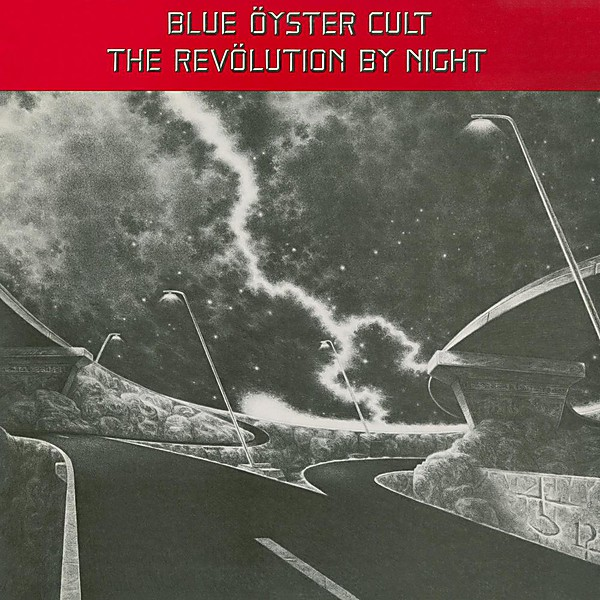

# The Revölution by Night

By **Blue Öyster Cult**

## Album Data

- **Catalog:** Beets
- **Format:** Digital, Album
- **Album:** The Revölution by Night
- **Artist:** Blue Öyster Cult
- **Albumartist:** Blue Öyster Cult
- **Genre:** Rock And Roll
- **MusicBrainz Album Artist ID:** [c7423e0c-ab3e-4ab4-be10-cdff5a9d3062](https://musicbrainz.org/artist/c7423e0c-ab3e-4ab4-be10-cdff5a9d3062)
- **MusicBrainz Album ID:** [6fe787ed-760f-4e4c-b53f-a082792c79f2](https://musicbrainz.org/release/6fe787ed-760f-4e4c-b53f-a082792c79f2)
- **MusicBrainz Release Group ID:** [7c995ff8-2db7-33cd-8505-ec2e1ab12403](https://musicbrainz.org/release-group/7c995ff8-2db7-33cd-8505-ec2e1ab12403)
- **Year:** 1983
- **Catalog #:** COL 502235 2
- **Label:** Columbia
- **Total Tracks:** 12

## Album Tracks

### Track 01 - The Red & The Black

- **Artist:** Blue Öyster Cult
- **Format:** ALAC
- **Genre:** Psychedelic Rock
- **Length:** 4:23
- **MusicBrainz Track ID:** [a03e28d0-1977-43a4-a855-c514388bbfd4](https://musicbrainz.org/recording/a03e28d0-1977-43a4-a855-c514388bbfd4)
- **Title:** The Red & The Black
- **Track:** 01
- **Year:** 2001

### Track 02 - O.D.’d on Life Itself

- **Artist:** Blue Öyster Cult
- **Format:** ALAC
- **Genre:** Heavy Metal
- **Length:** 4:47
- **MusicBrainz Track ID:** [73cb66fa-d144-4722-823f-2fc2e8523719](https://musicbrainz.org/recording/73cb66fa-d144-4722-823f-2fc2e8523719)
- **Title:** O.D.’d on Life Itself
- **Track:** 02
- **Year:** 2001

### Track 03 - Hot Rails to Hell

- **Artist:** Blue Öyster Cult
- **Format:** ALAC
- **Genre:** Heavy Metal
- **Length:** 5:11
- **MusicBrainz Track ID:** [2d06aef6-fa2a-44a3-a1f4-46037b919f5d](https://musicbrainz.org/recording/2d06aef6-fa2a-44a3-a1f4-46037b919f5d)
- **Title:** Hot Rails to Hell
- **Track:** 03
- **Year:** 2001

### Track 04 - 7 Screaming Diz-Busters

- **Artist:** Blue Öyster Cult
- **Format:** ALAC
- **Genre:** Speed Metal
- **Length:** 7:01
- **MusicBrainz Track ID:** [5b4c4109-74f0-48cb-8171-b49b6b884e82](https://musicbrainz.org/recording/5b4c4109-74f0-48cb-8171-b49b6b884e82)
- **Title:** 7 Screaming Diz-Busters
- **Track:** 04
- **Year:** 2001

### Track 05 - Baby Ice Dog

- **Artist:** Blue Öyster Cult
- **Format:** ALAC
- **Genre:** Heavy Metal
- **Length:** 3:28
- **MusicBrainz Track ID:** [73ec1847-c270-40c4-9740-a24771735391](https://musicbrainz.org/recording/73ec1847-c270-40c4-9740-a24771735391)
- **Title:** Baby Ice Dog
- **Track:** 05
- **Year:** 2001

### Track 06 - Wings Wetted Down

- **Artist:** Blue Öyster Cult
- **Format:** ALAC
- **Genre:** Progressive Rock
- **Length:** 4:12
- **MusicBrainz Track ID:** [d9d1950c-020e-4b51-89c2-ddde02d9f008](https://musicbrainz.org/recording/d9d1950c-020e-4b51-89c2-ddde02d9f008)
- **Title:** Wings Wetted Down
- **Track:** 06
- **Year:** 2001

### Track 07 - Teen Archer

- **Artist:** Blue Öyster Cult
- **Format:** ALAC
- **Genre:** Progressive Rock
- **Length:** 3:57
- **MusicBrainz Track ID:** [2eccfbc4-708b-4fb0-98bb-c49f6e5e946b](https://musicbrainz.org/recording/2eccfbc4-708b-4fb0-98bb-c49f6e5e946b)
- **Title:** Teen Archer
- **Track:** 07
- **Year:** 2001

### Track 08 - Mistress of the Salmon Salt (Quicklime Girl)

- **Artist:** Blue Öyster Cult
- **Format:** ALAC
- **Genre:** Psychedelic Rock
- **Length:** 5:08
- **MusicBrainz Track ID:** [f8bf57be-3615-4d74-9feb-395e3b61123e](https://musicbrainz.org/recording/f8bf57be-3615-4d74-9feb-395e3b61123e)
- **Title:** Mistress of the Salmon Salt (Quicklime Girl)
- **Track:** 08
- **Year:** 2001

### Track 09 - Cities on Flame With Rock and Roll (live)

- **Artist:** Blue Öyster Cult
- **Format:** ALAC
- **Genre:** Heavy Metal
- **Length:** 4:44
- **MusicBrainz Track ID:** [7200ae52-5056-48a0-b2c6-37e899719567](https://musicbrainz.org/recording/7200ae52-5056-48a0-b2c6-37e899719567)
- **Title:** Cities on Flame With Rock and Roll (live)
- **Track:** 09
- **Year:** 2001

### Track 10 - Buck’s Boogie (studio version)

- **Artist:** Blue Öyster Cult
- **Format:** ALAC
- **Genre:** Heavy Metal
- **Length:** 5:21
- **MusicBrainz Track ID:** [d4fae762-182b-44cf-bad6-52b50ccfe02a](https://musicbrainz.org/recording/d4fae762-182b-44cf-bad6-52b50ccfe02a)
- **Title:** Buck’s Boogie (studio version)
- **Track:** 10
- **Year:** 2001

### Track 11 - 7 Screaming Diz-Busters (live)

- **Artist:** Blue Öyster Cult
- **Format:** ALAC
- **Genre:** Progressive Rock
- **Length:** 14:00
- **MusicBrainz Track ID:** [82377c0b-27fb-4682-a5ad-c9db4adc1d4f](https://musicbrainz.org/recording/82377c0b-27fb-4682-a5ad-c9db4adc1d4f)
- **Title:** 7 Screaming Diz-Busters (live)
- **Track:** 11
- **Year:** 2001

### Track 12 - O.D.’d on Life Itself (live)

- **Artist:** Blue Öyster Cult
- **Format:** ALAC
- **Genre:** Heavy Metal
- **Length:** 4:52
- **MusicBrainz Track ID:** [0c2f7f98-10dd-4cd1-a8a9-621f99b54f08](https://musicbrainz.org/recording/0c2f7f98-10dd-4cd1-a8a9-621f99b54f08)
- **Title:** O.D.’d on Life Itself (live)
- **Track:** 12
- **Year:** 2001

