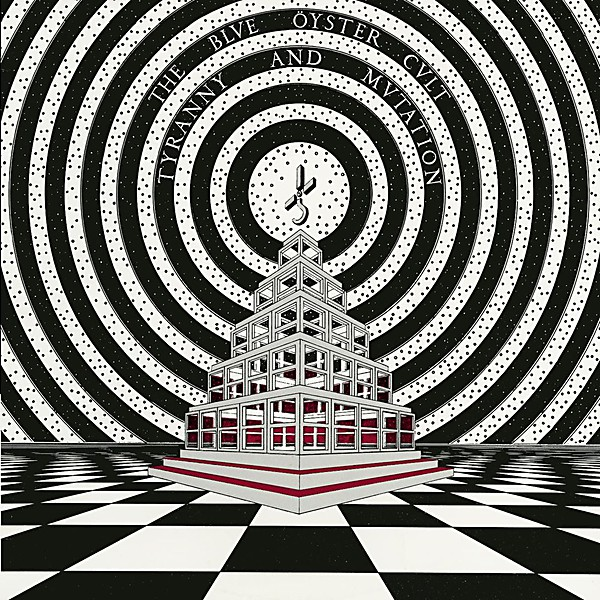

# Tyranny and Mutation

By **Blue Öyster Cult**

## Album Data

- **Catalog:** Beets
- **Format:** Digital, Album
- **Album:** Tyranny and Mutation
- **Artist:** Blue Öyster Cult
- **Albumartist:** Blue Öyster Cult
- **Genre:** Heavy Metal
- **MusicBrainz Album Artist ID:** [c7423e0c-ab3e-4ab4-be10-cdff5a9d3062](https://musicbrainz.org/artist/c7423e0c-ab3e-4ab4-be10-cdff5a9d3062)
- **MusicBrainz Album ID:** [f1bb29f7-1d0c-4bd7-bb3e-97a86a194827](https://musicbrainz.org/release/f1bb29f7-1d0c-4bd7-bb3e-97a86a194827)
- **MusicBrainz Release Group ID:** [bf03b3c6-0b14-3492-bbcc-0ba570eb46ab](https://musicbrainz.org/release-group/bf03b3c6-0b14-3492-bbcc-0ba570eb46ab)
- **Year:** 2001
- **Catalog #:** COL 502235 2
- **Label:** Columbia
- **Total Tracks:** 12

## Album Tracks

### Track 01 - The Red & The Black

- **Artist:** Blue Öyster Cult
- **Format:** ALAC
- **Genre:** Psychedelic Rock
- **Length:** 4:23
- **MusicBrainz Track ID:** [a03e28d0-1977-43a4-a855-c514388bbfd4](https://musicbrainz.org/recording/a03e28d0-1977-43a4-a855-c514388bbfd4)
- **Title:** The Red & The Black
- **Track:** 01
- **Year:** 2001

### Track 02 - O.D.’d on Life Itself

- **Artist:** Blue Öyster Cult
- **Format:** ALAC
- **Genre:** Heavy Metal
- **Length:** 4:47
- **MusicBrainz Track ID:** [73cb66fa-d144-4722-823f-2fc2e8523719](https://musicbrainz.org/recording/73cb66fa-d144-4722-823f-2fc2e8523719)
- **Title:** O.D.’d on Life Itself
- **Track:** 02
- **Year:** 2001

### Track 03 - Hot Rails to Hell

- **Artist:** Blue Öyster Cult
- **Format:** ALAC
- **Genre:** Heavy Metal
- **Length:** 5:11
- **MusicBrainz Track ID:** [2d06aef6-fa2a-44a3-a1f4-46037b919f5d](https://musicbrainz.org/recording/2d06aef6-fa2a-44a3-a1f4-46037b919f5d)
- **Title:** Hot Rails to Hell
- **Track:** 03
- **Year:** 2001

### Track 04 - 7 Screaming Diz-Busters

- **Artist:** Blue Öyster Cult
- **Format:** ALAC
- **Genre:** Speed Metal
- **Length:** 7:01
- **MusicBrainz Track ID:** [5b4c4109-74f0-48cb-8171-b49b6b884e82](https://musicbrainz.org/recording/5b4c4109-74f0-48cb-8171-b49b6b884e82)
- **Title:** 7 Screaming Diz-Busters
- **Track:** 04
- **Year:** 2001

### Track 05 - Baby Ice Dog

- **Artist:** Blue Öyster Cult
- **Format:** ALAC
- **Genre:** Heavy Metal
- **Length:** 3:28
- **MusicBrainz Track ID:** [73ec1847-c270-40c4-9740-a24771735391](https://musicbrainz.org/recording/73ec1847-c270-40c4-9740-a24771735391)
- **Title:** Baby Ice Dog
- **Track:** 05
- **Year:** 2001

### Track 06 - Wings Wetted Down

- **Artist:** Blue Öyster Cult
- **Format:** ALAC
- **Genre:** Progressive Rock
- **Length:** 4:12
- **MusicBrainz Track ID:** [d9d1950c-020e-4b51-89c2-ddde02d9f008](https://musicbrainz.org/recording/d9d1950c-020e-4b51-89c2-ddde02d9f008)
- **Title:** Wings Wetted Down
- **Track:** 06
- **Year:** 2001

### Track 07 - Teen Archer

- **Artist:** Blue Öyster Cult
- **Format:** ALAC
- **Genre:** Progressive Rock
- **Length:** 3:57
- **MusicBrainz Track ID:** [2eccfbc4-708b-4fb0-98bb-c49f6e5e946b](https://musicbrainz.org/recording/2eccfbc4-708b-4fb0-98bb-c49f6e5e946b)
- **Title:** Teen Archer
- **Track:** 07
- **Year:** 2001

### Track 08 - Mistress of the Salmon Salt (Quicklime Girl)

- **Artist:** Blue Öyster Cult
- **Format:** ALAC
- **Genre:** Psychedelic Rock
- **Length:** 5:08
- **MusicBrainz Track ID:** [f8bf57be-3615-4d74-9feb-395e3b61123e](https://musicbrainz.org/recording/f8bf57be-3615-4d74-9feb-395e3b61123e)
- **Title:** Mistress of the Salmon Salt (Quicklime Girl)
- **Track:** 08
- **Year:** 2001

### Track 09 - Cities on Flame With Rock and Roll (live)

- **Artist:** Blue Öyster Cult
- **Format:** ALAC
- **Genre:** Heavy Metal
- **Length:** 4:44
- **MusicBrainz Track ID:** [7200ae52-5056-48a0-b2c6-37e899719567](https://musicbrainz.org/recording/7200ae52-5056-48a0-b2c6-37e899719567)
- **Title:** Cities on Flame With Rock and Roll (live)
- **Track:** 09
- **Year:** 2001

### Track 10 - Buck’s Boogie (studio version)

- **Artist:** Blue Öyster Cult
- **Format:** ALAC
- **Genre:** Heavy Metal
- **Length:** 5:21
- **MusicBrainz Track ID:** [d4fae762-182b-44cf-bad6-52b50ccfe02a](https://musicbrainz.org/recording/d4fae762-182b-44cf-bad6-52b50ccfe02a)
- **Title:** Buck’s Boogie (studio version)
- **Track:** 10
- **Year:** 2001

### Track 11 - 7 Screaming Diz-Busters (live)

- **Artist:** Blue Öyster Cult
- **Format:** ALAC
- **Genre:** Progressive Rock
- **Length:** 14:00
- **MusicBrainz Track ID:** [82377c0b-27fb-4682-a5ad-c9db4adc1d4f](https://musicbrainz.org/recording/82377c0b-27fb-4682-a5ad-c9db4adc1d4f)
- **Title:** 7 Screaming Diz-Busters (live)
- **Track:** 11
- **Year:** 2001

### Track 12 - O.D.’d on Life Itself (live)

- **Artist:** Blue Öyster Cult
- **Format:** ALAC
- **Genre:** Heavy Metal
- **Length:** 4:52
- **MusicBrainz Track ID:** [0c2f7f98-10dd-4cd1-a8a9-621f99b54f08](https://musicbrainz.org/recording/0c2f7f98-10dd-4cd1-a8a9-621f99b54f08)
- **Title:** O.D.’d on Life Itself (live)
- **Track:** 12
- **Year:** 2001

## See also

- [Agents of Fortune](Agents_of_Fortune.md)
- [Blue Öyster Cult](Blue_Öyster_Cult.md)
- [Club Ninja](Club_Ninja.md)
- [Cultösaurus Erectus](Cultösaurus_Erectus.md)
- [Extraterrestrial Live](Extraterrestrial_Live.md)
- [Fire of Unknown Origin](Fire_of_Unknown_Origin.md)
- [Harvester of Lives](Harvester_of_Lives.md)
- [Imaginos](Imaginos.md)
- [Mirrors](Mirrors.md)
- [On Your Feet or on Your Knees](On_Your_Feet_or_on_Your_Knees.md)
- [Radios Appear](Radios_Appear.md)
- [Rarities](Rarities.md)
- [Secret Treaties](Secret_Treaties.md)
- [Some Enchanted Evening](Some_Enchanted_Evening.md)
- [Spectres](Spectres.md)
- [The Revölution by Night](The_Revölution_by_Night.md)
- [CD: Agents Of Fortune](../../CD/Blue_Öyster_Cult/Agents_Of_Fortune.md)
- [CD: ](../../CD/Blue_Öyster_Cult/Blue_Öyster_Cult_index.md)
- [CD: Blue Öyster Cult](../../CD/Blue_Öyster_Cult/Blue_Öyster_Cult.md)
- [CD: Club Ninja](../../CD/Blue_Öyster_Cult/Club_Ninja.md)
- [CD: Extraterrestrial Live](../../CD/Blue_Öyster_Cult/Extraterrestrial_Live.md)
- [CD: Imaginos](../../CD/Blue_Öyster_Cult/Imaginos.md)
- [CD: Radios Appear](../../CD/Blue_Öyster_Cult/Radios_Appear-_The_Best_Of_Broadcasts.md)
- [CD: Rarities](../../CD/Blue_Öyster_Cult/Rarities.md)
- [CD: Secret Treaties](../../CD/Blue_Öyster_Cult/Secret_Treaties.md)
- [CD: Some Enchanted Evening](../../CD/Blue_Öyster_Cult/Some_Enchanted_Evening.md)
- [CD: Spectres](../../CD/Blue_Öyster_Cult/Spectres.md)
- [CD: The Columbia Albums Collection (Disc 10)](../../CD/Blue_Öyster_Cult/The_Columbia_Albums_Collection_Disc_10.md)
- [CD: The Columbia Albums Collection (Disc 12)](../../CD/Blue_Öyster_Cult/The_Columbia_Albums_Collection_Disc_12.md)
- [CD: The Columbia Albums Collection (Disc 4)](../../CD/Blue_Öyster_Cult/The_Columbia_Albums_Collection_Disc_4.md)
- [CD: The Columbia Albums Collection (Disc 8)](../../CD/Blue_Öyster_Cult/The_Columbia_Albums_Collection_Disc_8.md)
- [CD: The Columbia Albums Collection (Disc 9)](../../CD/Blue_Öyster_Cult/The_Columbia_Albums_Collection_Disc_9.md)
- [CD: Tyranny & Mutation](../../CD/Blue_Öyster_Cult/Tyranny_and_Mutation.md)
- [Roon: 40th Anniversary - Agents Of Fortune - Live 2016 (Live)](../../Roon/Blue_Öyster_Cult/40th_Anniversary_-_Agents_Of_Fortune_-_Live_2016_Live.md)
- [Roon: Blue Oyster Cult](../../Roon/Blue_Öyster_Cult/Blue_Oyster_Cult.md)
- [Roon: Cultosaurus Erectus](../../Roon/Blue_Öyster_Cult/Cultosaurus_Erectus.md)
- [Roon: Fire Of Unknown Origin](../../Roon/Blue_Öyster_Cult/Fire_Of_Unknown_Origin.md)
- [Roon: Imaginos](../../Roon/Blue_Öyster_Cult/Imaginos.md)
- [Roon: Mirrors](../../Roon/Blue_Öyster_Cult/Mirrors.md)
- [Roon: On Your Feet Or On Your Knees (Live)](../../Roon/Blue_Öyster_Cult/On_Your_Feet_Or_On_Your_Knees_Live.md)
- [Roon: Rarities](../../Roon/Blue_Öyster_Cult/Rarities.md)
- [Roon: Secret Treaties](../../Roon/Blue_Öyster_Cult/Secret_Treaties.md)
- [Roon: Some Enchanted Evening (Live)](../../Roon/Blue_Öyster_Cult/Some_Enchanted_Evening_Live.md)
- [Roon: Spectres](../../Roon/Blue_Öyster_Cult/Spectres.md)
- [Roon: The Revolution By Night](../../Roon/Blue_Öyster_Cult/The_Revolution_By_Night.md)
- [Roon: Tyranny And Mutation](../../Roon/Blue_Öyster_Cult/Tyranny_And_Mutation.md)
- [Vinyl: Agents Of Fortune](../../Vinyl/Blue_Öyster_Cult/Agents_Of_Fortune.md)
- [Vinyl: ](../../Vinyl/Blue_Öyster_Cult/Blue_Öyster_Cult.md)
- [Vinyl: Secret Treaties](../../Vinyl/Blue_Öyster_Cult/Secret_Treaties.md)
- [Vinyl: Tyranny And Mutation](../../Vinyl/Blue_Öyster_Cult/Tyranny_And_Mutation.md)
