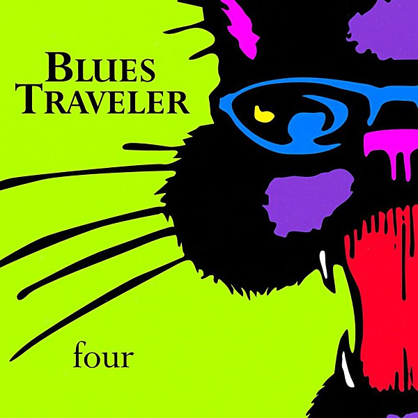

# four

By **Blues Traveler**

## Album Data

- **Catalog:** Beets
- **Format:** Digital, Album
- **Album:** four
- **Artist:** Blues Traveler
- **Albumartist:** Blues Traveler
- **Genre:** Southern Rock
- **MusicBrainz Album Artist ID:** [6b28ecf0-94e6-48bb-aa2a-5ede325b675b](https://musicbrainz.org/artist/6b28ecf0-94e6-48bb-aa2a-5ede325b675b)
- **MusicBrainz Album ID:** [365f2bc6-b56c-460c-9ce9-cde7bb27e46d](https://musicbrainz.org/release/365f2bc6-b56c-460c-9ce9-cde7bb27e46d)
- **MusicBrainz Release Group ID:** [32c5e894-7670-379e-929b-84014fd8f054](https://musicbrainz.org/release-group/32c5e894-7670-379e-929b-84014fd8f054)
- **Year:** 1994
- **Catalog #:** [none]
- **Label:** A&M Records
- **Total Tracks:** 12

## Album Tracks

### Track 01 - Run-Around

- **Artist:** Blues Traveler
- **Format:** MP3
- **Genre:** Alternative Rock
- **Length:** 4:39
- **MusicBrainz Track ID:** [3cdf1ef8-1659-476b-912b-3753b860c466](https://musicbrainz.org/recording/3cdf1ef8-1659-476b-912b-3753b860c466)
- **Title:** Run-Around
- **Track:** 01
- **Year:** 1994

### Track 02 - Stand

- **Artist:** Blues Traveler
- **Format:** MP3
- **Genre:** Uk Garage
- **Length:** 5:18
- **MusicBrainz Track ID:** [94aa327d-2072-48e3-bdc1-fc7147f86468](https://musicbrainz.org/recording/94aa327d-2072-48e3-bdc1-fc7147f86468)
- **Title:** Stand
- **Track:** 02
- **Year:** 1994

### Track 03 - Look Around

- **Artist:** Blues Traveler
- **Format:** MP3
- **Genre:** Rock
- **Length:** 5:41
- **MusicBrainz Track ID:** [1dd6d64d-f007-4fb1-8a5e-0a2261993876](https://musicbrainz.org/recording/1dd6d64d-f007-4fb1-8a5e-0a2261993876)
- **Title:** Look Around
- **Track:** 03
- **Year:** 1994

### Track 04 - Fallible

- **Artist:** Blues Traveler
- **Format:** MP3
- **Genre:** Rock
- **Length:** 4:46
- **MusicBrainz Track ID:** [d9804b1c-a594-43c7-8f1e-e3fac6d1b90e](https://musicbrainz.org/recording/d9804b1c-a594-43c7-8f1e-e3fac6d1b90e)
- **Title:** Fallible
- **Track:** 04
- **Year:** 1994

### Track 05 - The Mountains Win Again

- **Artist:** Blues Traveler
- **Format:** MP3
- **Genre:** Rock
- **Length:** 5:05
- **MusicBrainz Track ID:** [29236965-cb04-4a6d-b0c5-e7a7ac4e5e68](https://musicbrainz.org/recording/29236965-cb04-4a6d-b0c5-e7a7ac4e5e68)
- **Title:** The Mountains Win Again
- **Track:** 05
- **Year:** 1994

### Track 06 - Freedom

- **Artist:** Blues Traveler
- **Format:** MP3
- **Genre:** Hard Rock
- **Length:** 4:01
- **MusicBrainz Track ID:** [8373ada3-1baf-470c-91aa-6e21edb92975](https://musicbrainz.org/recording/8373ada3-1baf-470c-91aa-6e21edb92975)
- **Title:** Freedom
- **Track:** 06
- **Year:** 1994

### Track 07 - Crash & Burn

- **Artist:** Blues Traveler
- **Format:** MP3
- **Genre:** Rock
- **Length:** 2:59
- **MusicBrainz Track ID:** [9a2a2269-1c57-4b02-9023-f9956a34ba25](https://musicbrainz.org/recording/9a2a2269-1c57-4b02-9023-f9956a34ba25)
- **Title:** Crash & Burn
- **Track:** 07
- **Year:** 1994

### Track 08 - Price to Pay

- **Artist:** Blues Traveler
- **Format:** MP3
- **Genre:** Rock
- **Length:** 5:16
- **MusicBrainz Track ID:** [001c5656-b746-474e-b23e-df55ff651aa8](https://musicbrainz.org/recording/001c5656-b746-474e-b23e-df55ff651aa8)
- **Title:** Price to Pay
- **Track:** 08
- **Year:** 1994

### Track 09 - Hook

- **Artist:** Blues Traveler
- **Format:** MP3
- **Genre:** Alternative Rock
- **Length:** 4:49
- **MusicBrainz Track ID:** [c3b070b3-3f29-4254-857a-577b7cb1821e](https://musicbrainz.org/recording/c3b070b3-3f29-4254-857a-577b7cb1821e)
- **Title:** Hook
- **Track:** 09
- **Year:** 1994

### Track 10 - The Good, the Bad and the Ugly

- **Artist:** Blues Traveler
- **Format:** MP3
- **Genre:** Blues
- **Length:** 1:55
- **MusicBrainz Track ID:** [88bdded6-fc6c-479d-b1d4-c2730fb157b6](https://musicbrainz.org/recording/88bdded6-fc6c-479d-b1d4-c2730fb157b6)
- **Title:** The Good, the Bad and the Ugly
- **Track:** 10
- **Year:** 1994

### Track 11 - Just Wait

- **Artist:** Blues Traveler
- **Format:** MP3
- **Genre:** Rock
- **Length:** 5:34
- **MusicBrainz Track ID:** [9a2bbe13-6aaf-4056-b2bf-0a1e0ce5794d](https://musicbrainz.org/recording/9a2bbe13-6aaf-4056-b2bf-0a1e0ce5794d)
- **Title:** Just Wait
- **Track:** 11
- **Year:** 1994

### Track 12 - Brother John

- **Artist:** Blues Traveler
- **Format:** MP3
- **Genre:** Rock
- **Length:** 6:37
- **MusicBrainz Track ID:** [3ec278ce-66e9-4c06-bfe4-15dcfd167706](https://musicbrainz.org/recording/3ec278ce-66e9-4c06-bfe4-15dcfd167706)
- **Title:** Brother John
- **Track:** 12
- **Year:** 1994

