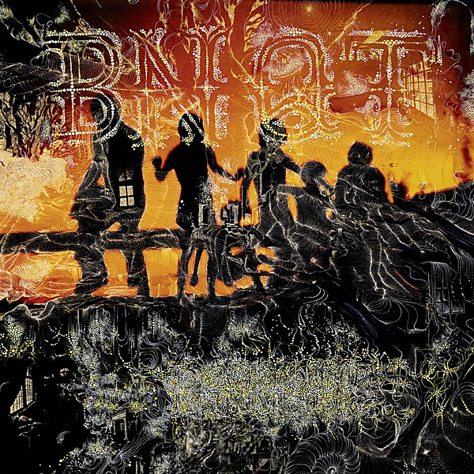

# Volume 1

By **BNQT**

## Album Data

- **Catalog:** Beets
- **Format:** Digital, Album
- **Album:** Volume 1
- **Artist:** Bnqt
- **Albumartist:** BNQT
- **Genre:** Indie Rock
- **MusicBrainz Album Artist ID:** [d40b93f9-e9c2-4a81-b2c5-9cc77ad080f0](https://musicbrainz.org/artist/d40b93f9-e9c2-4a81-b2c5-9cc77ad080f0)
- **MusicBrainz Album ID:** [9ac8115f-be2e-41b8-a929-a8a7d655a861](https://musicbrainz.org/release/9ac8115f-be2e-41b8-a929-a8a7d655a861)
- **MusicBrainz Release Group ID:** [6b45fb7c-e3b2-4792-b753-c5decb23c9d1](https://musicbrainz.org/release-group/6b45fb7c-e3b2-4792-b753-c5decb23c9d1)
- **Year:** 2017
- **Catalog #:** 
- **Label:** Bella Union
- **Total Tracks:** 10

## Album Tracks

### Track 01 - Restart

- **Artist:** BNQT
- **Format:** MP3
- **Genre:** Glam Rock
- **Length:** 4:26
- **MusicBrainz Track ID:** [a3959c6b-b649-48b2-a4d8-209f838fc0da](https://musicbrainz.org/recording/a3959c6b-b649-48b2-a4d8-209f838fc0da)
- **Title:** Restart
- **Track:** 01
- **Year:** 2017

### Track 02 - Unlikely Force

- **Artist:** BNQT
- **Format:** MP3
- **Genre:** Indie Rock
- **Length:** 4:06
- **MusicBrainz Track ID:** [763108c1-47a8-48fa-a019-4fc8b7deda0d](https://musicbrainz.org/recording/763108c1-47a8-48fa-a019-4fc8b7deda0d)
- **Title:** Unlikely Force
- **Track:** 02
- **Year:** 2017

### Track 03 - 100 Million Miles

- **Artist:** BNQT
- **Format:** MP3
- **Genre:** Indie Rock
- **Length:** 5:33
- **MusicBrainz Track ID:** [42146c22-6247-43e3-8a64-6ae9d2f0b67d](https://musicbrainz.org/recording/42146c22-6247-43e3-8a64-6ae9d2f0b67d)
- **Title:** 100 Million Miles
- **Track:** 03
- **Year:** 2017

### Track 04 - Mind of a Man

- **Artist:** BNQT
- **Format:** MP3
- **Genre:** Indie Rock
- **Length:** 3:55
- **MusicBrainz Track ID:** [1d23831f-210c-4e81-9a55-8f6296b3fb93](https://musicbrainz.org/recording/1d23831f-210c-4e81-9a55-8f6296b3fb93)
- **Title:** Mind of a Man
- **Track:** 04
- **Year:** 2017

### Track 05 - Hey Banana

- **Artist:** BNQT
- **Format:** MP3
- **Genre:** Indie Rock
- **Length:** 3:50
- **MusicBrainz Track ID:** [2ef756ea-b52d-4317-9c13-5dc179ceb472](https://musicbrainz.org/recording/2ef756ea-b52d-4317-9c13-5dc179ceb472)
- **Title:** Hey Banana
- **Track:** 05
- **Year:** 2017

### Track 06 - Real Love

- **Artist:** BNQT
- **Format:** MP3
- **Genre:** Indie Rock
- **Length:** 3:24
- **MusicBrainz Track ID:** [7fbc35db-eaa3-4040-8e42-f86d21392073](https://musicbrainz.org/recording/7fbc35db-eaa3-4040-8e42-f86d21392073)
- **Title:** Real Love
- **Track:** 06
- **Year:** 2017

### Track 07 - Failing at Feeling

- **Artist:** BNQT
- **Format:** MP3
- **Genre:** Indie Rock
- **Length:** 4:28
- **MusicBrainz Track ID:** [5b0d5a54-2828-494e-8e9c-c151da0b8cf0](https://musicbrainz.org/recording/5b0d5a54-2828-494e-8e9c-c151da0b8cf0)
- **Title:** Failing at Feeling
- **Track:** 07
- **Year:** 2017

### Track 08 - L.A. On My Mind

- **Artist:** BNQT
- **Format:** MP3
- **Genre:** Indie Rock
- **Length:** 3:41
- **MusicBrainz Track ID:** [977dc725-4180-4164-83e0-2f322e59b865](https://musicbrainz.org/recording/977dc725-4180-4164-83e0-2f322e59b865)
- **Title:** L.A. On My Mind
- **Track:** 08
- **Year:** 2017

### Track 09 - Tara

- **Artist:** BNQT
- **Format:** MP3
- **Genre:** Indie Rock
- **Length:** 4:12
- **MusicBrainz Track ID:** [9b7430ac-11c6-49df-af5b-f52f29549d4e](https://musicbrainz.org/recording/9b7430ac-11c6-49df-af5b-f52f29549d4e)
- **Title:** Tara
- **Track:** 09
- **Year:** 2017

### Track 10 - Fighting the World

- **Artist:** BNQT
- **Format:** MP3
- **Genre:** Indie Rock
- **Length:** 4:58
- **MusicBrainz Track ID:** [6ffad181-2f1b-4772-8dd5-8f8e8ca1df31](https://musicbrainz.org/recording/6ffad181-2f1b-4772-8dd5-8f8e8ca1df31)
- **Title:** Fighting the World
- **Track:** 10
- **Year:** 2017

