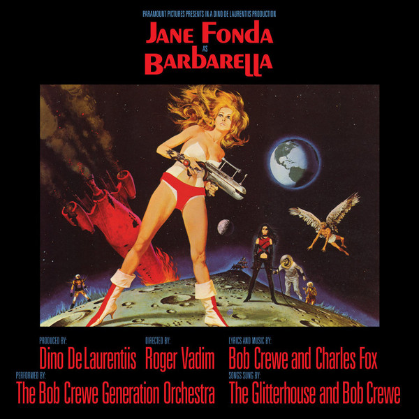

# Barbarella

By **Bob Crewe & Charles Fox**

## Album Data

- **Catalog:** Beets
- **Format:** Digital, Album
- **Album:** Barbarella
- **Artist:** Bob Crewe & Charles Fox
- **Albumartist:** Bob Crewe & Charles Fox
- **Genre:** Easy Listening
- **MusicBrainz Album Artist ID:** 
- **MusicBrainz Album ID:** 
- **MusicBrainz Release Group ID:** 
- **Year:** 1968
- **Catalog #:** 
- **Label:** 
- **Total Tracks:** 00

## Album Tracks

### Track 01 - Barbarella

- **Artist:** Bob Crewe & Charles Fox
- **Format:** MP3
- **Genre:** Space Age Pop
- **Length:** 2:40
- **MusicBrainz Track ID:** 
- **Title:** Barbarella
- **Track:** 01
- **Year:** 1968

### Track 02 - Goodnight Alfie

- **Artist:** Bob Crewe & Charles Fox
- **Format:** MP3
- **Genre:** Easy Listening
- **Length:** 1:28
- **MusicBrainz Track ID:** 
- **Title:** Goodnight Alfie
- **Track:** 02
- **Year:** 1968

### Track 04 - Intro Ski ride

- **Artist:** Bob Crewe & Charles Fox
- **Format:** MP3
- **Genre:** Easy Listening
- **Length:** 1:16
- **MusicBrainz Track ID:** 
- **Title:** Intro Ski ride
- **Track:** 04
- **Year:** 1968

### Track 05 - Ski Ride

- **Artist:** Bob Crewe & Charles Fox
- **Format:** MP3
- **Genre:** Easy Listening
- **Length:** 0:41
- **MusicBrainz Track ID:** 
- **Title:** Ski Ride
- **Track:** 05
- **Year:** 1968

### Track 08 - Pygar Finds Barbarella

- **Artist:** Bob Crewe & Charles Fox
- **Format:** MP3
- **Genre:** Easy Listening
- **Length:** 1:15
- **MusicBrainz Track ID:** 
- **Title:** Pygar Finds Barbarella
- **Track:** 08
- **Year:** 1968

### Track 14 - Hello Pretty Pretty

- **Artist:** Bob Crewe & Charles Fox
- **Format:** MP3
- **Genre:** Easy Listening
- **Length:** 0:58
- **MusicBrainz Track ID:** 
- **Title:** Hello Pretty Pretty
- **Track:** 14
- **Year:** 1968

### Track 15 - Pygar's Persecution

- **Artist:** Bob Crewe & Charles Fox
- **Format:** MP3
- **Genre:** Easy Listening
- **Length:** 1:07
- **MusicBrainz Track ID:** 
- **Title:** Pygar's Persecution
- **Track:** 15
- **Year:** 1968

### Track 18 - Smoke (Viper Vapor)

- **Artist:** Bob Crewe & Charles Fox
- **Format:** MP3
- **Genre:** Easy Listening
- **Length:** 2:16
- **MusicBrainz Track ID:** 
- **Title:** Smoke (Viper Vapor)
- **Track:** 18
- **Year:** 1968

### Track 19 - The Sex Machine

- **Artist:** Bob Crewe & Charles Fox
- **Format:** MP3
- **Genre:** Easy Listening
- **Length:** 3:15
- **MusicBrainz Track ID:** 
- **Title:** The Sex Machine
- **Track:** 19
- **Year:** 1968

