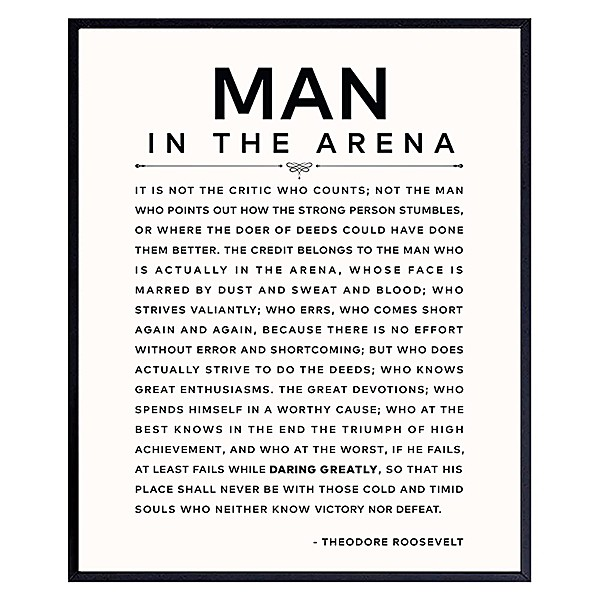

# Live At The 34th New Orleans Jazz & Heritage Festival

By **Bob Dylan**

## Album Data

- **Catalog:** Beets
- **Format:** Digital, Album
- **Album:** Live At The 34th New Orleans Jazz & Heritage Festival
- **Artist:** Bob Dylan
- **Albumartist:** Bob Dylan
- **Genre:** Folk Rock
- **MusicBrainz Album Artist ID:** 
- **MusicBrainz Album ID:** 
- **MusicBrainz Release Group ID:** 
- **Year:** 2003
- **Catalog #:** 
- **Label:** 
- **Total Tracks:** 00

## Album Tracks

### Track 08 - It Ain't Me, Babe

- **Artist:** Johnny & June Carter Cash
- **Format:** MP3
- **Genre:** Folk Rock
- **Length:** 1:48
- **MusicBrainz Track ID:** 
- **Title:** It Ain't Me, Babe
- **Track:** 08
- **Year:** 0000

## See also

- [Desire](Desire.md)
- [The 30th Anniversary Concert Celebration - Disc 1](The_30th_Anniversary_Concert_Celebration_-_Disc_1.md)
- [The Best of Bob Dylan](The_Best_of_Bob_Dylan.md)
- [The Freewheelin' Bob Dylan](The_Freewheelin_Bob_Dylan.md)
- [Roon: Blood On The Tracks](../../Roon/Bob_Dylan/Blood_On_The_Tracks.md)
- [Roon: Desire](../../Roon/Bob_Dylan/Desire.md)
- [Roon: Oh Mercy](../../Roon/Bob_Dylan/Oh_Mercy.md)
- [Vinyl: ](../../Vinyl/Bob_Dylan/Bob_Dylan.md)
- [Vinyl: Self Portrait](../../Vinyl/Bob_Dylan/Self_Portrait.md)
