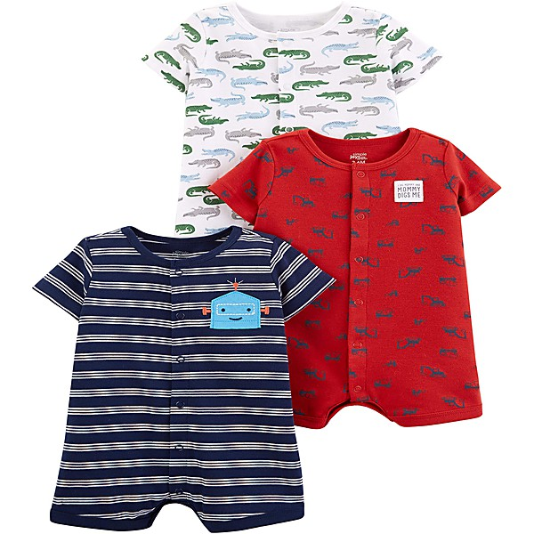

# The 30th Anniversary Concert Celebration - Disc 1

By **Bob Dylan**

## Album Data

- **Catalog:** Beets
- **Format:** Digital, Album
- **Album:** The 30th Anniversary Concert Celebration - Disc 1
- **Artist:** Bob Dylan
- **Albumartist:** Bob Dylan
- **Genre:** Folk Rock
- **MusicBrainz Album Artist ID:** 
- **MusicBrainz Album ID:** 
- **MusicBrainz Release Group ID:** 
- **Year:** 0000
- **Catalog #:** 
- **Label:** 
- **Total Tracks:** 00

## Album Tracks

### Track 06 - A Hard Rain's A-gonna Fall

- **Artist:** Bob Dylan
- **Format:** AAC
- **Genre:** Folk Rock
- **Length:** 6:53
- **MusicBrainz Track ID:** 
- **Title:** A Hard Rain's A-gonna Fall
- **Track:** 06
- **Year:** 1999

## See also

- [Desire](Desire.md)
- [Live At The 34th New Orleans Jazz & Heritage Festival](Live_At_The_34th_New_Orleans_Jazz_and_Heritage_Festival.md)
- [The Best of Bob Dylan](The_Best_of_Bob_Dylan.md)
- [The Freewheelin' Bob Dylan](The_Freewheelin_Bob_Dylan.md)
- [Roon: Blood On The Tracks](../../Roon/Bob_Dylan/Blood_On_The_Tracks.md)
- [Roon: Desire](../../Roon/Bob_Dylan/Desire.md)
- [Roon: Oh Mercy](../../Roon/Bob_Dylan/Oh_Mercy.md)
- [Vinyl: ](../../Vinyl/Bob_Dylan/Bob_Dylan.md)
- [Vinyl: Self Portrait](../../Vinyl/Bob_Dylan/Self_Portrait.md)
