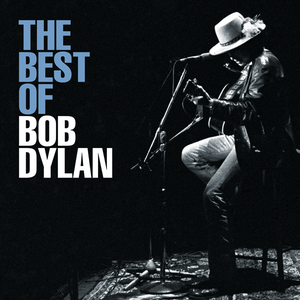

# The Best of Bob Dylan

By **Bob Dylan**

## Album Data

- **Catalog:** Beets
- **Format:** Digital, Album
- **Album:** The Best of Bob Dylan
- **Artist:** Bob Dylan
- **Albumartist:** Bob Dylan
- **Genre:** Folk Rock
- **MusicBrainz Album Artist ID:** [72c536dc-7137-4477-a521-567eeb840fa8](https://musicbrainz.org/artist/72c536dc-7137-4477-a521-567eeb840fa8)
- **MusicBrainz Album ID:** [b8cb90f5-1a2a-4f5f-8b15-1879e0e83455](https://musicbrainz.org/release/b8cb90f5-1a2a-4f5f-8b15-1879e0e83455)
- **MusicBrainz Release Group ID:** [fc2755ef-937d-3b95-8977-a4f64bd80243](https://musicbrainz.org/release-group/fc2755ef-937d-3b95-8977-a4f64bd80243)
- **Year:** 1997
- **Catalog #:** 487924.2
- **Label:** Columbia
- **Total Tracks:** 18

## Album Tracks

### Track 01 - Blowin’ in the Wind

- **Artist:** Bob Dylan
- **Format:** ALAC
- **Genre:** Folk Rock
- **Length:** 2:50
- **MusicBrainz Track ID:** [00e37446-2e4c-409a-a8a1-ed94f1b01a57](https://musicbrainz.org/recording/00e37446-2e4c-409a-a8a1-ed94f1b01a57)
- **Title:** Blowin’ in the Wind
- **Track:** 01
- **Year:** 1997

### Track 02 - The Times They Are A-Changin’

- **Artist:** Bob Dylan
- **Format:** ALAC
- **Genre:** Folk Rock
- **Length:** 3:16
- **MusicBrainz Track ID:** [bb79ce9e-f3d5-4f84-b1a2-130f414f8034](https://musicbrainz.org/recording/bb79ce9e-f3d5-4f84-b1a2-130f414f8034)
- **Title:** The Times They Are A-Changin’
- **Track:** 02
- **Year:** 1997

### Track 03 - Don’t Think Twice, It’s All Right

- **Artist:** Bob Dylan
- **Format:** ALAC
- **Genre:** Folk Rock
- **Length:** 3:42
- **MusicBrainz Track ID:** [19f571b4-b396-4113-9858-ab032074a3c7](https://musicbrainz.org/recording/19f571b4-b396-4113-9858-ab032074a3c7)
- **Title:** Don’t Think Twice, It’s All Right
- **Track:** 03
- **Year:** 1997

### Track 04 - Mr. Tambourine Man

- **Artist:** Bob Dylan
- **Format:** ALAC
- **Genre:** Folk Rock
- **Length:** 5:31
- **MusicBrainz Track ID:** [81ee2fd6-58a3-41de-b299-fe96dae9fde3](https://musicbrainz.org/recording/81ee2fd6-58a3-41de-b299-fe96dae9fde3)
- **Title:** Mr. Tambourine Man
- **Track:** 04
- **Year:** 1997

### Track 05 - Like a Rolling Stone

- **Artist:** Bob Dylan
- **Format:** ALAC
- **Genre:** Folk Rock
- **Length:** 6:12
- **MusicBrainz Track ID:** [26244520-0e1d-4d42-b101-ce6b83299d33](https://musicbrainz.org/recording/26244520-0e1d-4d42-b101-ce6b83299d33)
- **Title:** Like a Rolling Stone
- **Track:** 05
- **Year:** 1997

### Track 06 - Just Like a Woman

- **Artist:** Bob Dylan
- **Format:** ALAC
- **Genre:** Folk Rock
- **Length:** 4:58
- **MusicBrainz Track ID:** [0d24a997-5cf8-4629-8900-db1feda33ece](https://musicbrainz.org/recording/0d24a997-5cf8-4629-8900-db1feda33ece)
- **Title:** Just Like a Woman
- **Track:** 06
- **Year:** 1997

### Track 07 - All Along the Watchtower

- **Artist:** Bob Dylan
- **Format:** ALAC
- **Genre:** Folk Rock
- **Length:** 2:35
- **MusicBrainz Track ID:** [a280c14d-9898-42ff-910a-683fccaf3d06](https://musicbrainz.org/recording/a280c14d-9898-42ff-910a-683fccaf3d06)
- **Title:** All Along the Watchtower
- **Track:** 07
- **Year:** 1997

### Track 08 - Lay Lady Lay

- **Artist:** Bob Dylan
- **Format:** ALAC
- **Genre:** Folk Rock
- **Length:** 3:22
- **MusicBrainz Track ID:** [9fd94be8-2c33-4621-aff8-e1caa7c923ce](https://musicbrainz.org/recording/9fd94be8-2c33-4621-aff8-e1caa7c923ce)
- **Title:** Lay Lady Lay
- **Track:** 08
- **Year:** 1997

### Track 09 - I Shall Be Released

- **Artist:** Bob Dylan
- **Format:** ALAC
- **Genre:** Folk Rock
- **Length:** 3:07
- **MusicBrainz Track ID:** [c5209290-b9c4-4fe4-85fa-6d3287b04c4d](https://musicbrainz.org/recording/c5209290-b9c4-4fe4-85fa-6d3287b04c4d)
- **Title:** I Shall Be Released
- **Track:** 09
- **Year:** 1997

### Track 10 - If Not for You

- **Artist:** Bob Dylan
- **Format:** ALAC
- **Genre:** Folk Rock
- **Length:** 2:45
- **MusicBrainz Track ID:** [6199daf3-1d69-4a27-84bf-c456ccf521fe](https://musicbrainz.org/recording/6199daf3-1d69-4a27-84bf-c456ccf521fe)
- **Title:** If Not for You
- **Track:** 10
- **Year:** 1997

### Track 11 - Knockin’ on Heaven’s Door

- **Artist:** Bob Dylan
- **Format:** ALAC
- **Genre:** Folk Rock
- **Length:** 2:34
- **MusicBrainz Track ID:** [6fe0f731-6a6a-4985-a9bb-cd032ec3bc3a](https://musicbrainz.org/recording/6fe0f731-6a6a-4985-a9bb-cd032ec3bc3a)
- **Title:** Knockin’ on Heaven’s Door
- **Track:** 11
- **Year:** 1997

### Track 12 - Forever Young

- **Artist:** Bob Dylan
- **Format:** ALAC
- **Genre:** Folk Rock
- **Length:** 5:00
- **MusicBrainz Track ID:** [40158b00-5beb-4561-a09d-4ea0013be046](https://musicbrainz.org/recording/40158b00-5beb-4561-a09d-4ea0013be046)
- **Title:** Forever Young
- **Track:** 12
- **Year:** 1997

### Track 13 - Tangled Up in Blue

- **Artist:** Bob Dylan
- **Format:** ALAC
- **Genre:** Folk Rock
- **Length:** 5:45
- **MusicBrainz Track ID:** [9e5680b3-1a52-4910-9a47-f04f46545b98](https://musicbrainz.org/recording/9e5680b3-1a52-4910-9a47-f04f46545b98)
- **Title:** Tangled Up in Blue
- **Track:** 13
- **Year:** 1997

### Track 14 - Oh, Sister

- **Artist:** Bob Dylan
- **Format:** ALAC
- **Genre:** Folk Rock
- **Length:** 4:04
- **MusicBrainz Track ID:** [3762512f-c1f9-4c4d-a9aa-3170cca85470](https://musicbrainz.org/recording/3762512f-c1f9-4c4d-a9aa-3170cca85470)
- **Title:** Oh, Sister
- **Track:** 14
- **Year:** 1997

### Track 15 - Gotta Serve Somebody

- **Artist:** Bob Dylan
- **Format:** ALAC
- **Genre:** Folk Rock
- **Length:** 5:27
- **MusicBrainz Track ID:** [8720126d-b5d6-47b5-93d9-d097be3e880e](https://musicbrainz.org/recording/8720126d-b5d6-47b5-93d9-d097be3e880e)
- **Title:** Gotta Serve Somebody
- **Track:** 15
- **Year:** 1997

### Track 16 - Jokerman

- **Artist:** Bob Dylan
- **Format:** ALAC
- **Genre:** Soft Rock
- **Length:** 6:19
- **MusicBrainz Track ID:** [fbd96791-374a-4e01-ad3d-ffa9827877d4](https://musicbrainz.org/recording/fbd96791-374a-4e01-ad3d-ffa9827877d4)
- **Title:** Jokerman
- **Track:** 16
- **Year:** 1997

### Track 17 - Everything Is Broken

- **Artist:** Bob Dylan
- **Format:** ALAC
- **Genre:** Folk Rock
- **Length:** 3:17
- **MusicBrainz Track ID:** [ccbe8992-e312-48d5-b132-62dcaa15bc99](https://musicbrainz.org/recording/ccbe8992-e312-48d5-b132-62dcaa15bc99)
- **Title:** Everything Is Broken
- **Track:** 17
- **Year:** 1997

### Track 18 - Shelter From the Storm

- **Artist:** Bob Dylan
- **Format:** ALAC
- **Genre:** Folk Rock
- **Length:** 6:00
- **MusicBrainz Track ID:** [4ddc578e-636c-4cd4-9d00-271ba367c01f](https://musicbrainz.org/recording/4ddc578e-636c-4cd4-9d00-271ba367c01f)
- **Title:** Shelter From the Storm
- **Track:** 18
- **Year:** 1997

## See also

- [Desire](Desire.md)
- [Live At The 34th New Orleans Jazz & Heritage Festival](Live_At_The_34th_New_Orleans_Jazz_and_Heritage_Festival.md)
- [The 30th Anniversary Concert Celebration - Disc 1](The_30th_Anniversary_Concert_Celebration_-_Disc_1.md)
- [The Freewheelin' Bob Dylan](The_Freewheelin_Bob_Dylan.md)
- [Roon: Blood On The Tracks](../../Roon/Bob_Dylan/Blood_On_The_Tracks.md)
- [Roon: Desire](../../Roon/Bob_Dylan/Desire.md)
- [Roon: Oh Mercy](../../Roon/Bob_Dylan/Oh_Mercy.md)
- [Vinyl: ](../../Vinyl/Bob_Dylan/Bob_Dylan.md)
- [Vinyl: Self Portrait](../../Vinyl/Bob_Dylan/Self_Portrait.md)
