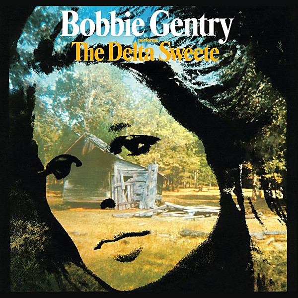

# The Delta Sweete

By **Bobbie Gentry**

## Album Data

- **Catalog:** Beets
- **Format:** Digital, Album
- **Album:** The Delta Sweete
- **Artist:** Bobbie Gentry
- **Albumartist:** Bobbie Gentry
- **Genre:** Blue-Eyed Soul
- **MusicBrainz Album Artist ID:** [a5106366-6368-4a02-a580-73a3c02abb2f](https://musicbrainz.org/artist/a5106366-6368-4a02-a580-73a3c02abb2f)
- **MusicBrainz Album ID:** [16fa6404-7257-4da2-96f1-daa2015c41e0](https://musicbrainz.org/release/16fa6404-7257-4da2-96f1-daa2015c41e0)
- **MusicBrainz Release Group ID:** [23b26d1f-8a60-319d-9333-d6391c7a982d](https://musicbrainz.org/release-group/23b26d1f-8a60-319d-9333-d6391c7a982d)
- **Year:** 1968
- **Catalog #:** ST 2842
- **Label:** Capitol Records
- **Total Tracks:** 12

## Album Tracks

### Track 01 - Okolona River Bottom Band

- **Artist:** Bobbie Gentry
- **Format:** AAC
- **Genre:** Americana
- **Length:** 3:02
- **MusicBrainz Track ID:** [baebf5f1-6568-4298-bd7d-faa1b60b13b3](https://musicbrainz.org/recording/baebf5f1-6568-4298-bd7d-faa1b60b13b3)
- **Title:** Okolona River Bottom Band
- **Track:** 01
- **Year:** 1968

### Track 02 - Big Boss Man

- **Artist:** Bobbie Gentry
- **Format:** AAC
- **Genre:** Folk Rock
- **Length:** 3:04
- **MusicBrainz Track ID:** [fc090875-890f-4ccf-92a5-5f7de44c3834](https://musicbrainz.org/recording/fc090875-890f-4ccf-92a5-5f7de44c3834)
- **Title:** Big Boss Man
- **Track:** 02
- **Year:** 1968

### Track 03 - Reunion

- **Artist:** Bobbie Gentry
- **Format:** AAC
- **Genre:** Americana
- **Length:** 2:37
- **MusicBrainz Track ID:** [7893da56-7103-4550-90e4-94c86e61a66e](https://musicbrainz.org/recording/7893da56-7103-4550-90e4-94c86e61a66e)
- **Title:** Reunion
- **Track:** 03
- **Year:** 1968

### Track 04 - Parchman Farm

- **Artist:** Bobbie Gentry
- **Format:** AAC
- **Genre:** Blue-Eyed Soul
- **Length:** 3:20
- **MusicBrainz Track ID:** [77547ff2-e986-418f-a564-1dd5f8229913](https://musicbrainz.org/recording/77547ff2-e986-418f-a564-1dd5f8229913)
- **Title:** Parchman Farm
- **Track:** 04
- **Year:** 1968

### Track 05 - Mornin’ Glory

- **Artist:** Bobbie Gentry
- **Format:** AAC
- **Genre:** Blue-Eyed Soul
- **Length:** 3:15
- **MusicBrainz Track ID:** [b7803c10-57d3-4ca0-8746-d53ce4096406](https://musicbrainz.org/recording/b7803c10-57d3-4ca0-8746-d53ce4096406)
- **Title:** Mornin’ Glory
- **Track:** 05
- **Year:** 1968

### Track 06 - Sermon

- **Artist:** Bobbie Gentry
- **Format:** AAC
- **Genre:** Country Rock
- **Length:** 2:37
- **MusicBrainz Track ID:** [1b62c5bf-7009-4bed-b5ec-9c2d919be9f0](https://musicbrainz.org/recording/1b62c5bf-7009-4bed-b5ec-9c2d919be9f0)
- **Title:** Sermon
- **Track:** 06
- **Year:** 1968

### Track 07 - Tobacco Road

- **Artist:** Bobbie Gentry
- **Format:** AAC
- **Genre:** Americana
- **Length:** 2:54
- **MusicBrainz Track ID:** [83d4e8da-509a-4163-88da-5cf5b6176df9](https://musicbrainz.org/recording/83d4e8da-509a-4163-88da-5cf5b6176df9)
- **Title:** Tobacco Road
- **Track:** 07
- **Year:** 1968

### Track 08 - Penduli Pendulum

- **Artist:** Bobbie Gentry
- **Format:** AAC
- **Genre:** Americana
- **Length:** 1:59
- **MusicBrainz Track ID:** [00a368c5-152d-464a-a0c5-e44d3ed591b0](https://musicbrainz.org/recording/00a368c5-152d-464a-a0c5-e44d3ed591b0)
- **Title:** Penduli Pendulum
- **Track:** 08
- **Year:** 1968

### Track 09 - Jessye’ Lisabeth

- **Artist:** Bobbie Gentry
- **Format:** AAC
- **Genre:** Blue-Eyed Soul
- **Length:** 3:04
- **MusicBrainz Track ID:** [1a5334f7-ce4c-4993-b969-e2c4f00797ef](https://musicbrainz.org/recording/1a5334f7-ce4c-4993-b969-e2c4f00797ef)
- **Title:** Jessye’ Lisabeth
- **Track:** 09
- **Year:** 1968

### Track 10 - Refractions

- **Artist:** Bobbie Gentry
- **Format:** AAC
- **Genre:** Blue-Eyed Soul
- **Length:** 2:36
- **MusicBrainz Track ID:** [9bc1c04b-fe7a-4220-b419-4784b89acf29](https://musicbrainz.org/recording/9bc1c04b-fe7a-4220-b419-4784b89acf29)
- **Title:** Refractions
- **Track:** 10
- **Year:** 1968

### Track 11 - Louisiana Man

- **Artist:** Bobbie Gentry
- **Format:** AAC
- **Genre:** Country
- **Length:** 2:46
- **MusicBrainz Track ID:** [2502bf3b-e7a5-4820-af0e-81a29fb3c29b](https://musicbrainz.org/recording/2502bf3b-e7a5-4820-af0e-81a29fb3c29b)
- **Title:** Louisiana Man
- **Track:** 11
- **Year:** 1968

### Track 12 - Courtyard

- **Artist:** Bobbie Gentry
- **Format:** AAC
- **Genre:** Blue-Eyed Soul
- **Length:** 2:59
- **MusicBrainz Track ID:** [c4ab2882-16e1-4dec-a0d2-fb098609cb39](https://musicbrainz.org/recording/c4ab2882-16e1-4dec-a0d2-fb098609cb39)
- **Title:** Courtyard
- **Track:** 12
- **Year:** 1968

## See also

- [Fancy](Fancy.md)
- [Roon: Fancy](../../Roon/Bobbie_Gentry/Fancy.md)
- [Roon: Ode To Billie Joe](../../Roon/Bobbie_Gentry/Ode_To_Billie_Joe.md)
- [Roon: The Delta Sweete (Deluxe Edition)](../../Roon/Bobbie_Gentry/The_Delta_Sweete_Deluxe_Edition.md)
