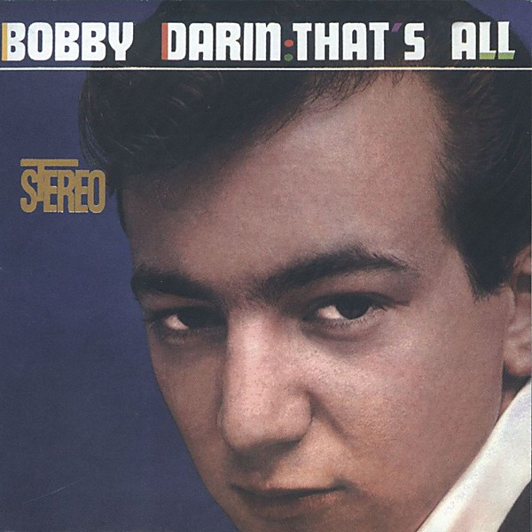

# That's All

By **Bobby Darin**

## Album Data

- **Catalog:** Beets
- **Format:** Digital, Album
- **Album:** That's All
- **Artist:** Bobby Darin
- **Albumartist:** Bobby Darin
- **Genre:** Rockabilly
- **MusicBrainz Album Artist ID:** [1f223eed-aa38-49da-9e76-62ab3adc2e04](https://musicbrainz.org/artist/1f223eed-aa38-49da-9e76-62ab3adc2e04)
- **MusicBrainz Album ID:** [1a2b775f-dbc6-3e70-ad45-fa86339b7c54](https://musicbrainz.org/release/1a2b775f-dbc6-3e70-ad45-fa86339b7c54)
- **MusicBrainz Release Group ID:** [b647afe5-5bcd-3ba0-bcb0-793ebcb87dae](https://musicbrainz.org/release-group/b647afe5-5bcd-3ba0-bcb0-793ebcb87dae)
- **Year:** 1994
- **Catalog #:** 82627-2
- **Label:** Atlantic
- **Total Tracks:** 12

## Album Tracks

### Track 01 - Mack the Knife

- **Artist:** Bobby Darin
- **Format:** ALAC
- **Genre:** Swing
- **Length:** 3:13
- **MusicBrainz Track ID:** [327805b8-2ed6-46aa-8b91-2b48154892b7](https://musicbrainz.org/recording/327805b8-2ed6-46aa-8b91-2b48154892b7)
- **Title:** Mack the Knife
- **Track:** 01
- **Year:** 1994

### Track 02 - Beyond the Sea

- **Artist:** Bobby Darin
- **Format:** ALAC
- **Genre:** Swing
- **Length:** 2:58
- **MusicBrainz Track ID:** [ee5e992a-acd9-448a-b2cd-42d41e0fb190](https://musicbrainz.org/recording/ee5e992a-acd9-448a-b2cd-42d41e0fb190)
- **Title:** Beyond the Sea
- **Track:** 02
- **Year:** 1994

### Track 03 - Through a Long and Sleepless Night

- **Artist:** Bobby Darin
- **Format:** ALAC
- **Genre:** Rockabilly
- **Length:** 2:46
- **MusicBrainz Track ID:** [c5468c58-d78b-4189-b01e-d0208522a9cd](https://musicbrainz.org/recording/c5468c58-d78b-4189-b01e-d0208522a9cd)
- **Title:** Through a Long and Sleepless Night
- **Track:** 03
- **Year:** 1994

### Track 04 - Softly as in a Morning Sunrise

- **Artist:** Bobby Darin
- **Format:** ALAC
- **Genre:** Swing
- **Length:** 2:37
- **MusicBrainz Track ID:** [f9872adb-ce09-4f88-9a72-1448ff88bd90](https://musicbrainz.org/recording/f9872adb-ce09-4f88-9a72-1448ff88bd90)
- **Title:** Softly as in a Morning Sunrise
- **Track:** 04
- **Year:** 1994

### Track 05 - She Needs Me

- **Artist:** Bobby Darin
- **Format:** ALAC
- **Genre:** Rockabilly
- **Length:** 3:37
- **MusicBrainz Track ID:** [b81d0e26-9e57-4ad4-ad8e-ae8a717714d7](https://musicbrainz.org/recording/b81d0e26-9e57-4ad4-ad8e-ae8a717714d7)
- **Title:** She Needs Me
- **Track:** 05
- **Year:** 1994

### Track 06 - It Ain't Necessarily So

- **Artist:** Bobby Darin
- **Format:** ALAC
- **Genre:** Jazz
- **Length:** 3:36
- **MusicBrainz Track ID:** [03df6d70-2f2c-4fad-a8a4-5684068a4990](https://musicbrainz.org/recording/03df6d70-2f2c-4fad-a8a4-5684068a4990)
- **Title:** It Ain't Necessarily So
- **Track:** 06
- **Year:** 1994

### Track 07 - I'll Remember April

- **Artist:** Bobby Darin
- **Format:** ALAC
- **Genre:** Rockabilly
- **Length:** 2:30
- **MusicBrainz Track ID:** [5d7b9d28-9178-4463-944f-2be99262384f](https://musicbrainz.org/recording/5d7b9d28-9178-4463-944f-2be99262384f)
- **Title:** I'll Remember April
- **Track:** 07
- **Year:** 1994

### Track 08 - That's the Way Love Is

- **Artist:** Bobby Darin
- **Format:** ALAC
- **Genre:** Swing
- **Length:** 3:09
- **MusicBrainz Track ID:** [90b8fa01-c8d2-4f39-9aa8-004e7b7fa1c9](https://musicbrainz.org/recording/90b8fa01-c8d2-4f39-9aa8-004e7b7fa1c9)
- **Title:** That's the Way Love Is
- **Track:** 08
- **Year:** 1994

### Track 09 - Was There a Call for Me

- **Artist:** Bobby Darin
- **Format:** ALAC
- **Genre:** Jazz
- **Length:** 3:18
- **MusicBrainz Track ID:** [d4cbc62f-0429-4c6e-ae76-466e865e80a5](https://musicbrainz.org/recording/d4cbc62f-0429-4c6e-ae76-466e865e80a5)
- **Title:** Was There a Call for Me
- **Track:** 09
- **Year:** 1994

### Track 10 - Some of These Days

- **Artist:** Bobby Darin
- **Format:** ALAC
- **Genre:** Rockabilly
- **Length:** 2:49
- **MusicBrainz Track ID:** [1e0bafb4-abfe-4cad-ab00-7100559900f7](https://musicbrainz.org/recording/1e0bafb4-abfe-4cad-ab00-7100559900f7)
- **Title:** Some of These Days
- **Track:** 10
- **Year:** 1994

### Track 11 - Where Is the One

- **Artist:** Bobby Darin
- **Format:** ALAC
- **Genre:** Pop
- **Length:** 3:40
- **MusicBrainz Track ID:** [2d789e8e-163e-485c-b3c0-41bf6a608b0e](https://musicbrainz.org/recording/2d789e8e-163e-485c-b3c0-41bf6a608b0e)
- **Title:** Where Is the One
- **Track:** 11
- **Year:** 1994

### Track 12 - That's All

- **Artist:** Bobby Darin
- **Format:** ALAC
- **Genre:** Pop
- **Length:** 2:23
- **MusicBrainz Track ID:** [423502de-0ef9-4697-8d63-b62b2128e088](https://musicbrainz.org/recording/423502de-0ef9-4697-8d63-b62b2128e088)
- **Title:** That's All
- **Track:** 12
- **Year:** 1994

## See also

- [Roon: Bobby Darin](../../Roon/Bobby_Darin/Bobby_Darin.md)
- [Roon: Live At The Desert Inn](../../Roon/Bobby_Darin/Live_At_The_Desert_Inn.md)
- [Roon: That's All](../../Roon/Bobby_Darin/Thats_All.md)
- [Roon: This Is Darin](../../Roon/Bobby_Darin/This_Is_Darin.md)
- [Roon: Two of a Kind](../../Roon/Bobby_Darin/Two_of_a_Kind.md)
- [Roon: Wild, Cool & Swingin'](../../Roon/Bobby_Darin/Wild__Cool_and_Swingin.md)
