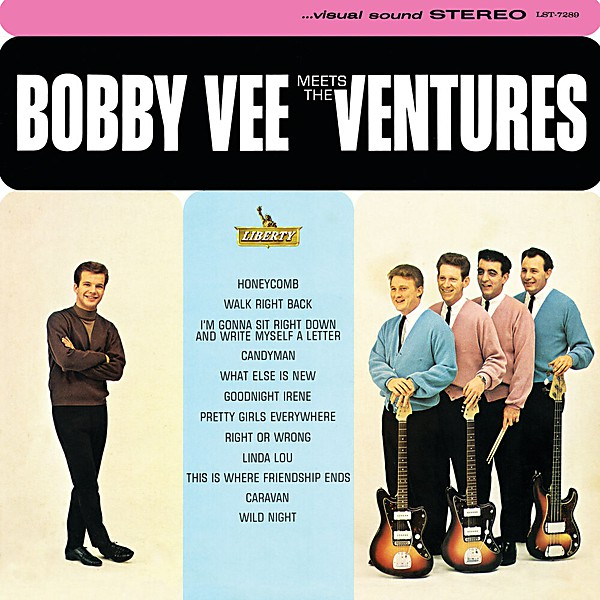

# Bobby Vee Meets The Ventures

By **Bobby Vee**

## Album Data

- **Catalog:** Beets
- **Format:** Digital, Album
- **Album:** Bobby Vee Meets The Ventures
- **Artist:** Bobby Vee
- **Albumartist:** Bobby Vee
- **Genre:** Rock And Roll
- **MusicBrainz Album Artist ID:** 
- **MusicBrainz Album ID:** 
- **MusicBrainz Release Group ID:** 
- **Year:** 0000
- **Catalog #:** 
- **Label:** 
- **Total Tracks:** 00

## Album Tracks

### Track 00 - Charms

- **Artist:** Bobby Vee
- **Format:** ALAC
- **Genre:** Pop
- **Length:** 2:14
- **MusicBrainz Track ID:** 
- **Title:** Charms
- **Track:** 00
- **Year:** 0000

### Track 00 - Come Back When You Grow Up

- **Artist:** Bobby Vee
- **Format:** ALAC
- **Genre:** Soft Rock
- **Length:** 2:20
- **MusicBrainz Track ID:** 
- **Title:** Come Back When You Grow Up
- **Track:** 00
- **Year:** 0000

### Track 00 - Devil Or Angel

- **Artist:** Bobby Vee
- **Format:** ALAC
- **Genre:** Pop
- **Length:** 2:35
- **MusicBrainz Track ID:** 
- **Title:** Devil Or Angel
- **Track:** 00
- **Year:** 0000

### Track 00 - Please Don't Ask About Barbara

- **Artist:** Bobby Vee
- **Format:** ALAC
- **Genre:** Pop
- **Length:** 2:08
- **MusicBrainz Track ID:** 
- **Title:** Please Don't Ask About Barbara
- **Track:** 00
- **Year:** 0000

### Track 00 - Rubber Ball

- **Artist:** Bobby Vee
- **Format:** ALAC
- **Genre:** Rock
- **Length:** 2:22
- **MusicBrainz Track ID:** 
- **Title:** Rubber Ball
- **Track:** 00
- **Year:** 0000

### Track 00 - Run To Him

- **Artist:** Bobby Vee
- **Format:** ALAC
- **Genre:** Pop
- **Length:** 2:15
- **MusicBrainz Track ID:** 
- **Title:** Run To Him
- **Track:** 00
- **Year:** 0000

### Track 00 - Sharing You

- **Artist:** Bobby Vee
- **Format:** ALAC
- **Genre:** Close Harmony
- **Length:** 2:06
- **MusicBrainz Track ID:** 
- **Title:** Sharing You
- **Track:** 00
- **Year:** 0000

### Track 00 - Take Good Care Of My Baby

- **Artist:** Bobby Vee
- **Format:** ALAC
- **Genre:** Pop
- **Length:** 2:32
- **MusicBrainz Track ID:** 
- **Title:** Take Good Care Of My Baby
- **Track:** 00
- **Year:** 0000

### Track 00 - The Night Has A Thousand Eyes

- **Artist:** Bobby Vee
- **Format:** ALAC
- **Genre:** Pop
- **Length:** 2:53
- **MusicBrainz Track ID:** 
- **Title:** The Night Has A Thousand Eyes
- **Track:** 00
- **Year:** 0000

### Track 00 - Walkin With My Angel

- **Artist:** Bobby Vee
- **Format:** ALAC
- **Genre:** Close Harmony
- **Length:** 2:19
- **MusicBrainz Track ID:** 
- **Title:** Walkin With My Angel
- **Track:** 00
- **Year:** 0000

## See also

- [The Very Best Of Bobby Vee](The_Very_Best_Of_Bobby_Vee.md)
- [Roon: Very Best Of](../../Roon/Bobby_Vee/Very_Best_Of.md)
