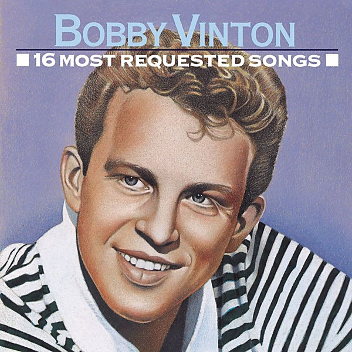

# 16 Most Requested Songs

By **Bobby Vinton**

## Album Data

- **Catalog:** Beets
- **Format:** Digital, Album
- **Album:** 16 Most Requested Songs
- **Artist:** Bobby Vinton
- **Albumartist:** Bobby Vinton
- **Genre:** Close Harmony
- **MusicBrainz Album Artist ID:** 
- **MusicBrainz Album ID:** 
- **MusicBrainz Release Group ID:** 
- **Year:** 2000
- **Catalog #:** 
- **Label:** 
- **Total Tracks:** 00

## Album Tracks

### Track 00 - Mr. Lonely

- **Artist:** Bobby Vinton
- **Format:** AAC
- **Genre:** Pop
- **Length:** 2:40
- **MusicBrainz Track ID:** 
- **Title:** Mr. Lonely
- **Track:** 00
- **Year:** 0000

## See also

- [1964](1964.md)
- [Roon: Bobby Vinton's Greatest Hits](../../Roon/Bobby_Vinton/Bobby_Vintons_Greatest_Hits.md)
- [Vinyl: ](../../Vinyl/Bobby_Vinton/Bobby_Vinton.md)
- [Vinyl: Mr. Lonely / It's Better To Have Loved](../../Vinyl/Bobby_Vinton/Mr_Lonely_-_Its_Better_To_Have_Loved.md)
