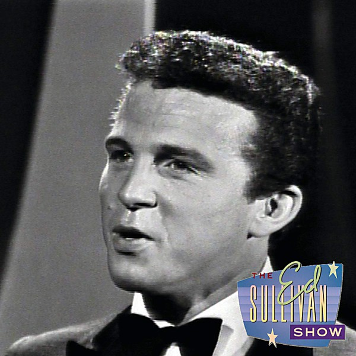

# 1964

By **Bobby Vinton**

## Album Data

- **Catalog:** Beets
- **Format:** Digital, Album
- **Album:** 1964
- **Artist:** Bobby Vinton
- **Albumartist:** Bobby Vinton
- **Genre:** Pop
- **MusicBrainz Album Artist ID:** 
- **MusicBrainz Album ID:** 
- **MusicBrainz Release Group ID:** 
- **Year:** 0000
- **Catalog #:** 
- **Label:** 
- **Total Tracks:** 00

## Album Tracks

### Track 00 - Mr. Lonely

- **Artist:** Bobby Vinton
- **Format:** AAC
- **Genre:** Pop
- **Length:** 2:40
- **MusicBrainz Track ID:** 
- **Title:** Mr. Lonely
- **Track:** 00
- **Year:** 0000

