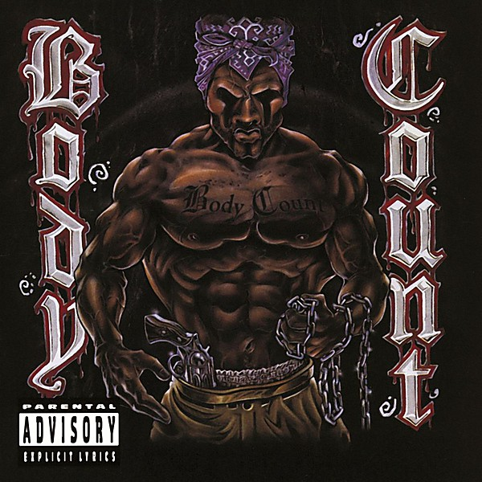

# Body Count

By **Body Count**

## Album Data

- **Catalog:** Beets
- **Format:** Digital, Album
- **Album:** Body Count
- **Artist:** Body Count
- **Albumartist:** Body Count
- **Genre:** Crossover Thrash
- **MusicBrainz Album Artist ID:** [8b12db5d-54a9-4014-9fa8-d646ac291361](https://musicbrainz.org/artist/8b12db5d-54a9-4014-9fa8-d646ac291361)
- **MusicBrainz Album ID:** [835e69db-ade5-4782-a747-ec19c6721054](https://musicbrainz.org/release/835e69db-ade5-4782-a747-ec19c6721054)
- **MusicBrainz Release Group ID:** [8c7d82c9-cb5d-371c-8e6b-d2fba0244ca0](https://musicbrainz.org/release-group/8c7d82c9-cb5d-371c-8e6b-d2fba0244ca0)
- **Year:** 1992
- **Catalog #:** 9362-45139-2
- **Label:** Sire Records
- **Total Tracks:** 17

## Album Tracks

### Track 01 - Smoked Pork

- **Artist:** Body Count
- **Format:** ALAC
- **Genre:** Thrash Metal
- **Length:** 0:46
- **MusicBrainz Track ID:** [86aae68c-7881-49bc-a155-8a349a148922](https://musicbrainz.org/recording/86aae68c-7881-49bc-a155-8a349a148922)
- **Title:** Smoked Pork
- **Track:** 01
- **Year:** 1992

### Track 02 - Body Count’s in the House

- **Artist:** Body Count
- **Format:** ALAC
- **Genre:** Crossover Thrash
- **Length:** 3:24
- **MusicBrainz Track ID:** [760a9df7-0301-4544-a87d-47f2b0c4605e](https://musicbrainz.org/recording/760a9df7-0301-4544-a87d-47f2b0c4605e)
- **Title:** Body Count’s in the House
- **Track:** 02
- **Year:** 1992

### Track 03 - Now Sports

- **Artist:** Body Count
- **Format:** ALAC
- **Genre:** Rock
- **Length:** 0:04
- **MusicBrainz Track ID:** [38b95186-79f5-4151-80dc-3a5199ac2a96](https://musicbrainz.org/recording/38b95186-79f5-4151-80dc-3a5199ac2a96)
- **Title:** Now Sports
- **Track:** 03
- **Year:** 1992

### Track 04 - Body Count

- **Artist:** Body Count
- **Format:** ALAC
- **Genre:** Rapcore
- **Length:** 5:17
- **MusicBrainz Track ID:** [cdaa9c0c-94e0-4b3e-8198-96a687748564](https://musicbrainz.org/recording/cdaa9c0c-94e0-4b3e-8198-96a687748564)
- **Title:** Body Count
- **Track:** 04
- **Year:** 1992

### Track 05 - A Statistic

- **Artist:** Body Count
- **Format:** ALAC
- **Genre:** Crossover Thrash
- **Length:** 0:06
- **MusicBrainz Track ID:** [354acd9b-664c-4e48-b508-99439f6b6c25](https://musicbrainz.org/recording/354acd9b-664c-4e48-b508-99439f6b6c25)
- **Title:** A Statistic
- **Track:** 05
- **Year:** 1992

### Track 06 - Bowels of the Devil

- **Artist:** Body Count
- **Format:** ALAC
- **Genre:** Crossover Thrash
- **Length:** 3:43
- **MusicBrainz Track ID:** [1bd5e01e-f536-4185-94ea-6e02bb07ca1c](https://musicbrainz.org/recording/1bd5e01e-f536-4185-94ea-6e02bb07ca1c)
- **Title:** Bowels of the Devil
- **Track:** 06
- **Year:** 1992

### Track 07 - The Real Problem

- **Artist:** Body Count
- **Format:** ALAC
- **Genre:** Rock
- **Length:** 0:11
- **MusicBrainz Track ID:** [d5be79b4-0b3d-476c-ac99-6c9228e8f442](https://musicbrainz.org/recording/d5be79b4-0b3d-476c-ac99-6c9228e8f442)
- **Title:** The Real Problem
- **Track:** 07
- **Year:** 1992

### Track 08 - KKK Bitch

- **Artist:** Body Count
- **Format:** ALAC
- **Genre:** Rapcore
- **Length:** 2:52
- **MusicBrainz Track ID:** [e0d91f0d-6334-434d-bf4d-e693a755fa92](https://musicbrainz.org/recording/e0d91f0d-6334-434d-bf4d-e693a755fa92)
- **Title:** KKK Bitch
- **Track:** 08
- **Year:** 1992

### Track 09 - C Note

- **Artist:** Body Count
- **Format:** ALAC
- **Genre:** Rapcore
- **Length:** 1:35
- **MusicBrainz Track ID:** [8d13129b-a297-4afc-a665-7cacdcddb8d3](https://musicbrainz.org/recording/8d13129b-a297-4afc-a665-7cacdcddb8d3)
- **Title:** C Note
- **Track:** 09
- **Year:** 1992

### Track 10 - Voodoo

- **Artist:** Body Count
- **Format:** ALAC
- **Genre:** Crossover Thrash
- **Length:** 5:00
- **MusicBrainz Track ID:** [0c0dc07e-afaa-43a6-b856-9142773b0b29](https://musicbrainz.org/recording/0c0dc07e-afaa-43a6-b856-9142773b0b29)
- **Title:** Voodoo
- **Track:** 10
- **Year:** 1992

### Track 11 - The Winner Loses

- **Artist:** Body Count
- **Format:** ALAC
- **Genre:** Crossover Thrash
- **Length:** 6:32
- **MusicBrainz Track ID:** [c7ed7eb4-c716-4776-b4a7-5f7053bec03f](https://musicbrainz.org/recording/c7ed7eb4-c716-4776-b4a7-5f7053bec03f)
- **Title:** The Winner Loses
- **Track:** 11
- **Year:** 1992

### Track 12 - There Goes the Neighborhood

- **Artist:** Body Count
- **Format:** ALAC
- **Genre:** Crossover Thrash
- **Length:** 5:50
- **MusicBrainz Track ID:** [447d4c73-6f14-484f-bbcf-b33bb3ef9794](https://musicbrainz.org/recording/447d4c73-6f14-484f-bbcf-b33bb3ef9794)
- **Title:** There Goes the Neighborhood
- **Track:** 12
- **Year:** 1992

### Track 13 - Oprah

- **Artist:** Body Count
- **Format:** ALAC
- **Genre:** Crossover Thrash
- **Length:** 0:06
- **MusicBrainz Track ID:** [943cfbf0-a42f-44fd-8b45-7a15086ebb74](https://musicbrainz.org/recording/943cfbf0-a42f-44fd-8b45-7a15086ebb74)
- **Title:** Oprah
- **Track:** 13
- **Year:** 1992

### Track 14 - Evil Dick

- **Artist:** Body Count
- **Format:** ALAC
- **Genre:** Crossover Thrash
- **Length:** 3:58
- **MusicBrainz Track ID:** [3c1fb18b-afbd-4aa1-a17e-057d005b5e11](https://musicbrainz.org/recording/3c1fb18b-afbd-4aa1-a17e-057d005b5e11)
- **Title:** Evil Dick
- **Track:** 14
- **Year:** 1992

### Track 15 - Body Count Anthem

- **Artist:** Body Count
- **Format:** ALAC
- **Genre:** Crossover Thrash
- **Length:** 2:46
- **MusicBrainz Track ID:** [ade4b85e-eb1b-4c3f-90a6-391c69f7a5c1](https://musicbrainz.org/recording/ade4b85e-eb1b-4c3f-90a6-391c69f7a5c1)
- **Title:** Body Count Anthem
- **Track:** 15
- **Year:** 1992

### Track 16 - Momma’s Gotta Die Tonight

- **Artist:** Body Count
- **Format:** ALAC
- **Genre:** Crossover Thrash
- **Length:** 6:11
- **MusicBrainz Track ID:** [13ca9d4b-3364-40fc-a656-942045c5fcdc](https://musicbrainz.org/recording/13ca9d4b-3364-40fc-a656-942045c5fcdc)
- **Title:** Momma’s Gotta Die Tonight
- **Track:** 16
- **Year:** 1992

### Track 17 - Freedom of Speech

- **Artist:** Ice‐T
- **Format:** ALAC
- **Genre:** Rap Metal
- **Length:** 4:41
- **MusicBrainz Track ID:** [61a10a02-95ec-41fc-b9b1-86c198b2bb9b](https://musicbrainz.org/recording/61a10a02-95ec-41fc-b9b1-86c198b2bb9b)
- **Title:** Freedom of Speech
- **Track:** 17
- **Year:** 1992

