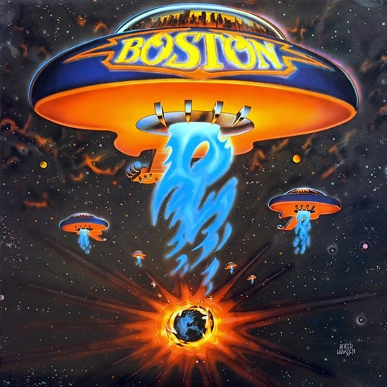

# Boston

By **Boston**

## Album Data

- **Catalog:** Beets
- **Format:** Digital, Album
- **Album:** Boston
- **Artist:** Boston
- **Albumartist:** Boston
- **Genre:** Progressive Rock
- **MusicBrainz Album Artist ID:** [0d8b0d50-e4cf-4da4-965d-f24c58ec3268](https://musicbrainz.org/artist/0d8b0d50-e4cf-4da4-965d-f24c58ec3268)
- **MusicBrainz Album ID:** [a9b0139a-b50b-4dc0-b556-79cd1b0343ab](https://musicbrainz.org/release/a9b0139a-b50b-4dc0-b556-79cd1b0343ab)
- **MusicBrainz Release Group ID:** [f0371fc4-3e22-3d8d-8ce3-4af873ea6f1c](https://musicbrainz.org/release-group/f0371fc4-3e22-3d8d-8ce3-4af873ea6f1c)
- **Year:** 1976
- **Catalog #:** MCAD-6188
- **Label:** MCA Records
- **Total Tracks:** 10

## Album Tracks

### Track 01 - Amanda

- **Artist:** Boston
- **Format:** ALAC
- **Genre:** Hard Rock
- **Length:** 4:16
- **MusicBrainz Track ID:** [2cd88abb-3e28-4369-a5e3-ec76064c76a6](https://musicbrainz.org/recording/2cd88abb-3e28-4369-a5e3-ec76064c76a6)
- **Title:** Amanda
- **Track:** 01
- **Year:** 1986

### Track 02 - We’re Ready

- **Artist:** Boston
- **Format:** ALAC
- **Genre:** Progressive Rock
- **Length:** 3:58
- **MusicBrainz Track ID:** [7f1e6fa5-c300-4a89-b15e-7fa5921df097](https://musicbrainz.org/recording/7f1e6fa5-c300-4a89-b15e-7fa5921df097)
- **Title:** We’re Ready
- **Track:** 02
- **Year:** 1986

### Track 03 - The Launch

- **Artist:** Boston
- **Format:** ALAC
- **Genre:** Hard Rock
- **Length:** 2:55
- **MusicBrainz Track ID:** [452e5f11-4963-446c-ab1e-f033512299a2](https://musicbrainz.org/recording/452e5f11-4963-446c-ab1e-f033512299a2)
- **Title:** The Launch
- **Track:** 03
- **Year:** 1986

### Track 04 - Cool the Engines

- **Artist:** Boston
- **Format:** ALAC
- **Genre:** Progressive Rock
- **Length:** 4:23
- **MusicBrainz Track ID:** [5f20e9c9-120a-4dd5-b776-cc47002938e2](https://musicbrainz.org/recording/5f20e9c9-120a-4dd5-b776-cc47002938e2)
- **Title:** Cool the Engines
- **Track:** 04
- **Year:** 1986

### Track 05 - My Destination

- **Artist:** Boston
- **Format:** ALAC
- **Genre:** Soft Rock
- **Length:** 2:19
- **MusicBrainz Track ID:** [03025f16-6585-4016-98f0-73ec84d82786](https://musicbrainz.org/recording/03025f16-6585-4016-98f0-73ec84d82786)
- **Title:** My Destination
- **Track:** 05
- **Year:** 1986

### Track 06 - A New World

- **Artist:** Boston
- **Format:** ALAC
- **Genre:** Progressive Rock
- **Length:** 0:36
- **MusicBrainz Track ID:** [b5e1745f-1732-4725-b222-61369674776e](https://musicbrainz.org/recording/b5e1745f-1732-4725-b222-61369674776e)
- **Title:** A New World
- **Track:** 06
- **Year:** 1986

### Track 07 - To Be a Man

- **Artist:** Boston
- **Format:** ALAC
- **Genre:** Progressive Rock
- **Length:** 3:30
- **MusicBrainz Track ID:** [0d92e6ad-ee7b-4661-ab6f-685271c78a56](https://musicbrainz.org/recording/0d92e6ad-ee7b-4661-ab6f-685271c78a56)
- **Title:** To Be a Man
- **Track:** 07
- **Year:** 1986

### Track 08 - I Think I Like It

- **Artist:** Boston
- **Format:** ALAC
- **Genre:** Progressive Rock
- **Length:** 4:06
- **MusicBrainz Track ID:** [54750d7b-0025-48c4-bcc3-bb4d0d4e8e37](https://musicbrainz.org/recording/54750d7b-0025-48c4-bcc3-bb4d0d4e8e37)
- **Title:** I Think I Like It
- **Track:** 08
- **Year:** 1986

### Track 09 - Can’tcha Say (You Believe in Me) / Still in Love

- **Artist:** Boston
- **Format:** ALAC
- **Genre:** Progressive Rock
- **Length:** 5:13
- **MusicBrainz Track ID:** [50a0a2ea-d4ec-46f8-955a-f59e77a4158f](https://musicbrainz.org/recording/50a0a2ea-d4ec-46f8-955a-f59e77a4158f)
- **Title:** Can’tcha Say (You Believe in Me) / Still in Love
- **Track:** 09
- **Year:** 1986

### Track 10 - Hollyann

- **Artist:** Boston
- **Format:** ALAC
- **Genre:** Hard Rock
- **Length:** 5:09
- **MusicBrainz Track ID:** [02396d32-d951-4c50-855f-0c2c6797aac1](https://musicbrainz.org/recording/02396d32-d951-4c50-855f-0c2c6797aac1)
- **Title:** Hollyann
- **Track:** 10
- **Year:** 1986

## See also

- [Third Stage](Third_Stage.md)
- [Walk On](Walk_On.md)
- [Roon: Boston](../../Roon/Boston/Boston.md)
- [Roon: Don't Look Back](../../Roon/Boston/Dont_Look_Back.md)
