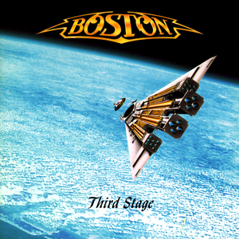

# Third Stage

By **Boston**

## Album Data

- **Catalog:** Beets
- **Format:** Digital, Album
- **Album:** Third Stage
- **Artist:** Boston
- **Albumartist:** Boston
- **Genre:** Progressive Rock
- **MusicBrainz Album Artist ID:** [0d8b0d50-e4cf-4da4-965d-f24c58ec3268](https://musicbrainz.org/artist/0d8b0d50-e4cf-4da4-965d-f24c58ec3268)
- **MusicBrainz Album ID:** [03663c40-95ae-3e3c-ac94-efea79317279](https://musicbrainz.org/release/03663c40-95ae-3e3c-ac94-efea79317279)
- **MusicBrainz Release Group ID:** [abdc4c7e-656e-343b-add2-00a8c6277bbc](https://musicbrainz.org/release-group/abdc4c7e-656e-343b-add2-00a8c6277bbc)
- **Year:** 1986
- **Catalog #:** MCAD-10973
- **Label:** MCA Records
- **Total Tracks:** 10

## Album Tracks

### Track 01 - I Need Your Love

- **Artist:** Boston
- **Format:** MP3
- **Genre:** Symphonic
- **Length:** 5:33
- **MusicBrainz Track ID:** [674880c7-c66d-4238-b144-f9214095b5b3](https://musicbrainz.org/recording/674880c7-c66d-4238-b144-f9214095b5b3)
- **Title:** I Need Your Love
- **Track:** 01
- **Year:** 1994

### Track 02 - Surrender to Me

- **Artist:** Boston
- **Format:** MP3
- **Genre:** Soft Rock
- **Length:** 5:33
- **MusicBrainz Track ID:** [55348b39-3e80-43d3-bc7e-87d70584cd73](https://musicbrainz.org/recording/55348b39-3e80-43d3-bc7e-87d70584cd73)
- **Title:** Surrender to Me
- **Track:** 02
- **Year:** 1994

### Track 03 - Livin’ for You

- **Artist:** Boston
- **Format:** MP3
- **Genre:** Soft Rock
- **Length:** 4:57
- **MusicBrainz Track ID:** [e0aad6aa-5237-4019-ad5a-827b7018ba58](https://musicbrainz.org/recording/e0aad6aa-5237-4019-ad5a-827b7018ba58)
- **Title:** Livin’ for You
- **Track:** 03
- **Year:** 1994

### Track 04 - Walkin’ at Night

- **Artist:** Boston
- **Format:** MP3
- **Genre:** Soft Rock
- **Length:** 2:02
- **MusicBrainz Track ID:** [58c8c9f6-79a4-4be0-8644-33efaea7b52e](https://musicbrainz.org/recording/58c8c9f6-79a4-4be0-8644-33efaea7b52e)
- **Title:** Walkin’ at Night
- **Track:** 04
- **Year:** 1994

### Track 05 - Walk On

- **Artist:** Boston
- **Format:** MP3
- **Genre:** Soft Rock
- **Length:** 2:57
- **MusicBrainz Track ID:** [4a53401f-41af-49d2-a1e3-41ddfa78b4bd](https://musicbrainz.org/recording/4a53401f-41af-49d2-a1e3-41ddfa78b4bd)
- **Title:** Walk On
- **Track:** 05
- **Year:** 1994

### Track 06 - Get Organ‐ized

- **Artist:** Boston
- **Format:** MP3
- **Genre:** Soft Rock
- **Length:** 4:27
- **MusicBrainz Track ID:** [ca70efe2-cee7-4f9f-aeaa-22eb8346df31](https://musicbrainz.org/recording/ca70efe2-cee7-4f9f-aeaa-22eb8346df31)
- **Title:** Get Organ‐ized
- **Track:** 06
- **Year:** 1994

### Track 07 - Walk On (Some More)

- **Artist:** Boston
- **Format:** MP3
- **Genre:** Soft Rock
- **Length:** 2:54
- **MusicBrainz Track ID:** [74d211de-299c-4918-9598-e9ed140436f6](https://musicbrainz.org/recording/74d211de-299c-4918-9598-e9ed140436f6)
- **Title:** Walk On (Some More)
- **Track:** 07
- **Year:** 1994

### Track 08 - What’s Your Name

- **Artist:** Boston
- **Format:** MP3
- **Genre:** Soft Rock
- **Length:** 4:28
- **MusicBrainz Track ID:** [05270590-e9d0-4e97-917a-97e3d5d933b8](https://musicbrainz.org/recording/05270590-e9d0-4e97-917a-97e3d5d933b8)
- **Title:** What’s Your Name
- **Track:** 08
- **Year:** 1994

### Track 09 - Magdalene

- **Artist:** Boston
- **Format:** MP3
- **Genre:** Soft Rock
- **Length:** 5:57
- **MusicBrainz Track ID:** [b73ca6c9-f1ea-453a-9f33-ef3d488f3c32](https://musicbrainz.org/recording/b73ca6c9-f1ea-453a-9f33-ef3d488f3c32)
- **Title:** Magdalene
- **Track:** 09
- **Year:** 1994

### Track 10 - We Can Make It

- **Artist:** Boston
- **Format:** MP3
- **Genre:** Soft Rock
- **Length:** 5:29
- **MusicBrainz Track ID:** [8a5e58bd-8a57-4a5e-8442-fe78e1c7c796](https://musicbrainz.org/recording/8a5e58bd-8a57-4a5e-8442-fe78e1c7c796)
- **Title:** We Can Make It
- **Track:** 10
- **Year:** 1994

## See also

- [Boston](Boston.md)
- [Walk On](Walk_On.md)
- [Roon: Boston](../../Roon/Boston/Boston.md)
- [Roon: Don't Look Back](../../Roon/Boston/Dont_Look_Back.md)
