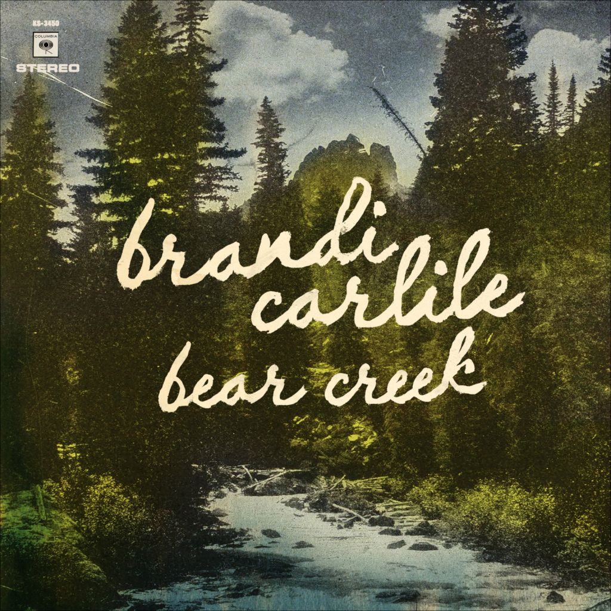

# Bear Creek

By **Brandi Carlile**

## Album Data

- **Catalog:** Beets
- **Format:** Digital, Album
- **Album:** Bear Creek
- **Artist:** Brandi Carlile
- **Albumartist:** Brandi Carlile
- **Genre:** Folk Rock
- **MusicBrainz Album Artist ID:** [baf05baf-69fb-47dd-93c2-033536b8c385](https://musicbrainz.org/artist/baf05baf-69fb-47dd-93c2-033536b8c385)
- **MusicBrainz Album ID:** [b39a99ff-43b8-4061-be03-e401dff03cc9](https://musicbrainz.org/release/b39a99ff-43b8-4061-be03-e401dff03cc9)
- **MusicBrainz Release Group ID:** [ec268c29-bdc7-4424-925e-71a4f805ea94](https://musicbrainz.org/release-group/ec268c29-bdc7-4424-925e-71a4f805ea94)
- **Year:** 2012
- **Catalog #:** 88697 00802 2
- **Label:** Columbia
- **Total Tracks:** 13

## Album Tracks

### Track 01 - Late Morning Lullaby

- **Artist:** Brandi Carlile
- **Format:** ALAC
- **Genre:** Pop
- **Length:** 3:27
- **MusicBrainz Track ID:** [fd375dfd-79be-4ee8-9ab1-ed7e5747f87d](https://musicbrainz.org/recording/fd375dfd-79be-4ee8-9ab1-ed7e5747f87d)
- **Title:** Late Morning Lullaby
- **Track:** 01
- **Year:** 2007

### Track 02 - The Story

- **Artist:** Brandi Carlile
- **Format:** ALAC
- **Genre:** Rock
- **Length:** 3:58
- **MusicBrainz Track ID:** [e4cc4cf8-b087-4ed1-bea3-69279a81fcba](https://musicbrainz.org/recording/e4cc4cf8-b087-4ed1-bea3-69279a81fcba)
- **Title:** The Story
- **Track:** 02
- **Year:** 2007

### Track 03 - Turpentine

- **Artist:** Brandi Carlile
- **Format:** ALAC
- **Genre:** Rock
- **Length:** 2:58
- **MusicBrainz Track ID:** [865b05e6-df39-4211-9a5f-2ab4cdb9c7d4](https://musicbrainz.org/recording/865b05e6-df39-4211-9a5f-2ab4cdb9c7d4)
- **Title:** Turpentine
- **Track:** 03
- **Year:** 2007

### Track 04 - My Song

- **Artist:** Brandi Carlile
- **Format:** ALAC
- **Genre:** Folk Rock
- **Length:** 4:28
- **MusicBrainz Track ID:** [2d2d378d-e871-4609-9282-50174a70993a](https://musicbrainz.org/recording/2d2d378d-e871-4609-9282-50174a70993a)
- **Title:** My Song
- **Track:** 04
- **Year:** 2007

### Track 05 - Wasted

- **Artist:** Brandi Carlile
- **Format:** ALAC
- **Genre:** Folk Rock
- **Length:** 3:47
- **MusicBrainz Track ID:** [32797c5a-4c70-4106-a1a0-ee60aa56f070](https://musicbrainz.org/recording/32797c5a-4c70-4106-a1a0-ee60aa56f070)
- **Title:** Wasted
- **Track:** 05
- **Year:** 2007

### Track 06 - Have You Ever

- **Artist:** Brandi Carlile
- **Format:** ALAC
- **Genre:** Folk Rock
- **Length:** 2:32
- **MusicBrainz Track ID:** [ddff0c55-c123-4b4f-bf0f-dd427414d442](https://musicbrainz.org/recording/ddff0c55-c123-4b4f-bf0f-dd427414d442)
- **Title:** Have You Ever
- **Track:** 06
- **Year:** 2007

### Track 07 - Josephine

- **Artist:** Brandi Carlile
- **Format:** ALAC
- **Genre:** Folk Rock
- **Length:** 3:02
- **MusicBrainz Track ID:** [5b936ee6-4319-40e8-bcf9-ecd68f29b4af](https://musicbrainz.org/recording/5b936ee6-4319-40e8-bcf9-ecd68f29b4af)
- **Title:** Josephine
- **Track:** 07
- **Year:** 2007

### Track 08 - Losing Heart

- **Artist:** Brandi Carlile
- **Format:** ALAC
- **Genre:** Folk Rock
- **Length:** 3:35
- **MusicBrainz Track ID:** [39a77042-7b18-48db-80aa-faa7a4a1939b](https://musicbrainz.org/recording/39a77042-7b18-48db-80aa-faa7a4a1939b)
- **Title:** Losing Heart
- **Track:** 08
- **Year:** 2007

### Track 09 - Cannonball

- **Artist:** Brandi Carlile
- **Format:** ALAC
- **Genre:** Rock
- **Length:** 3:52
- **MusicBrainz Track ID:** [a7219336-eb9b-4e15-9331-b9ed156656fc](https://musicbrainz.org/recording/a7219336-eb9b-4e15-9331-b9ed156656fc)
- **Title:** Cannonball
- **Track:** 09
- **Year:** 2007

### Track 10 - Until I Die

- **Artist:** Brandi Carlile
- **Format:** ALAC
- **Genre:** Folk Rock
- **Length:** 4:06
- **MusicBrainz Track ID:** [82f56e8f-7f9c-4f9b-a6dd-bec405565a33](https://musicbrainz.org/recording/82f56e8f-7f9c-4f9b-a6dd-bec405565a33)
- **Title:** Until I Die
- **Track:** 10
- **Year:** 2007

### Track 11 - Downpour

- **Artist:** Brandi Carlile
- **Format:** ALAC
- **Genre:** Folk Rock
- **Length:** 3:14
- **MusicBrainz Track ID:** [2113d93d-4292-465e-959a-7cd72642609f](https://musicbrainz.org/recording/2113d93d-4292-465e-959a-7cd72642609f)
- **Title:** Downpour
- **Track:** 11
- **Year:** 2007

### Track 12 - Shadow on the Wall

- **Artist:** Brandi Carlile
- **Format:** ALAC
- **Genre:** Rock
- **Length:** 3:15
- **MusicBrainz Track ID:** [d726b330-a643-42a7-b2ce-86cf56951c5b](https://musicbrainz.org/recording/d726b330-a643-42a7-b2ce-86cf56951c5b)
- **Title:** Shadow on the Wall
- **Track:** 12
- **Year:** 2007

### Track 13 - Again Today / [silence] / Hiding My Heart

- **Artist:** Brandi Carlile
- **Format:** ALAC
- **Genre:** Folk Rock
- **Length:** 10:38
- **MusicBrainz Track ID:** [d0ba9c73-27b4-44cb-bcdb-99f832388aee](https://musicbrainz.org/recording/d0ba9c73-27b4-44cb-bcdb-99f832388aee)
- **Title:** Again Today / [silence] / Hiding My Heart
- **Track:** 13
- **Year:** 2007

## See also

- [The Story](The_Story.md)
- [Roon: Bear Creek](../../Roon/Brandi_Carlile/Bear_Creek.md)
- [Roon: Brandi Carlile](../../Roon/Brandi_Carlile/Brandi_Carlile.md)
- [Roon: By the Way, I Forgive You](../../Roon/Brandi_Carlile/By_the_Way__I_Forgive_You.md)
- [Roon: In These Silent Days](../../Roon/Brandi_Carlile/In_These_Silent_Days.md)
- [Roon: The Story](../../Roon/Brandi_Carlile/The_Story.md)
