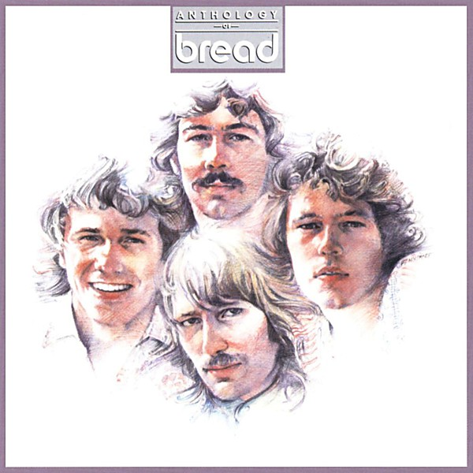

# Anthology of Bread

By **Bread**

## Album Data

- **Catalog:** Beets
- **Format:** Digital, Album
- **Album:** Anthology of Bread
- **Artist:** Bread
- **Albumartist:** Bread
- **Genre:** Soft Rock
- **MusicBrainz Album Artist ID:** [e3bcf587-a354-4723-a2d3-1c679d6571ea](https://musicbrainz.org/artist/e3bcf587-a354-4723-a2d3-1c679d6571ea)
- **MusicBrainz Album ID:** [6c9fd440-cea3-4aa1-8a0c-06dbe09b2f72](https://musicbrainz.org/release/6c9fd440-cea3-4aa1-8a0c-06dbe09b2f72)
- **MusicBrainz Release Group ID:** [6c592fab-50a5-38e9-a72c-2836af885300](https://musicbrainz.org/release-group/6c592fab-50a5-38e9-a72c-2836af885300)
- **Year:** 1985
- **Catalog #:** 
- **Label:** 
- **Total Tracks:** 20

## Album Tracks

### Track 01 - Make It With You

- **Artist:** Bread
- **Format:** ALAC
- **Genre:** Soft Rock
- **Length:** 3:11
- **MusicBrainz Track ID:** [ca2ca59b-165f-4fda-bd20-c8a42eba1ff1](https://musicbrainz.org/recording/ca2ca59b-165f-4fda-bd20-c8a42eba1ff1)
- **Title:** Make It With You
- **Track:** 01
- **Year:** 1985

### Track 02 - Dismal Day

- **Artist:** Bread
- **Format:** ALAC
- **Genre:** Emo
- **Length:** 2:16
- **MusicBrainz Track ID:** [38aeb964-5567-4d01-9bdb-46a812df6887](https://musicbrainz.org/recording/38aeb964-5567-4d01-9bdb-46a812df6887)
- **Title:** Dismal Day
- **Track:** 02
- **Year:** 1985

### Track 03 - London Bridge

- **Artist:** Bread
- **Format:** ALAC
- **Genre:** Emo
- **Length:** 2:31
- **MusicBrainz Track ID:** [782d3b11-d01d-44ce-8b1d-49869d59c070](https://musicbrainz.org/recording/782d3b11-d01d-44ce-8b1d-49869d59c070)
- **Title:** London Bridge
- **Track:** 03
- **Year:** 1985

### Track 04 - Anyway You Want Me

- **Artist:** Bread
- **Format:** ALAC
- **Genre:** Emo
- **Length:** 3:07
- **MusicBrainz Track ID:** [e60e2558-1e0d-4998-abed-0bf5d861dad2](https://musicbrainz.org/recording/e60e2558-1e0d-4998-abed-0bf5d861dad2)
- **Title:** Anyway You Want Me
- **Track:** 04
- **Year:** 1985

### Track 05 - Look What You've Done

- **Artist:** Bread
- **Format:** ALAC
- **Genre:** Emo
- **Length:** 3:11
- **MusicBrainz Track ID:** [5d3b6fd8-cde9-42a7-84cd-eacb29a8dfb5](https://musicbrainz.org/recording/5d3b6fd8-cde9-42a7-84cd-eacb29a8dfb5)
- **Title:** Look What You've Done
- **Track:** 05
- **Year:** 1985

### Track 06 - It Don't Matter to Me

- **Artist:** Bread
- **Format:** ALAC
- **Genre:** Soft Rock
- **Length:** 2:49
- **MusicBrainz Track ID:** [96565f21-fe3f-4460-8295-609b260f2cfe](https://musicbrainz.org/recording/96565f21-fe3f-4460-8295-609b260f2cfe)
- **Title:** It Don't Matter to Me
- **Track:** 06
- **Year:** 1985

### Track 07 - The Last Time

- **Artist:** Bread
- **Format:** ALAC
- **Genre:** Soft Rock
- **Length:** 4:03
- **MusicBrainz Track ID:** [825a3002-2042-45e6-ad43-b825616efbd5](https://musicbrainz.org/recording/825a3002-2042-45e6-ad43-b825616efbd5)
- **Title:** The Last Time
- **Track:** 07
- **Year:** 1985

### Track 08 - Let Your Love Go

- **Artist:** Bread
- **Format:** ALAC
- **Genre:** Soft Rock
- **Length:** 2:21
- **MusicBrainz Track ID:** [b07c43ff-2c1e-44f7-8dce-6ed8b5c6d29e](https://musicbrainz.org/recording/b07c43ff-2c1e-44f7-8dce-6ed8b5c6d29e)
- **Title:** Let Your Love Go
- **Track:** 08
- **Year:** 1985

### Track 09 - Truckin'

- **Artist:** Bread
- **Format:** ALAC
- **Genre:** Soft Rock
- **Length:** 2:31
- **MusicBrainz Track ID:** [85077fe2-349d-43b1-ae1d-8c53976b8853](https://musicbrainz.org/recording/85077fe2-349d-43b1-ae1d-8c53976b8853)
- **Title:** Truckin'
- **Track:** 09
- **Year:** 1985

### Track 10 - If

- **Artist:** Bread
- **Format:** ALAC
- **Genre:** Soft Rock
- **Length:** 2:34
- **MusicBrainz Track ID:** [a54d5cb8-7c70-4d3c-bc20-1fdb99bf5791](https://musicbrainz.org/recording/a54d5cb8-7c70-4d3c-bc20-1fdb99bf5791)
- **Title:** If
- **Track:** 10
- **Year:** 1985

### Track 11 - Baby I'm-A Want You

- **Artist:** Bread
- **Format:** ALAC
- **Genre:** Soft Rock
- **Length:** 2:26
- **MusicBrainz Track ID:** [31b40ec9-284b-4970-987f-3a6604d01790](https://musicbrainz.org/recording/31b40ec9-284b-4970-987f-3a6604d01790)
- **Title:** Baby I'm-A Want You
- **Track:** 11
- **Year:** 1985

### Track 12 - Everything I Own

- **Artist:** Bread
- **Format:** ALAC
- **Genre:** Soft Rock
- **Length:** 3:06
- **MusicBrainz Track ID:** [d068da52-8a64-4531-bf06-292b942a1ba0](https://musicbrainz.org/recording/d068da52-8a64-4531-bf06-292b942a1ba0)
- **Title:** Everything I Own
- **Track:** 12
- **Year:** 1985

### Track 13 - Down on My Knees

- **Artist:** Bread
- **Format:** ALAC
- **Genre:** Emo
- **Length:** 2:43
- **MusicBrainz Track ID:** [196a9ea9-67b2-4deb-9711-40070d8adc79](https://musicbrainz.org/recording/196a9ea9-67b2-4deb-9711-40070d8adc79)
- **Title:** Down on My Knees
- **Track:** 13
- **Year:** 1985

### Track 14 - Aubrey

- **Artist:** Bread
- **Format:** ALAC
- **Genre:** Soft Rock
- **Length:** 3:37
- **MusicBrainz Track ID:** [a6a5b1e2-ae0e-4ceb-98ff-40f775878fbd](https://musicbrainz.org/recording/a6a5b1e2-ae0e-4ceb-98ff-40f775878fbd)
- **Title:** Aubrey
- **Track:** 14
- **Year:** 1985

### Track 15 - Diary

- **Artist:** Bread
- **Format:** ALAC
- **Genre:** Emo
- **Length:** 3:07
- **MusicBrainz Track ID:** [8907671d-ce7c-45ce-81c8-12b18029b639](https://musicbrainz.org/recording/8907671d-ce7c-45ce-81c8-12b18029b639)
- **Title:** Diary
- **Track:** 15
- **Year:** 1985

### Track 16 - Sweet Surrender

- **Artist:** Bread
- **Format:** ALAC
- **Genre:** Emo
- **Length:** 2:35
- **MusicBrainz Track ID:** [5a31e4eb-40b8-4df3-a6f7-c13e368da42d](https://musicbrainz.org/recording/5a31e4eb-40b8-4df3-a6f7-c13e368da42d)
- **Title:** Sweet Surrender
- **Track:** 16
- **Year:** 1985

### Track 17 - The Guitar Man

- **Artist:** Bread
- **Format:** ALAC
- **Genre:** Soft Rock
- **Length:** 3:44
- **MusicBrainz Track ID:** [dafbf9f2-1c43-4889-8cbd-3d895d06b182](https://musicbrainz.org/recording/dafbf9f2-1c43-4889-8cbd-3d895d06b182)
- **Title:** The Guitar Man
- **Track:** 17
- **Year:** 1985

### Track 18 - Fancy Dancer

- **Artist:** Bread
- **Format:** ALAC
- **Genre:** Pop Rock
- **Length:** 3:30
- **MusicBrainz Track ID:** [eb9835da-b666-40ac-bcdd-d54db0abab28](https://musicbrainz.org/recording/eb9835da-b666-40ac-bcdd-d54db0abab28)
- **Title:** Fancy Dancer
- **Track:** 18
- **Year:** 1985

### Track 19 - She's the Only One

- **Artist:** Bread
- **Format:** ALAC
- **Genre:** Soft Rock
- **Length:** 2:58
- **MusicBrainz Track ID:** [b1c8d5bb-1594-412d-b296-7c273ba38740](https://musicbrainz.org/recording/b1c8d5bb-1594-412d-b296-7c273ba38740)
- **Title:** She's the Only One
- **Track:** 19
- **Year:** 1985

### Track 20 - Lost Without Your Love

- **Artist:** Bread
- **Format:** ALAC
- **Genre:** Soft Rock
- **Length:** 0:00
- **MusicBrainz Track ID:** [f3270edf-be66-474d-b15f-08e3f8f43a8d](https://musicbrainz.org/recording/f3270edf-be66-474d-b15f-08e3f8f43a8d)
- **Title:** Lost Without Your Love
- **Track:** 20
- **Year:** 1985

## See also

- [Roon: Guitar Man](../../Roon/Bread/Guitar_Man.md)
- [Roon: The Studio Album Collection](../../Roon/Bread/The_Studio_Album_Collection.md)
