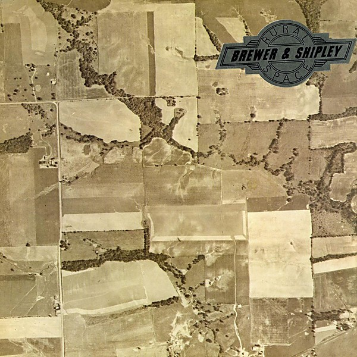

# Rural Space

By **Brewer & Shipley**

## Album Data

- **Catalog:** Beets
- **Format:** Digital, Album
- **Album:** Rural Space
- **Artist:** Brewer & Shipley
- **Albumartist:** Brewer & Shipley
- **Genre:** Folk Rock
- **MusicBrainz Album Artist ID:** 
- **MusicBrainz Album ID:** 
- **MusicBrainz Release Group ID:** 
- **Year:** 0000
- **Catalog #:** KSBS 2039
- **Label:** Kama Sutra
- **Total Tracks:** 10

## Album Tracks

### Track 01 - Shake Off the Demon

- **Artist:** Brewer & Shipley
- **Format:** ALAC
- **Genre:** Folk Rock
- **Length:** 3:13
- **MusicBrainz Track ID:** [2239e68e-da11-480c-9227-745de79b10da](https://musicbrainz.org/recording/2239e68e-da11-480c-9227-745de79b10da)
- **Title:** Shake Off the Demon
- **Track:** 01
- **Year:** 1971

### Track 02 - Merciful Love

- **Artist:** Brewer & Shipley
- **Format:** ALAC
- **Genre:** Folk Rock
- **Length:** 1:54
- **MusicBrainz Track ID:** [0ce89913-09ec-425d-a1ca-94e30778aee7](https://musicbrainz.org/recording/0ce89913-09ec-425d-a1ca-94e30778aee7)
- **Title:** Merciful Love
- **Track:** 02
- **Year:** 1971

### Track 03 - Message From the Mission (Hold On)

- **Artist:** Brewer & Shipley
- **Format:** ALAC
- **Genre:** Folk Rock
- **Length:** 3:07
- **MusicBrainz Track ID:** [0b361df5-1df4-4410-9e65-a90efb6ab98b](https://musicbrainz.org/recording/0b361df5-1df4-4410-9e65-a90efb6ab98b)
- **Title:** Message From the Mission (Hold On)
- **Track:** 03
- **Year:** 1971

### Track 04 - One by One

- **Artist:** Brewer & Shipley
- **Format:** ALAC
- **Genre:** Folk Rock
- **Length:** 3:04
- **MusicBrainz Track ID:** [b21ccb83-2960-4ece-8065-6e8277bb8495](https://musicbrainz.org/recording/b21ccb83-2960-4ece-8065-6e8277bb8495)
- **Title:** One by One
- **Track:** 04
- **Year:** 1971

### Track 05 - When Everybody Comes Home

- **Artist:** Brewer & Shipley
- **Format:** ALAC
- **Genre:** Folk Rock
- **Length:** 2:02
- **MusicBrainz Track ID:** [34614850-5297-4b6f-98c3-dc2e852d7b34](https://musicbrainz.org/recording/34614850-5297-4b6f-98c3-dc2e852d7b34)
- **Title:** When Everybody Comes Home
- **Track:** 05
- **Year:** 1971

### Track 06 - Working on the Well

- **Artist:** Brewer & Shipley
- **Format:** ALAC
- **Genre:** Folk Rock
- **Length:** 3:17
- **MusicBrainz Track ID:** [4cf1b07b-f529-4b8d-aee4-741388ef114b](https://musicbrainz.org/recording/4cf1b07b-f529-4b8d-aee4-741388ef114b)
- **Title:** Working on the Well
- **Track:** 06
- **Year:** 1971

### Track 07 - Rock Me on the Water

- **Artist:** Brewer & Shipley
- **Format:** ALAC
- **Genre:** Folk Rock
- **Length:** 4:01
- **MusicBrainz Track ID:** [d7b2dfb2-e12d-41f1-ae1c-e3d684ba7905](https://musicbrainz.org/recording/d7b2dfb2-e12d-41f1-ae1c-e3d684ba7905)
- **Title:** Rock Me on the Water
- **Track:** 07
- **Year:** 1971

### Track 08 - Natural Child

- **Artist:** Brewer & Shipley
- **Format:** ALAC
- **Genre:** Folk Rock
- **Length:** 3:46
- **MusicBrainz Track ID:** [f0d2f399-223a-4d7b-823b-25ec4d78bb67](https://musicbrainz.org/recording/f0d2f399-223a-4d7b-823b-25ec4d78bb67)
- **Title:** Natural Child
- **Track:** 08
- **Year:** 1971

### Track 09 - Back to the Farm

- **Artist:** Brewer & Shipley
- **Format:** ALAC
- **Genre:** Folk Rock
- **Length:** 3:21
- **MusicBrainz Track ID:** [b0294d64-e02b-41ca-bbcb-97b6b178e4f6](https://musicbrainz.org/recording/b0294d64-e02b-41ca-bbcb-97b6b178e4f6)
- **Title:** Back to the Farm
- **Track:** 09
- **Year:** 1971

### Track 10 - Sweet Love

- **Artist:** Brewer & Shipley
- **Format:** ALAC
- **Genre:** Folk Rock
- **Length:** 3:53
- **MusicBrainz Track ID:** [fa009148-1e70-46bd-8747-9ae528ccdf22](https://musicbrainz.org/recording/fa009148-1e70-46bd-8747-9ae528ccdf22)
- **Title:** Sweet Love
- **Track:** 10
- **Year:** 1971

## See also

- [Shake Off the Demon](Shake_Off_the_Demon.md)
- [Tarkio](Tarkio.md)
- [Weeds](Weeds.md)
- [Roon: Shake off the Demon](../../Roon/Brewer_and_Shipley/Shake_off_the_Demon.md)
- [Roon: Tarkio Road](../../Roon/Brewer_and_Shipley/Tarkio_Road.md)
- [Roon: Weeds](../../Roon/Brewer_and_Shipley/Weeds.md)
