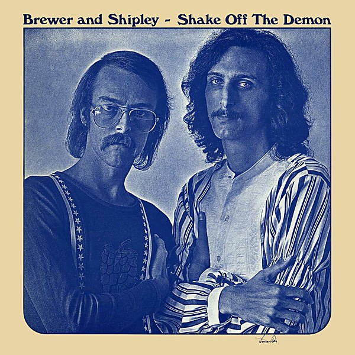

# Shake Off the Demon

By **Brewer & Shipley**

## Album Data

- **Catalog:** Beets
- **Format:** Digital, Album
- **Album:** Shake Off the Demon
- **Artist:** Brewer & Shipley
- **Albumartist:** Brewer & Shipley
- **Genre:** Folk Rock
- **MusicBrainz Album Artist ID:** [a6fc09b9-74b7-48c1-9cc6-7889ec902abc](https://musicbrainz.org/artist/a6fc09b9-74b7-48c1-9cc6-7889ec902abc)
- **MusicBrainz Album ID:** [f389bbee-5938-4c16-8d47-c53f0d792094](https://musicbrainz.org/release/f389bbee-5938-4c16-8d47-c53f0d792094)
- **MusicBrainz Release Group ID:** [ca7bf8dc-e472-40cb-ac84-4a5baae49163](https://musicbrainz.org/release-group/ca7bf8dc-e472-40cb-ac84-4a5baae49163)
- **Year:** 1971
- **Catalog #:** KSBS 2024
- **Label:** Kama Sutra
- **Total Tracks:** 10

## Album Tracks

### Track 01 - One Toke Over the Line

- **Artist:** Brewer & Shipley
- **Format:** ALAC
- **Genre:** Psychedelic Rock
- **Length:** 3:21
- **MusicBrainz Track ID:** [bc322b58-9a1a-4865-b98a-14bf903b12ed](https://musicbrainz.org/recording/bc322b58-9a1a-4865-b98a-14bf903b12ed)
- **Title:** One Toke Over the Line
- **Track:** 01
- **Year:** 1970

### Track 02 - Song From Platte River

- **Artist:** Brewer & Shipley
- **Format:** ALAC
- **Genre:** Country
- **Length:** 3:19
- **MusicBrainz Track ID:** [d8513f98-521e-4d7d-9fb7-66534ade2c7a](https://musicbrainz.org/recording/d8513f98-521e-4d7d-9fb7-66534ade2c7a)
- **Title:** Song From Platte River
- **Track:** 02
- **Year:** 1970

### Track 03 - The Light

- **Artist:** Brewer & Shipley
- **Format:** ALAC
- **Genre:** Folk Rock
- **Length:** 3:10
- **MusicBrainz Track ID:** [610972a9-9a98-4dad-b7b8-7df789ce4760](https://musicbrainz.org/recording/610972a9-9a98-4dad-b7b8-7df789ce4760)
- **Title:** The Light
- **Track:** 03
- **Year:** 1970

### Track 04 - Ruby on the Morning

- **Artist:** Brewer & Shipley
- **Format:** ALAC
- **Genre:** Folk Rock
- **Length:** 2:19
- **MusicBrainz Track ID:** [d62de060-aee4-4fa6-b647-699c194b512f](https://musicbrainz.org/recording/d62de060-aee4-4fa6-b647-699c194b512f)
- **Title:** Ruby on the Morning
- **Track:** 04
- **Year:** 1970

### Track 05 - Oh Mommy

- **Artist:** Brewer & Shipley
- **Format:** ALAC
- **Genre:** Folk Rock
- **Length:** 3:05
- **MusicBrainz Track ID:** [b598e586-5fa5-43cf-9002-5de69d942673](https://musicbrainz.org/recording/b598e586-5fa5-43cf-9002-5de69d942673)
- **Title:** Oh Mommy
- **Track:** 05
- **Year:** 1970

### Track 06 - Don’t Want to Die in Georgia

- **Artist:** Brewer & Shipley
- **Format:** ALAC
- **Genre:** Folk Rock
- **Length:** 3:48
- **MusicBrainz Track ID:** [861b2999-9586-4b06-92c5-e55359709745](https://musicbrainz.org/recording/861b2999-9586-4b06-92c5-e55359709745)
- **Title:** Don’t Want to Die in Georgia
- **Track:** 06
- **Year:** 1970

### Track 07 - Can’t Go Home

- **Artist:** Brewer & Shipley
- **Format:** ALAC
- **Genre:** Folk Rock
- **Length:** 2:33
- **MusicBrainz Track ID:** [204478d7-d3c7-4274-8f10-ed1985a7f115](https://musicbrainz.org/recording/204478d7-d3c7-4274-8f10-ed1985a7f115)
- **Title:** Can’t Go Home
- **Track:** 07
- **Year:** 1970

### Track 08 - Tarkio Road

- **Artist:** Brewer & Shipley
- **Format:** ALAC
- **Genre:** Soft Rock
- **Length:** 4:33
- **MusicBrainz Track ID:** [5e1bcb6e-68fb-448b-afef-02159aede955](https://musicbrainz.org/recording/5e1bcb6e-68fb-448b-afef-02159aede955)
- **Title:** Tarkio Road
- **Track:** 08
- **Year:** 1970

### Track 09 - Seems Like a Long Time

- **Artist:** Brewer & Shipley
- **Format:** ALAC
- **Genre:** Folk Rock
- **Length:** 4:15
- **MusicBrainz Track ID:** [162c98b8-e7c2-4fcc-b1e1-dd70c2fb1c95](https://musicbrainz.org/recording/162c98b8-e7c2-4fcc-b1e1-dd70c2fb1c95)
- **Title:** Seems Like a Long Time
- **Track:** 09
- **Year:** 1970

### Track 10 - Fifty States of Freedom

- **Artist:** Brewer & Shipley
- **Format:** ALAC
- **Genre:** Folk Rock
- **Length:** 6:51
- **MusicBrainz Track ID:** [1f1cfb30-5499-4c8d-acb8-f4bc313fa4f5](https://musicbrainz.org/recording/1f1cfb30-5499-4c8d-acb8-f4bc313fa4f5)
- **Title:** Fifty States of Freedom
- **Track:** 10
- **Year:** 1970

## See also

- [Rural Space](Rural_Space.md)
- [Tarkio](Tarkio.md)
- [Weeds](Weeds.md)
- [Roon: Shake off the Demon](../../Roon/Brewer_and_Shipley/Shake_off_the_Demon.md)
- [Roon: Tarkio Road](../../Roon/Brewer_and_Shipley/Tarkio_Road.md)
- [Roon: Weeds](../../Roon/Brewer_and_Shipley/Weeds.md)
