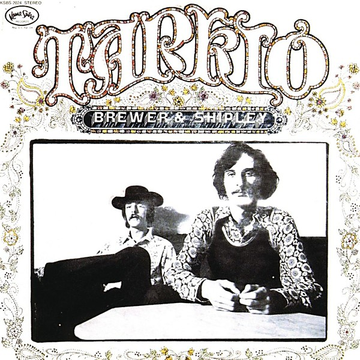

# Tarkio

By **Brewer & Shipley**

## Album Data

- **Catalog:** Beets
- **Format:** Digital, Album
- **Album:** Tarkio
- **Artist:** Brewer & Shipley
- **Albumartist:** Brewer & Shipley
- **Genre:** Folk Rock
- **MusicBrainz Album Artist ID:** [a6fc09b9-74b7-48c1-9cc6-7889ec902abc](https://musicbrainz.org/artist/a6fc09b9-74b7-48c1-9cc6-7889ec902abc)
- **MusicBrainz Album ID:** [980f4d48-70f9-4510-bf75-fbfe5f34596d](https://musicbrainz.org/release/980f4d48-70f9-4510-bf75-fbfe5f34596d)
- **MusicBrainz Release Group ID:** [88ed2488-ac24-30b4-8b6f-da339c6082f7](https://musicbrainz.org/release-group/88ed2488-ac24-30b4-8b6f-da339c6082f7)
- **Year:** 1970
- **Catalog #:** 
- **Label:** 
- **Total Tracks:** 10

## Album Tracks

### Track 01 - Lady Like You

- **Artist:** Brewer & Shipley
- **Format:** ALAC
- **Genre:** Folk Rock
- **Length:** 2:07
- **MusicBrainz Track ID:** [6f2d5ee2-61a1-4e67-969e-1b9a5de7c18b](https://musicbrainz.org/recording/6f2d5ee2-61a1-4e67-969e-1b9a5de7c18b)
- **Title:** Lady Like You
- **Track:** 01
- **Year:** 1969

### Track 02 - Rise Up (Easy Rider)

- **Artist:** Brewer & Shipley
- **Format:** ALAC
- **Genre:** Folk Rock
- **Length:** 3:16
- **MusicBrainz Track ID:** [461826fe-9e59-4230-a339-aa758b482fb7](https://musicbrainz.org/recording/461826fe-9e59-4230-a339-aa758b482fb7)
- **Title:** Rise Up (Easy Rider)
- **Track:** 02
- **Year:** 1969

### Track 03 - Boomerang

- **Artist:** Brewer & Shipley
- **Format:** ALAC
- **Genre:** Folk Rock
- **Length:** 2:20
- **MusicBrainz Track ID:** [2e5d9fde-e95c-470b-a0c8-ce1f063a54fd](https://musicbrainz.org/recording/2e5d9fde-e95c-470b-a0c8-ce1f063a54fd)
- **Title:** Boomerang
- **Track:** 03
- **Year:** 1969

### Track 04 - Indian Summer

- **Artist:** Brewer & Shipley
- **Format:** ALAC
- **Genre:** Folk Rock
- **Length:** 2:56
- **MusicBrainz Track ID:** [d5d856d8-6084-4174-a2db-6b4823e9437b](https://musicbrainz.org/recording/d5d856d8-6084-4174-a2db-6b4823e9437b)
- **Title:** Indian Summer
- **Track:** 04
- **Year:** 1969

### Track 05 - All Along the Watchtower

- **Artist:** Brewer & Shipley
- **Format:** ALAC
- **Genre:** Rock
- **Length:** 3:17
- **MusicBrainz Track ID:** [43c4486c-8848-4d5f-beaa-7f63da39369d](https://musicbrainz.org/recording/43c4486c-8848-4d5f-beaa-7f63da39369d)
- **Title:** All Along the Watchtower
- **Track:** 05
- **Year:** 1969

### Track 06 - People Love Each Other

- **Artist:** Brewer & Shipley
- **Format:** ALAC
- **Genre:** Folk Rock
- **Length:** 2:52
- **MusicBrainz Track ID:** [6be401fa-dccb-4601-b284-9f109e4ad749](https://musicbrainz.org/recording/6be401fa-dccb-4601-b284-9f109e4ad749)
- **Title:** People Love Each Other
- **Track:** 06
- **Year:** 1969

### Track 07 - Pig's Head

- **Artist:** Brewer & Shipley
- **Format:** ALAC
- **Genre:** Folk Rock
- **Length:** 2:07
- **MusicBrainz Track ID:** [b078dfa6-c4cd-4cb7-bd10-076166ec0a4e](https://musicbrainz.org/recording/b078dfa6-c4cd-4cb7-bd10-076166ec0a4e)
- **Title:** Pig's Head
- **Track:** 07
- **Year:** 1969

### Track 08 - Oh, Sweet Lady

- **Artist:** Brewer & Shipley
- **Format:** ALAC
- **Genre:** Folk Rock
- **Length:** 1:57
- **MusicBrainz Track ID:** [28a2f0a6-19a0-4d73-813e-41283b28a7f0](https://musicbrainz.org/recording/28a2f0a6-19a0-4d73-813e-41283b28a7f0)
- **Title:** Oh, Sweet Lady
- **Track:** 08
- **Year:** 1969

### Track 09 - Too Soon Tomorrow

- **Artist:** Brewer & Shipley
- **Format:** ALAC
- **Genre:** Folk Rock
- **Length:** 2:50
- **MusicBrainz Track ID:** [336e6845-4db3-45b5-8978-e9ed103d096c](https://musicbrainz.org/recording/336e6845-4db3-45b5-8978-e9ed103d096c)
- **Title:** Too Soon Tomorrow
- **Track:** 09
- **Year:** 1969

### Track 10 - Whitchi-Tai-To

- **Artist:** Brewer & Shipley
- **Format:** ALAC
- **Genre:** Folk Rock
- **Length:** 6:55
- **MusicBrainz Track ID:** [33c9d814-1760-4d61-aba6-29a28c047ccb](https://musicbrainz.org/recording/33c9d814-1760-4d61-aba6-29a28c047ccb)
- **Title:** Whitchi-Tai-To
- **Track:** 10
- **Year:** 1969

## See also

- [Rural Space](Rural_Space.md)
- [Shake Off the Demon](Shake_Off_the_Demon.md)
- [Weeds](Weeds.md)
- [Roon: Shake off the Demon](../../Roon/Brewer_and_Shipley/Shake_off_the_Demon.md)
- [Roon: Tarkio Road](../../Roon/Brewer_and_Shipley/Tarkio_Road.md)
- [Roon: Weeds](../../Roon/Brewer_and_Shipley/Weeds.md)
