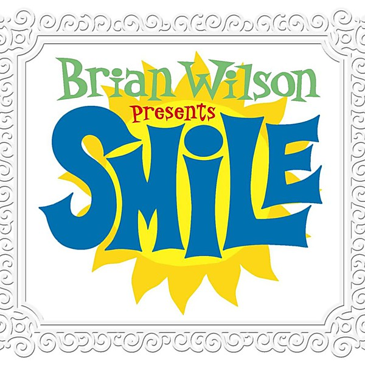

# SMiLE

By **Brian Wilson**

## Album Data

- **Catalog:** Beets
- **Format:** Digital, Album
- **Album:** SMiLE
- **Artist:** Brian Wilson
- **Albumartist:** Brian Wilson
- **Genre:** Surf Rock
- **MusicBrainz Album Artist ID:** [634fe78e-fc6b-4b2a-ba83-c8c66e13a8aa](https://musicbrainz.org/artist/634fe78e-fc6b-4b2a-ba83-c8c66e13a8aa)
- **MusicBrainz Album ID:** [b7b2aa52-2189-486a-aa6f-de095ddfd019](https://musicbrainz.org/release/b7b2aa52-2189-486a-aa6f-de095ddfd019)
- **MusicBrainz Release Group ID:** [7eea3a40-7c24-34f9-aa48-958edb5145c5](https://musicbrainz.org/release-group/7eea3a40-7c24-34f9-aa48-958edb5145c5)
- **Year:** 2004
- **Catalog #:** 
- **Label:** Nonesuch
- **Total Tracks:** 18

## Album Tracks

### Track 01 - Our Prayer / Gee

- **Artist:** Brian Wilson
- **Format:** AAC
- **Genre:** Surf Rock
- **Length:** 2:09
- **MusicBrainz Track ID:** [4e295eee-35ac-40ea-ba6e-a8c585061848](https://musicbrainz.org/recording/4e295eee-35ac-40ea-ba6e-a8c585061848)
- **Title:** Our Prayer / Gee
- **Track:** 01
- **Year:** 2004

### Track 02 - Heroes and Villains

- **Artist:** Brian Wilson
- **Format:** MP3
- **Genre:** Orchestral
- **Length:** 4:52
- **MusicBrainz Track ID:** [a67c14e3-fb84-4dd9-88b7-085842489273](https://musicbrainz.org/recording/a67c14e3-fb84-4dd9-88b7-085842489273)
- **Title:** Heroes and Villains
- **Track:** 02
- **Year:** 2004

### Track 03 - Roll Plymouth Rock

- **Artist:** Brian Wilson
- **Format:** MP3
- **Genre:** Surf Pop
- **Length:** 3:47
- **MusicBrainz Track ID:** [b4418e80-d62b-40e3-9702-285018968f2a](https://musicbrainz.org/recording/b4418e80-d62b-40e3-9702-285018968f2a)
- **Title:** Roll Plymouth Rock
- **Track:** 03
- **Year:** 2004

### Track 04 - Barnyard

- **Artist:** Brian Wilson
- **Format:** MP3
- **Genre:** Surf Rock
- **Length:** 0:58
- **MusicBrainz Track ID:** [48785bf5-45c3-4942-ac31-0830992f7e72](https://musicbrainz.org/recording/48785bf5-45c3-4942-ac31-0830992f7e72)
- **Title:** Barnyard
- **Track:** 04
- **Year:** 2004

### Track 05 - Old Master Painter / You Are My Sunshine

- **Artist:** Brian Wilson
- **Format:** MP3
- **Genre:** Surf Rock
- **Length:** 1:03
- **MusicBrainz Track ID:** [f37fb3f3-b14c-4555-9811-9f8b170a44e0](https://musicbrainz.org/recording/f37fb3f3-b14c-4555-9811-9f8b170a44e0)
- **Title:** Old Master Painter / You Are My Sunshine
- **Track:** 05
- **Year:** 2004

### Track 06 - Cabin Essence

- **Artist:** Brian Wilson
- **Format:** MP3
- **Genre:** Surf Rock
- **Length:** 3:29
- **MusicBrainz Track ID:** [63c7f6c1-ce3e-4c12-82d5-c34899052f46](https://musicbrainz.org/recording/63c7f6c1-ce3e-4c12-82d5-c34899052f46)
- **Title:** Cabin Essence
- **Track:** 06
- **Year:** 2004

### Track 07 - Wonderful

- **Artist:** Brian Wilson
- **Format:** MP3
- **Genre:** Orchestral
- **Length:** 2:06
- **MusicBrainz Track ID:** [e8b70d47-4044-484c-a79f-dbdaf11c42c1](https://musicbrainz.org/recording/e8b70d47-4044-484c-a79f-dbdaf11c42c1)
- **Title:** Wonderful
- **Track:** 07
- **Year:** 2004

### Track 08 - Song for Children

- **Artist:** Brian Wilson
- **Format:** MP3
- **Genre:** Surf Rock
- **Length:** 2:16
- **MusicBrainz Track ID:** [facd512c-0589-497d-bcbd-bb4f1e9e3475](https://musicbrainz.org/recording/facd512c-0589-497d-bcbd-bb4f1e9e3475)
- **Title:** Song for Children
- **Track:** 08
- **Year:** 2004

### Track 09 - Child Is Father of the Man

- **Artist:** Brian Wilson
- **Format:** MP3
- **Genre:** Surf Rock
- **Length:** 2:17
- **MusicBrainz Track ID:** [80147c2b-75be-4e43-9450-453e8897109a](https://musicbrainz.org/recording/80147c2b-75be-4e43-9450-453e8897109a)
- **Title:** Child Is Father of the Man
- **Track:** 09
- **Year:** 2004

### Track 10 - Surf's Up

- **Artist:** Brian Wilson
- **Format:** MP3
- **Genre:** Orchestral
- **Length:** 4:08
- **MusicBrainz Track ID:** [81471669-fa10-40f2-a161-a0ab779c9bf9](https://musicbrainz.org/recording/81471669-fa10-40f2-a161-a0ab779c9bf9)
- **Title:** Surf's Up
- **Track:** 10
- **Year:** 2004

### Track 11 - I'm in Great Shape / I Wanna Be Around / Workshop

- **Artist:** Brian Wilson
- **Format:** MP3
- **Genre:** Surf Rock
- **Length:** 1:56
- **MusicBrainz Track ID:** [d9d7cb25-99d0-43db-a033-9eeb4ba27575](https://musicbrainz.org/recording/d9d7cb25-99d0-43db-a033-9eeb4ba27575)
- **Title:** I'm in Great Shape / I Wanna Be Around / Workshop
- **Track:** 11
- **Year:** 2004

### Track 12 - Vega-Tables

- **Artist:** Brian Wilson
- **Format:** MP3
- **Genre:** Surf Rock
- **Length:** 2:19
- **MusicBrainz Track ID:** [94b47dae-8967-4523-81ae-d2775f243ac2](https://musicbrainz.org/recording/94b47dae-8967-4523-81ae-d2775f243ac2)
- **Title:** Vega-Tables
- **Track:** 12
- **Year:** 2004

### Track 13 - On a Holiday

- **Artist:** Brian Wilson
- **Format:** MP3
- **Genre:** Surf Rock
- **Length:** 2:35
- **MusicBrainz Track ID:** [eeb1d633-ab53-47d5-aa16-ed316bf5bbc2](https://musicbrainz.org/recording/eeb1d633-ab53-47d5-aa16-ed316bf5bbc2)
- **Title:** On a Holiday
- **Track:** 13
- **Year:** 2004

### Track 14 - Wind Chimes

- **Artist:** Brian Wilson
- **Format:** MP3
- **Genre:** Orchestral
- **Length:** 2:53
- **MusicBrainz Track ID:** [10758520-646d-4481-9d6d-003cdea5c7f8](https://musicbrainz.org/recording/10758520-646d-4481-9d6d-003cdea5c7f8)
- **Title:** Wind Chimes
- **Track:** 14
- **Year:** 2004

### Track 15 - Mrs. O'Leary's Cow

- **Artist:** Brian Wilson
- **Format:** MP3
- **Genre:** Acid Rock
- **Length:** 2:27
- **MusicBrainz Track ID:** [382795a5-cee1-4428-a5ea-2bec31cf9bb7](https://musicbrainz.org/recording/382795a5-cee1-4428-a5ea-2bec31cf9bb7)
- **Title:** Mrs. O'Leary's Cow
- **Track:** 15
- **Year:** 2004

### Track 16 - In Blue Hawaii

- **Artist:** Brian Wilson
- **Format:** MP3
- **Genre:** Surf Rock
- **Length:** 2:59
- **MusicBrainz Track ID:** [b0d2c365-1569-43b1-a4e7-a6a6dc5b04cc](https://musicbrainz.org/recording/b0d2c365-1569-43b1-a4e7-a6a6dc5b04cc)
- **Title:** In Blue Hawaii
- **Track:** 16
- **Year:** 2004

### Track 17 - Good Vibrations

- **Artist:** Brian Wilson
- **Format:** MP3
- **Genre:** Surf Rock
- **Length:** 4:36
- **MusicBrainz Track ID:** [4c2b475d-9489-4b77-ab9b-5deddcc5e422](https://musicbrainz.org/recording/4c2b475d-9489-4b77-ab9b-5deddcc5e422)
- **Title:** Good Vibrations
- **Track:** 17
- **Year:** 2004

## See also

- [Roon: Smile](../../Roon/Brian_Wilson/Smile.md)
- [Vinyl: ](../../Vinyl/Brian_Wilson/Brian_Wilson_index.md)
- [Vinyl: Brian Wilson](../../Vinyl/Brian_Wilson/Brian_Wilson.md)
