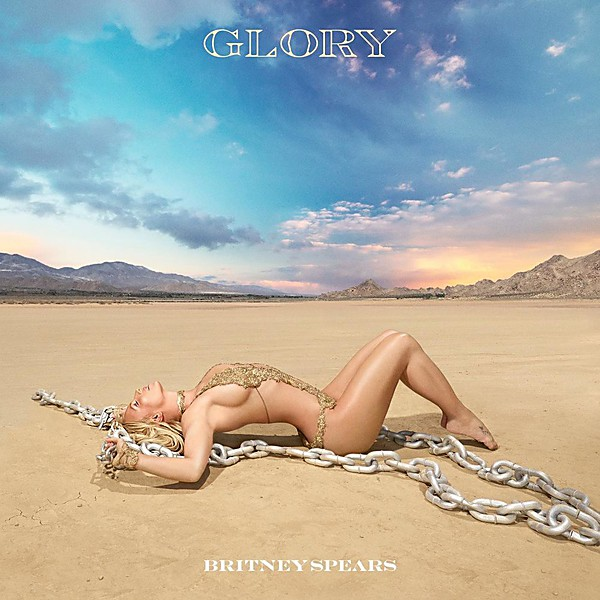

# Glory

By **Britney Spears**

## Album Data

- **Catalog:** Beets
- **Format:** Digital, Album
- **Album:** Glory
- **Artist:** Britney Spears
- **Albumartist:** Britney Spears
- **Genre:** Pop
- **MusicBrainz Album Artist ID:** [45a663b5-b1cb-4a91-bff6-2bef7bbfdd76](https://musicbrainz.org/artist/45a663b5-b1cb-4a91-bff6-2bef7bbfdd76)
- **MusicBrainz Album ID:** [55a71468-36b7-4423-93ca-5814643bcc0b](https://musicbrainz.org/release/55a71468-36b7-4423-93ca-5814643bcc0b)
- **MusicBrainz Release Group ID:** [00351ca9-c8e0-4ac3-9f59-b2c485da9be0](https://musicbrainz.org/release-group/00351ca9-c8e0-4ac3-9f59-b2c485da9be0)
- **Year:** 2016
- **Catalog #:** 536667
- **Label:** RCA
- **Total Tracks:** 17

## Album Tracks

### Track 01 - Invitation

- **Artist:** Britney Spears
- **Format:** ALAC
- **Genre:** Dream Pop
- **Length:** 3:18
- **MusicBrainz Track ID:** [575ed7ed-eebf-46dd-bb08-a3fd852f3785](https://musicbrainz.org/recording/575ed7ed-eebf-46dd-bb08-a3fd852f3785)
- **Title:** Invitation
- **Track:** 01
- **Year:** 2016

### Track 02 - Do You Wanna Come Over?

- **Artist:** Britney Spears
- **Format:** ALAC
- **Genre:** Electropop
- **Length:** 3:22
- **MusicBrainz Track ID:** [10dd19a3-5109-4c7f-a00e-9953169133e6](https://musicbrainz.org/recording/10dd19a3-5109-4c7f-a00e-9953169133e6)
- **Title:** Do You Wanna Come Over?
- **Track:** 02
- **Year:** 2016

### Track 04 - Private Show

- **Artist:** Britney Spears
- **Format:** ALAC
- **Genre:** Pop
- **Length:** 3:55
- **MusicBrainz Track ID:** [ac207d7a-01dc-4df6-99fc-95f862a4421a](https://musicbrainz.org/recording/ac207d7a-01dc-4df6-99fc-95f862a4421a)
- **Title:** Private Show
- **Track:** 04
- **Year:** 2016

### Track 05 - Man on the Moon

- **Artist:** Britney Spears
- **Format:** ALAC
- **Genre:** Electropop
- **Length:** 3:46
- **MusicBrainz Track ID:** [534d5cec-5bf6-4291-bf40-eaa632384de6](https://musicbrainz.org/recording/534d5cec-5bf6-4291-bf40-eaa632384de6)
- **Title:** Man on the Moon
- **Track:** 05
- **Year:** 2016

### Track 06 - Just Luv Me

- **Artist:** Britney Spears
- **Format:** ALAC
- **Genre:** Dream Pop
- **Length:** 4:01
- **MusicBrainz Track ID:** [f551ec83-ab5d-4d95-8e01-33b59bcf36dc](https://musicbrainz.org/recording/f551ec83-ab5d-4d95-8e01-33b59bcf36dc)
- **Title:** Just Luv Me
- **Track:** 06
- **Year:** 2016

### Track 07 - Clumsy

- **Artist:** Britney Spears
- **Format:** ALAC
- **Genre:** Electropop
- **Length:** 3:02
- **MusicBrainz Track ID:** [bbb92795-c06f-4c23-b0ae-114ef3f81164](https://musicbrainz.org/recording/bbb92795-c06f-4c23-b0ae-114ef3f81164)
- **Title:** Clumsy
- **Track:** 07
- **Year:** 2016

### Track 08 - Slumber Party

- **Artist:** Britney Spears
- **Format:** ALAC
- **Genre:** Bossa Nova
- **Length:** 3:34
- **MusicBrainz Track ID:** [775507e0-f689-472c-b962-7efb3ef915b8](https://musicbrainz.org/recording/775507e0-f689-472c-b962-7efb3ef915b8)
- **Title:** Slumber Party
- **Track:** 08
- **Year:** 2016

### Track 09 - Just Like Me

- **Artist:** Britney Spears
- **Format:** ALAC
- **Genre:** Country Pop
- **Length:** 2:44
- **MusicBrainz Track ID:** [4f219b05-b36a-455e-bb61-661e8a21d618](https://musicbrainz.org/recording/4f219b05-b36a-455e-bb61-661e8a21d618)
- **Title:** Just Like Me
- **Track:** 09
- **Year:** 2016

### Track 10 - Love Me Down

- **Artist:** Britney Spears
- **Format:** ALAC
- **Genre:** Electropop
- **Length:** 3:18
- **MusicBrainz Track ID:** [c2f6d3b3-197c-48fe-a60f-794087b37afe](https://musicbrainz.org/recording/c2f6d3b3-197c-48fe-a60f-794087b37afe)
- **Title:** Love Me Down
- **Track:** 10
- **Year:** 2016

### Track 11 - Hard to Forget Ya

- **Artist:** Britney Spears
- **Format:** ALAC
- **Genre:** Pop Rock
- **Length:** 3:29
- **MusicBrainz Track ID:** [fb369cd1-3265-44c5-94ae-11ee86fde00a](https://musicbrainz.org/recording/fb369cd1-3265-44c5-94ae-11ee86fde00a)
- **Title:** Hard to Forget Ya
- **Track:** 11
- **Year:** 2016

### Track 12 - What You Need

- **Artist:** Britney Spears
- **Format:** ALAC
- **Genre:** Uk Garage
- **Length:** 3:07
- **MusicBrainz Track ID:** [984ba864-4dbe-41e0-869b-125c7c9180f0](https://musicbrainz.org/recording/984ba864-4dbe-41e0-869b-125c7c9180f0)
- **Title:** What You Need
- **Track:** 12
- **Year:** 2016

### Track 13 - Better

- **Artist:** Britney Spears
- **Format:** ALAC
- **Genre:** Pop
- **Length:** 3:09
- **MusicBrainz Track ID:** [f943e6b7-0227-492d-acd9-7a19e2b932bc](https://musicbrainz.org/recording/f943e6b7-0227-492d-acd9-7a19e2b932bc)
- **Title:** Better
- **Track:** 13
- **Year:** 2016

### Track 14 - Change Your Mind (No Seas Cortes)

- **Artist:** Britney Spears
- **Format:** ALAC
- **Genre:** Pop
- **Length:** 3:00
- **MusicBrainz Track ID:** [050937a0-7df1-4c80-be88-8874f3d90a37](https://musicbrainz.org/recording/050937a0-7df1-4c80-be88-8874f3d90a37)
- **Title:** Change Your Mind (No Seas Cortes)
- **Track:** 14
- **Year:** 2016

### Track 15 - Liar

- **Artist:** Britney Spears
- **Format:** ALAC
- **Genre:** Synthpop
- **Length:** 3:16
- **MusicBrainz Track ID:** [4d7e8b9d-4124-4def-9b99-2e81cefbb945](https://musicbrainz.org/recording/4d7e8b9d-4124-4def-9b99-2e81cefbb945)
- **Title:** Liar
- **Track:** 15
- **Year:** 2016

### Track 16 - If I’m Dancing

- **Artist:** Britney Spears
- **Format:** ALAC
- **Genre:** Funk
- **Length:** 3:24
- **MusicBrainz Track ID:** [c983983d-af88-49ea-aaa8-214a165d8733](https://musicbrainz.org/recording/c983983d-af88-49ea-aaa8-214a165d8733)
- **Title:** If I’m Dancing
- **Track:** 16
- **Year:** 2016

### Track 17 - Coupure Électrique

- **Artist:** Britney Spears
- **Format:** ALAC
- **Genre:** J-Pop
- **Length:** 2:20
- **MusicBrainz Track ID:** [cb8c735f-fdb5-4623-a81e-9fc2167adcd7](https://musicbrainz.org/recording/cb8c735f-fdb5-4623-a81e-9fc2167adcd7)
- **Title:** Coupure Électrique
- **Track:** 17
- **Year:** 2016

### Track 03 - Make Me...

- **Artist:** Britney Spears feat. G‐Eazy
- **Format:** ALAC
- **Genre:** Pop
- **Length:** 3:51
- **MusicBrainz Track ID:** [7833f64a-1553-4c10-b64f-c439898c122d](https://musicbrainz.org/recording/7833f64a-1553-4c10-b64f-c439898c122d)
- **Title:** Make Me...
- **Track:** 03
- **Year:** 2016

## See also

- [Blackout (Bonus Track Version)](Blackout_Bonus_Track_Version.md)
- [Oops! I Did It Again](Oops!_I_Did_It_Again.md)
- [The Singles Collection](The_Singles_Collection.md)
- [CD: ](../../CD/Britney_Spears/Britney_Spears.md)
- [CD: Glory (Deluxe Edition)](../../CD/Britney_Spears/Glory_Deluxe_Edition.md)
- [CD: The Singles Collection](../../CD/Britney_Spears/The_Singles_Collection.md)
- [Roon: Glory](../../Roon/Britney_Spears/Glory.md)
- [Roon: The Essential Britney Spears](../../Roon/Britney_Spears/The_Essential_Britney_Spears.md)
- [Roon: The Singles Collection](../../Roon/Britney_Spears/The_Singles_Collection.md)
