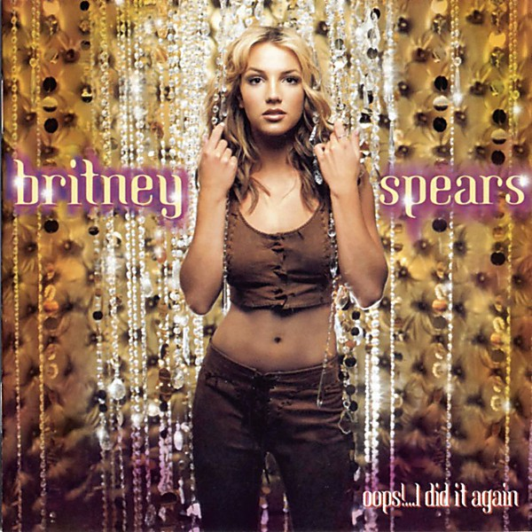

# Oops! I Did It Again

By **Britney Spears**

## Album Data

- **Catalog:** Beets
- **Format:** Digital, Album
- **Album:** Oops! I Did It Again
- **Artist:** Britney Spears
- **Albumartist:** Britney Spears
- **Genre:** Teen Pop
- **MusicBrainz Album Artist ID:** 
- **MusicBrainz Album ID:** 
- **MusicBrainz Release Group ID:** 
- **Year:** 2000
- **Catalog #:** 
- **Label:** 
- **Total Tracks:** 17

## Album Tracks

### Track 01 - 3

- **Artist:** Britney Spears
- **Format:** AAC
- **Genre:** Electropop
- **Length:** 3:33
- **MusicBrainz Track ID:** 
- **Title:** 3
- **Track:** 01
- **Year:** 2009

### Track 02 - ...Baby One More Time (2009 Remaster)

- **Artist:** Britney Spears
- **Format:** AAC
- **Genre:** Teen Pop
- **Length:** 3:30
- **MusicBrainz Track ID:** 
- **Title:** ...Baby One More Time (2009 Remaster)
- **Track:** 02
- **Year:** 2009

### Track 03 - (You Drive Me) Crazy (The Stop Remix!) (2009 Remaster)

- **Artist:** Britney Spears
- **Format:** AAC
- **Genre:** Teen Pop
- **Length:** 3:17
- **MusicBrainz Track ID:** 
- **Title:** (You Drive Me) Crazy (The Stop Remix!) (2009 Remaster)
- **Track:** 03
- **Year:** 2009

### Track 04 - Born To Make You Happy (Radio Edit - 2009 Remaster)

- **Artist:** Britney Spears
- **Format:** AAC
- **Genre:** Pop
- **Length:** 3:34
- **MusicBrainz Track ID:** 
- **Title:** Born To Make You Happy (Radio Edit - 2009 Remaster)
- **Track:** 04
- **Year:** 2009

### Track 05 - Oops!...I Did It Again (2009 Remaster)

- **Artist:** Britney Spears
- **Format:** AAC
- **Genre:** Pop
- **Length:** 3:31
- **MusicBrainz Track ID:** 
- **Title:** Oops!...I Did It Again (2009 Remaster)
- **Track:** 05
- **Year:** 2009

### Track 06 - Stronger (2009 Remaster)

- **Artist:** Britney Spears
- **Format:** AAC
- **Genre:** Pop
- **Length:** 3:23
- **MusicBrainz Track ID:** 
- **Title:** Stronger (2009 Remaster)
- **Track:** 06
- **Year:** 2009

### Track 07 - I'm A Slave 4 U (2009 Remaster)

- **Artist:** Britney Spears
- **Format:** AAC
- **Genre:** Pop
- **Length:** 3:23
- **MusicBrainz Track ID:** 
- **Title:** I'm A Slave 4 U (2009 Remaster)
- **Track:** 07
- **Year:** 2009

### Track 08 - Boys (The Co-Ed Remix) (2009 Remaster)

- **Artist:** Britney Spears
- **Format:** AAC
- **Genre:** Pop
- **Length:** 3:45
- **MusicBrainz Track ID:** 
- **Title:** Boys (The Co-Ed Remix) (2009 Remaster)
- **Track:** 08
- **Year:** 2009

### Track 10 - Toxic (2009 Remaster)

- **Artist:** Britney Spears
- **Format:** AAC
- **Genre:** Pop
- **Length:** 3:19
- **MusicBrainz Track ID:** 
- **Title:** Toxic (2009 Remaster)
- **Track:** 10
- **Year:** 2009

### Track 11 - Everytime (2009 Remaster)

- **Artist:** Britney Spears
- **Format:** AAC
- **Genre:** Pop
- **Length:** 3:53
- **MusicBrainz Track ID:** 
- **Title:** Everytime (2009 Remaster)
- **Track:** 11
- **Year:** 2009

### Track 12 - Gimme More (2009 Remaster)

- **Artist:** Britney Spears
- **Format:** AAC
- **Genre:** Pop
- **Length:** 4:11
- **MusicBrainz Track ID:** 
- **Title:** Gimme More (2009 Remaster)
- **Track:** 12
- **Year:** 2009

### Track 13 - Piece of Me (2009 Remaster)

- **Artist:** Britney Spears
- **Format:** AAC
- **Genre:** Pop
- **Length:** 3:32
- **MusicBrainz Track ID:** 
- **Title:** Piece of Me (2009 Remaster)
- **Track:** 13
- **Year:** 2009

### Track 14 - Womanizer (2009 Remaster)

- **Artist:** Britney Spears
- **Format:** MP3
- **Genre:** Pop
- **Length:** 3:43
- **MusicBrainz Track ID:** 
- **Title:** Womanizer (2009 Remaster)
- **Track:** 14
- **Year:** 2009

### Track 15 - Circus (2009 Remaster)

- **Artist:** Britney Spears
- **Format:** AAC
- **Genre:** Pop
- **Length:** 3:12
- **MusicBrainz Track ID:** 
- **Title:** Circus (2009 Remaster)
- **Track:** 15
- **Year:** 2009

### Track 16 - If U Seek Amy (2009 Remaster)

- **Artist:** Britney Spears
- **Format:** AAC
- **Genre:** Pop
- **Length:** 3:36
- **MusicBrainz Track ID:** 
- **Title:** If U Seek Amy (2009 Remaster)
- **Track:** 16
- **Year:** 2009

### Track 17 - Radar (2009 Remaster)

- **Artist:** Britney Spears
- **Format:** AAC
- **Genre:** Pop
- **Length:** 3:48
- **MusicBrainz Track ID:** 
- **Title:** Radar (2009 Remaster)
- **Track:** 17
- **Year:** 2009

### Track 09 - Me Against The Music (Video Mix - 2009 Remaster)

- **Artist:** Britney Spears featuring Madonna
- **Format:** AAC
- **Genre:** Pop
- **Length:** 3:44
- **MusicBrainz Track ID:** 
- **Title:** Me Against The Music (Video Mix - 2009 Remaster)
- **Track:** 09
- **Year:** 2009

## See also

- [Blackout (Bonus Track Version)](Blackout_Bonus_Track_Version.md)
- [Glory](Glory.md)
- [The Singles Collection](The_Singles_Collection.md)
- [CD: ](../../CD/Britney_Spears/Britney_Spears.md)
- [CD: Glory (Deluxe Edition)](../../CD/Britney_Spears/Glory_Deluxe_Edition.md)
- [CD: The Singles Collection](../../CD/Britney_Spears/The_Singles_Collection.md)
- [Roon: Glory](../../Roon/Britney_Spears/Glory.md)
- [Roon: The Essential Britney Spears](../../Roon/Britney_Spears/The_Essential_Britney_Spears.md)
- [Roon: The Singles Collection](../../Roon/Britney_Spears/The_Singles_Collection.md)
