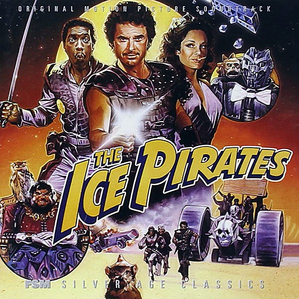

# The Ice Pirates

By **Bruce Broughton**

## Album Data

- **Catalog:** Beets
- **Format:** Digital, Album
- **Album:** The Ice Pirates
- **Artist:** Bruce Broughton
- **Albumartist:** Bruce Broughton
- **Genre:** Contemporary Classical
- **MusicBrainz Album Artist ID:** 
- **MusicBrainz Album ID:** 
- **MusicBrainz Release Group ID:** 
- **Year:** 1984
- **Catalog #:** 
- **Label:** 
- **Total Tracks:** 00

## Album Tracks

### Track 46 - Omega Robot

- **Artist:** Bruce Broughton
- **Format:** MP3
- **Genre:** Contemporary Classical
- **Length:** 1:04
- **MusicBrainz Track ID:** 
- **Title:** Omega Robot
- **Track:** 46
- **Year:** 1984

### Track 46 - Take Care

- **Artist:** Bruce Broughton
- **Format:** MP3
- **Genre:** Contemporary Classical
- **Length:** 4:54
- **MusicBrainz Track ID:** 
- **Title:** Take Care
- **Track:** 46
- **Year:** 1984

### Track 46 - Unicorn Attack

- **Artist:** Bruce Broughton
- **Format:** MP3
- **Genre:** Contemporary Classical
- **Length:** 2:32
- **MusicBrainz Track ID:** 
- **Title:** Unicorn Attack
- **Track:** 46
- **Year:** 1984

