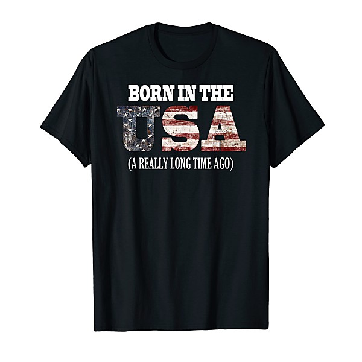

# Unknown Album (7/22/2005 7

By **Bruce Springsteen**

## Album Data

- **Catalog:** Beets
- **Format:** Digital, Album
- **Album:** Unknown Album (7/22/2005 7
- **Artist:** Bruce Springsteen
- **Albumartist:** Bruce Springsteen
- **Genre:** Americana
- **MusicBrainz Album Artist ID:** 
- **MusicBrainz Album ID:** 
- **MusicBrainz Release Group ID:** 
- **Year:** 0000
- **Catalog #:** CK 40999
- **Label:** Columbia
- **Total Tracks:** 12

## Album Tracks

### Track 01 - Ain’t Got You

- **Artist:** Bruce Springsteen
- **Format:** ALAC
- **Genre:** Pop Rock
- **Length:** 2:11
- **MusicBrainz Track ID:** [15937bdb-673b-4a04-8a1d-7071348dadeb](https://musicbrainz.org/recording/15937bdb-673b-4a04-8a1d-7071348dadeb)
- **Title:** Ain’t Got You
- **Track:** 01
- **Year:** 1987

### Track 02 - Tougher Than the Rest

- **Artist:** Bruce Springsteen
- **Format:** ALAC
- **Genre:** Soft Rock
- **Length:** 4:35
- **MusicBrainz Track ID:** [e7c22627-9e89-47d5-a526-ec494212fb2c](https://musicbrainz.org/recording/e7c22627-9e89-47d5-a526-ec494212fb2c)
- **Title:** Tougher Than the Rest
- **Track:** 02
- **Year:** 1987

### Track 03 - All That Heaven Will Allow

- **Artist:** Bruce Springsteen
- **Format:** ALAC
- **Genre:** Pop Rock
- **Length:** 2:39
- **MusicBrainz Track ID:** [179f299e-24a1-4f4c-8d3e-e79086c71723](https://musicbrainz.org/recording/179f299e-24a1-4f4c-8d3e-e79086c71723)
- **Title:** All That Heaven Will Allow
- **Track:** 03
- **Year:** 1987

### Track 04 - Spare Parts

- **Artist:** Bruce Springsteen
- **Format:** ALAC
- **Genre:** Pop Rock
- **Length:** 3:44
- **MusicBrainz Track ID:** [c8402b44-638e-42ed-a98c-4ab4e441fd1c](https://musicbrainz.org/recording/c8402b44-638e-42ed-a98c-4ab4e441fd1c)
- **Title:** Spare Parts
- **Track:** 04
- **Year:** 1987

### Track 05 - Cautious Man

- **Artist:** Bruce Springsteen
- **Format:** ALAC
- **Genre:** Pop Rock
- **Length:** 3:58
- **MusicBrainz Track ID:** [6c4c7b80-70b3-40b2-ae30-7a2f644f35b8](https://musicbrainz.org/recording/6c4c7b80-70b3-40b2-ae30-7a2f644f35b8)
- **Title:** Cautious Man
- **Track:** 05
- **Year:** 1987

### Track 06 - Walk Like a Man

- **Artist:** Bruce Springsteen
- **Format:** ALAC
- **Genre:** Pop Rock
- **Length:** 3:45
- **MusicBrainz Track ID:** [17ec614e-f950-4083-8cd4-ca3ef695fd5c](https://musicbrainz.org/recording/17ec614e-f950-4083-8cd4-ca3ef695fd5c)
- **Title:** Walk Like a Man
- **Track:** 06
- **Year:** 1987

### Track 07 - Tunnel of Love

- **Artist:** Bruce Springsteen
- **Format:** ALAC
- **Genre:** Soft Rock
- **Length:** 5:12
- **MusicBrainz Track ID:** [b1dddcd9-1052-4bd1-a9f2-ba13d4bcd0cd](https://musicbrainz.org/recording/b1dddcd9-1052-4bd1-a9f2-ba13d4bcd0cd)
- **Title:** Tunnel of Love
- **Track:** 07
- **Year:** 1987

### Track 08 - Two Faces

- **Artist:** Bruce Springsteen
- **Format:** ALAC
- **Genre:** Pop Rock
- **Length:** 3:03
- **MusicBrainz Track ID:** [a5b1fea4-459c-4fc7-86cf-c5080cb6f16d](https://musicbrainz.org/recording/a5b1fea4-459c-4fc7-86cf-c5080cb6f16d)
- **Title:** Two Faces
- **Track:** 08
- **Year:** 1987

### Track 09 - Brilliant Disguise

- **Artist:** Bruce Springsteen
- **Format:** ALAC
- **Genre:** Rock
- **Length:** 4:17
- **MusicBrainz Track ID:** [b5738dd5-7df0-4d48-926a-a135650d56ee](https://musicbrainz.org/recording/b5738dd5-7df0-4d48-926a-a135650d56ee)
- **Title:** Brilliant Disguise
- **Track:** 09
- **Year:** 1987

### Track 10 - One Step Up

- **Artist:** Bruce Springsteen
- **Format:** ALAC
- **Genre:** Pop Rock
- **Length:** 4:22
- **MusicBrainz Track ID:** [75d931ec-3a28-47e0-99f7-3d04930b85da](https://musicbrainz.org/recording/75d931ec-3a28-47e0-99f7-3d04930b85da)
- **Title:** One Step Up
- **Track:** 10
- **Year:** 1987

### Track 11 - When You’re Alone

- **Artist:** Bruce Springsteen
- **Format:** ALAC
- **Genre:** Pop Rock
- **Length:** 3:24
- **MusicBrainz Track ID:** [ca2e7873-0b56-47e6-8c76-bec878aa87a7](https://musicbrainz.org/recording/ca2e7873-0b56-47e6-8c76-bec878aa87a7)
- **Title:** When You’re Alone
- **Track:** 11
- **Year:** 1987

### Track 12 - Valentine’s Day

- **Artist:** Bruce Springsteen
- **Format:** ALAC
- **Genre:** Pop Rock
- **Length:** 5:11
- **MusicBrainz Track ID:** [ad35ece5-edbf-4c50-8552-1a57b01de439](https://musicbrainz.org/recording/ad35ece5-edbf-4c50-8552-1a57b01de439)
- **Title:** Valentine’s Day
- **Track:** 12
- **Year:** 1987

## See also

- [Tunnel of Love](Tunnel_of_Love.md)
- [Vinyl: ](../../Vinyl/Bruce_Springsteen/Bruce_Springsteen.md)
- [Vinyl: The River](../../Vinyl/Bruce_Springsteen/The_River.md)
