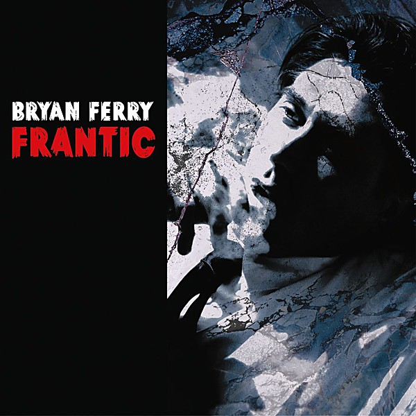

# Frantic

By **Bryan Ferry**

## Album Data

- **Catalog:** Beets
- **Format:** Digital, Album
- **Album:** Frantic
- **Artist:** Bryan Ferry
- **Albumartist:** Bryan Ferry
- **Genre:** Glam Rock
- **MusicBrainz Album Artist ID:** [4ef7a9e2-2cf5-483a-8616-ef7791a98026](https://musicbrainz.org/artist/4ef7a9e2-2cf5-483a-8616-ef7791a98026)
- **MusicBrainz Album ID:** [91059fed-fb96-4756-9b9f-463e943d05c2](https://musicbrainz.org/release/91059fed-fb96-4756-9b9f-463e943d05c2)
- **MusicBrainz Release Group ID:** [be5c4f6a-34c1-3d10-8177-04b5974c3b19](https://musicbrainz.org/release-group/be5c4f6a-34c1-3d10-8177-04b5974c3b19)
- **Year:** 2002
- **Catalog #:** 7243 8119842 1
- **Label:** Virgin
- **Total Tracks:** 13

## Album Tracks

### Track 01 - It's All Over Now, Baby Blue

- **Artist:** Bryan Ferry
- **Format:** AAC
- **Genre:** Rock
- **Length:** 4:05
- **MusicBrainz Track ID:** [1705f860-809e-422b-8380-ef91eaa5c51f](https://musicbrainz.org/recording/1705f860-809e-422b-8380-ef91eaa5c51f)
- **Title:** It's All Over Now, Baby Blue
- **Track:** 01
- **Year:** 2002

### Track 02 - Cruel

- **Artist:** Bryan Ferry
- **Format:** AAC
- **Genre:** Glam Rock
- **Length:** 3:55
- **MusicBrainz Track ID:** [3d8a2949-77fc-4192-a036-aae1ec7905e5](https://musicbrainz.org/recording/3d8a2949-77fc-4192-a036-aae1ec7905e5)
- **Title:** Cruel
- **Track:** 02
- **Year:** 2002

### Track 03 - Goin' Down

- **Artist:** Bryan Ferry
- **Format:** AAC
- **Genre:** Rock
- **Length:** 3:08
- **MusicBrainz Track ID:** [c56843aa-8d5d-462b-90e5-8d0150e80cb2](https://musicbrainz.org/recording/c56843aa-8d5d-462b-90e5-8d0150e80cb2)
- **Title:** Goin' Down
- **Track:** 03
- **Year:** 2002

### Track 04 - Goddess of Love

- **Artist:** Bryan Ferry
- **Format:** AAC
- **Genre:** Sophisti-Pop
- **Length:** 3:32
- **MusicBrainz Track ID:** [d1ce8483-4e8f-49c4-a971-858033c3cf0b](https://musicbrainz.org/recording/d1ce8483-4e8f-49c4-a971-858033c3cf0b)
- **Title:** Goddess of Love
- **Track:** 04
- **Year:** 2002

### Track 05 - Don't Think Twice, It's All Right

- **Artist:** Bryan Ferry
- **Format:** AAC
- **Genre:** Rock
- **Length:** 4:05
- **MusicBrainz Track ID:** [3fe864df-bb42-4087-83dd-b4f1192867ca](https://musicbrainz.org/recording/3fe864df-bb42-4087-83dd-b4f1192867ca)
- **Title:** Don't Think Twice, It's All Right
- **Track:** 05
- **Year:** 2002

### Track 06 - Nobody Loves Me

- **Artist:** Bryan Ferry
- **Format:** AAC
- **Genre:** Glam Rock
- **Length:** 3:22
- **MusicBrainz Track ID:** [d9d8fcc6-847e-44c2-93a4-1ee4dfc6db6b](https://musicbrainz.org/recording/d9d8fcc6-847e-44c2-93a4-1ee4dfc6db6b)
- **Title:** Nobody Loves Me
- **Track:** 06
- **Year:** 2002

### Track 07 - Ja Nun Hons Pris

- **Artist:** Bryan Ferry
- **Format:** AAC
- **Genre:** Rock
- **Length:** 0:35
- **MusicBrainz Track ID:** [a3ec3d4e-5a7a-422d-8a8f-e3dd10b2a1f6](https://musicbrainz.org/recording/a3ec3d4e-5a7a-422d-8a8f-e3dd10b2a1f6)
- **Title:** Ja Nun Hons Pris
- **Track:** 07
- **Year:** 2002

### Track 08 - A Fool for Love

- **Artist:** Bryan Ferry
- **Format:** AAC
- **Genre:** Soft Rock
- **Length:** 4:44
- **MusicBrainz Track ID:** [b1f98df1-3827-469f-89fb-c581c057f313](https://musicbrainz.org/recording/b1f98df1-3827-469f-89fb-c581c057f313)
- **Title:** A Fool for Love
- **Track:** 08
- **Year:** 2002

### Track 09 - Goodnight Irene

- **Artist:** Bryan Ferry
- **Format:** AAC
- **Genre:** Rock
- **Length:** 3:20
- **MusicBrainz Track ID:** [e8a91620-a847-47ee-b6ff-5ead2e68b3dd](https://musicbrainz.org/recording/e8a91620-a847-47ee-b6ff-5ead2e68b3dd)
- **Title:** Goodnight Irene
- **Track:** 09
- **Year:** 2002

### Track 10 - Hiroshima...

- **Artist:** Bryan Ferry
- **Format:** AAC
- **Genre:** Rock
- **Length:** 3:14
- **MusicBrainz Track ID:** [625a589d-4fdb-4845-b9e5-aeb722319022](https://musicbrainz.org/recording/625a589d-4fdb-4845-b9e5-aeb722319022)
- **Title:** Hiroshima...
- **Track:** 10
- **Year:** 2002

### Track 11 - San Simeon

- **Artist:** Bryan Ferry
- **Format:** AAC
- **Genre:** Rock
- **Length:** 4:34
- **MusicBrainz Track ID:** [022f6a46-ae00-4b16-a253-ae88b0adcd9d](https://musicbrainz.org/recording/022f6a46-ae00-4b16-a253-ae88b0adcd9d)
- **Title:** San Simeon
- **Track:** 11
- **Year:** 2002

### Track 12 - One Way Love

- **Artist:** Bryan Ferry
- **Format:** AAC
- **Genre:** Rock
- **Length:** 3:05
- **MusicBrainz Track ID:** [6e83f81c-a6a8-41ec-a8a3-0e41a016ed9d](https://musicbrainz.org/recording/6e83f81c-a6a8-41ec-a8a3-0e41a016ed9d)
- **Title:** One Way Love
- **Track:** 12
- **Year:** 2002

### Track 13 - I Thought

- **Artist:** Bryan Ferry
- **Format:** AAC
- **Genre:** Soft Rock
- **Length:** 5:40
- **MusicBrainz Track ID:** [c03fe397-fafc-4700-8dc2-fcc358cf82d8](https://musicbrainz.org/recording/c03fe397-fafc-4700-8dc2-fcc358cf82d8)
- **Title:** I Thought
- **Track:** 13
- **Year:** 2002

## See also

- [Roon: Frantic](../../Roon/Bryan_Ferry/Frantic.md)
