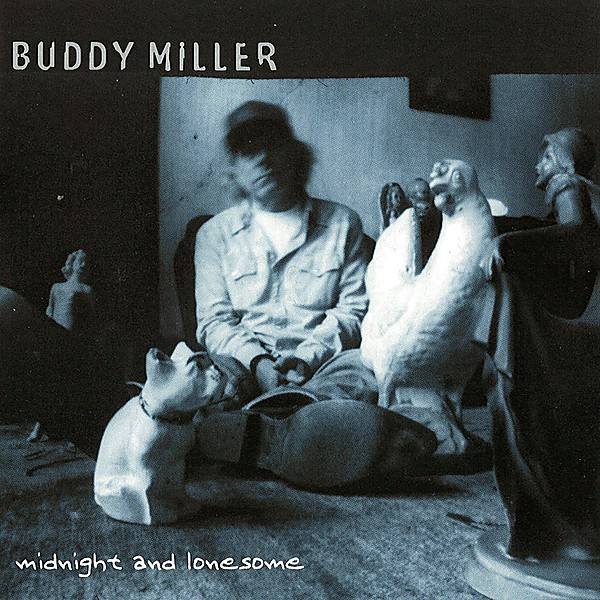

# Midnight and Lonesome

By **Buddy Miller**

## Album Data

- **Catalog:** Beets
- **Format:** Digital, Album
- **Album:** Midnight and Lonesome
- **Artist:** Buddy Miller
- **Albumartist:** Buddy Miller
- **Genre:** Country
- **MusicBrainz Album Artist ID:** [ae9156f5-1ed4-4c42-828b-fe1f7b1876a7](https://musicbrainz.org/artist/ae9156f5-1ed4-4c42-828b-fe1f7b1876a7)
- **MusicBrainz Album ID:** [156117c2-3c70-475b-ad43-bb92eb2a0d93](https://musicbrainz.org/release/156117c2-3c70-475b-ad43-bb92eb2a0d93)
- **MusicBrainz Release Group ID:** [58945386-70fc-316b-82c2-873a753e596c](https://musicbrainz.org/release-group/58945386-70fc-316b-82c2-873a753e596c)
- **Year:** 2002
- **Catalog #:** 
- **Label:** Hightone
- **Total Tracks:** 11

## Album Tracks

### Track 01 - The Price of Love

- **Artist:** Buddy Miller
- **Format:** MP3
- **Genre:** Rock And Roll
- **Length:** 4:44
- **MusicBrainz Track ID:** [c9f2af28-d207-4a7c-881e-7a48118b42aa](https://musicbrainz.org/recording/c9f2af28-d207-4a7c-881e-7a48118b42aa)
- **Title:** The Price of Love
- **Track:** 01
- **Year:** 2002

### Track 02 - Wild Card

- **Artist:** Buddy Miller
- **Format:** MP3
- **Genre:** Soul
- **Length:** 3:33
- **MusicBrainz Track ID:** [aae3bddf-668e-4452-b587-c88421799aec](https://musicbrainz.org/recording/aae3bddf-668e-4452-b587-c88421799aec)
- **Title:** Wild Card
- **Track:** 02
- **Year:** 2002

### Track 03 - I Can't Get Over You

- **Artist:** Buddy Miller
- **Format:** MP3
- **Genre:** Soul
- **Length:** 4:44
- **MusicBrainz Track ID:** [dfbf4abf-0e6f-4af9-8c1d-1be2ca8ae867](https://musicbrainz.org/recording/dfbf4abf-0e6f-4af9-8c1d-1be2ca8ae867)
- **Title:** I Can't Get Over You
- **Track:** 03
- **Year:** 2002

### Track 04 - Midnight and Lonesome

- **Artist:** Buddy Miller
- **Format:** MP3
- **Genre:** Soul
- **Length:** 3:54
- **MusicBrainz Track ID:** [47ad7a6b-f089-4987-8e38-da694d42cccc](https://musicbrainz.org/recording/47ad7a6b-f089-4987-8e38-da694d42cccc)
- **Title:** Midnight and Lonesome
- **Track:** 04
- **Year:** 2002

### Track 05 - When It Comes to You

- **Artist:** Buddy Miller
- **Format:** MP3
- **Genre:** Americana
- **Length:** 4:12
- **MusicBrainz Track ID:** [a3e92dc8-4637-4d92-94f1-fa8b621aa6be](https://musicbrainz.org/recording/a3e92dc8-4637-4d92-94f1-fa8b621aa6be)
- **Title:** When It Comes to You
- **Track:** 05
- **Year:** 2002

### Track 06 - Water When the Well Is Dry

- **Artist:** Buddy Miller
- **Format:** MP3
- **Genre:** Americana
- **Length:** 4:51
- **MusicBrainz Track ID:** [ea76cd99-54f1-4fec-855b-11edf8a1e2ae](https://musicbrainz.org/recording/ea76cd99-54f1-4fec-855b-11edf8a1e2ae)
- **Title:** Water When the Well Is Dry
- **Track:** 06
- **Year:** 2002

### Track 07 - A Showman's Life

- **Artist:** Buddy Miller
- **Format:** MP3
- **Genre:** Close Harmony
- **Length:** 4:43
- **MusicBrainz Track ID:** [159025c8-3290-4560-8a75-5979cd7719b2](https://musicbrainz.org/recording/159025c8-3290-4560-8a75-5979cd7719b2)
- **Title:** A Showman's Life
- **Track:** 07
- **Year:** 2002

### Track 08 - Little Bitty Kiss

- **Artist:** Buddy Miller
- **Format:** MP3
- **Genre:** Country Rock
- **Length:** 2:47
- **MusicBrainz Track ID:** [869be5af-6ef7-49e7-98fc-167f523d7ad0](https://musicbrainz.org/recording/869be5af-6ef7-49e7-98fc-167f523d7ad0)
- **Title:** Little Bitty Kiss
- **Track:** 08
- **Year:** 2002

### Track 09 - Please Send Me Someone to Love

- **Artist:** Buddy Miller
- **Format:** MP3
- **Genre:** Americana
- **Length:** 4:04
- **MusicBrainz Track ID:** [382cb674-5b9a-4d0c-945d-645e89ea8ea1](https://musicbrainz.org/recording/382cb674-5b9a-4d0c-945d-645e89ea8ea1)
- **Title:** Please Send Me Someone to Love
- **Track:** 09
- **Year:** 2002

### Track 10 - Oh Fait Pitie d'Amour (Love Have Mercy on Me)

- **Artist:** Buddy Miller
- **Format:** MP3
- **Genre:** Country
- **Length:** 3:19
- **MusicBrainz Track ID:** [4549adae-bf13-4f23-9263-a6cad5b7fcd9](https://musicbrainz.org/recording/4549adae-bf13-4f23-9263-a6cad5b7fcd9)
- **Title:** Oh Fait Pitie d'Amour (Love Have Mercy on Me)
- **Track:** 10
- **Year:** 2002

### Track 11 - Quecreek

- **Artist:** Buddy Miller
- **Format:** MP3
- **Genre:** Americana
- **Length:** 4:12
- **MusicBrainz Track ID:** [134b7ef8-9162-41af-af93-0a23acaa81da](https://musicbrainz.org/recording/134b7ef8-9162-41af-af93-0a23acaa81da)
- **Title:** Quecreek
- **Track:** 11
- **Year:** 2002

## See also

- [bonus disc-midnight and lonesome](bonus_disc-midnight_and_lonesome.md)
- [Roon: Buddy & Julie Miller](../../Roon/Buddy_Miller/Buddy_and_Julie_Miller.md)
- [Roon: Midnight And Lonesome](../../Roon/Buddy_Miller/Midnight_And_Lonesome.md)
