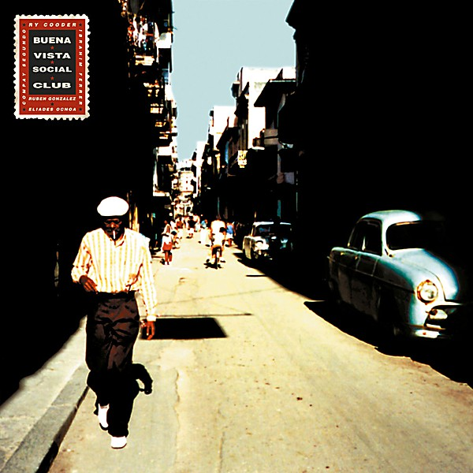

# Buena Vista Social Club

By **Buena Vista Social Club**

## Album Data

- **Catalog:** Beets
- **Format:** Digital, Album
- **Album:** Buena Vista Social Club
- **Artist:** Buena Vista Social Club
- **Albumartist:** Buena Vista Social Club
- **Genre:** Son
- **MusicBrainz Album Artist ID:** [2a85ecff-41e9-4be1-aca6-c87054a4c334](https://musicbrainz.org/artist/2a85ecff-41e9-4be1-aca6-c87054a4c334)
- **MusicBrainz Album ID:** [2e18e017-0a62-4c50-a708-b6fbea29612e](https://musicbrainz.org/release/2e18e017-0a62-4c50-a708-b6fbea29612e)
- **MusicBrainz Release Group ID:** [32bbab8e-02c0-30d2-9e23-a19739864b84](https://musicbrainz.org/release-group/32bbab8e-02c0-30d2-9e23-a19739864b84)
- **Year:** 1997
- **Catalog #:** 79478-2
- **Label:** Nonesuch
- **Total Tracks:** 14

## Album Tracks

### Track 01 - Chan Chan

- **Artist:** Buena Vista Social Club
- **Format:** MP3
- **Genre:** Latin Jazz
- **Length:** 4:17
- **MusicBrainz Track ID:** [47b7339f-8f7e-432e-acf1-8cb6b53a3554](https://musicbrainz.org/recording/47b7339f-8f7e-432e-acf1-8cb6b53a3554)
- **Title:** Chan Chan
- **Track:** 01
- **Year:** 1997

### Track 02 - De camino a la vereda

- **Artist:** Buena Vista Social Club
- **Format:** MP3
- **Genre:** Salsa
- **Length:** 5:03
- **MusicBrainz Track ID:** [f22b505c-9496-4c67-a872-c2768b4ae50f](https://musicbrainz.org/recording/f22b505c-9496-4c67-a872-c2768b4ae50f)
- **Title:** De camino a la vereda
- **Track:** 02
- **Year:** 1997

### Track 03 - El cuarto de Tula

- **Artist:** Buena Vista Social Club
- **Format:** MP3
- **Genre:** Salsa
- **Length:** 7:25
- **MusicBrainz Track ID:** [471cc66c-7772-4d6c-b780-b2429a48edc2](https://musicbrainz.org/recording/471cc66c-7772-4d6c-b780-b2429a48edc2)
- **Title:** El cuarto de Tula
- **Track:** 03
- **Year:** 1997

### Track 04 - Pueblo Nuevo

- **Artist:** Buena Vista Social Club
- **Format:** MP3
- **Genre:** Son
- **Length:** 6:06
- **MusicBrainz Track ID:** [7a2f8a38-e1a8-4f8d-9d92-919d6ea54195](https://musicbrainz.org/recording/7a2f8a38-e1a8-4f8d-9d92-919d6ea54195)
- **Title:** Pueblo Nuevo
- **Track:** 04
- **Year:** 1997

### Track 05 - Dos gardenias

- **Artist:** Buena Vista Social Club
- **Format:** MP3
- **Genre:** Latin Jazz
- **Length:** 3:04
- **MusicBrainz Track ID:** [3337d23e-eec6-4e8c-a279-9dcfee979719](https://musicbrainz.org/recording/3337d23e-eec6-4e8c-a279-9dcfee979719)
- **Title:** Dos gardenias
- **Track:** 05
- **Year:** 1997

### Track 06 - ¿Y tú qué has hecho?

- **Artist:** Buena Vista Social Club
- **Format:** MP3
- **Genre:** Son
- **Length:** 3:14
- **MusicBrainz Track ID:** [fd503a45-da49-4a11-8e4b-cc0e123cf366](https://musicbrainz.org/recording/fd503a45-da49-4a11-8e4b-cc0e123cf366)
- **Title:** ¿Y tú qué has hecho?
- **Track:** 06
- **Year:** 1997

### Track 07 - Veinte años

- **Artist:** Buena Vista Social Club
- **Format:** MP3
- **Genre:** Latin Jazz
- **Length:** 3:31
- **MusicBrainz Track ID:** [de7429d0-04f4-4c20-b0d8-b350610db002](https://musicbrainz.org/recording/de7429d0-04f4-4c20-b0d8-b350610db002)
- **Title:** Veinte años
- **Track:** 07
- **Year:** 1997

### Track 08 - El carretero

- **Artist:** Buena Vista Social Club
- **Format:** MP3
- **Genre:** Latin Jazz
- **Length:** 3:30
- **MusicBrainz Track ID:** [68d8672e-7f48-4fa6-aca1-b63fc9b3e2da](https://musicbrainz.org/recording/68d8672e-7f48-4fa6-aca1-b63fc9b3e2da)
- **Title:** El carretero
- **Track:** 08
- **Year:** 1997

### Track 09 - Candela

- **Artist:** Buena Vista Social Club
- **Format:** MP3
- **Genre:** Son
- **Length:** 5:29
- **MusicBrainz Track ID:** [16c11b1d-162e-4b9e-a3c0-fc74546b4520](https://musicbrainz.org/recording/16c11b1d-162e-4b9e-a3c0-fc74546b4520)
- **Title:** Candela
- **Track:** 09
- **Year:** 1997

### Track 10 - Amor de loca juventud

- **Artist:** Buena Vista Social Club
- **Format:** MP3
- **Genre:** Salsa
- **Length:** 3:22
- **MusicBrainz Track ID:** [4198c8e0-7cf4-48c1-b143-c2b9ad9074a8](https://musicbrainz.org/recording/4198c8e0-7cf4-48c1-b143-c2b9ad9074a8)
- **Title:** Amor de loca juventud
- **Track:** 10
- **Year:** 1997

### Track 11 - Orgullecida

- **Artist:** Buena Vista Social Club
- **Format:** MP3
- **Genre:** Son
- **Length:** 3:19
- **MusicBrainz Track ID:** [9820e0fd-a16c-43f3-8cd0-e5f0949ad9f6](https://musicbrainz.org/recording/9820e0fd-a16c-43f3-8cd0-e5f0949ad9f6)
- **Title:** Orgullecida
- **Track:** 11
- **Year:** 1997

### Track 12 - Murmullo

- **Artist:** Buena Vista Social Club
- **Format:** MP3
- **Genre:** Son
- **Length:** 3:51
- **MusicBrainz Track ID:** [b6d6d862-bc20-4c9a-9571-ee6f9cbb490c](https://musicbrainz.org/recording/b6d6d862-bc20-4c9a-9571-ee6f9cbb490c)
- **Title:** Murmullo
- **Track:** 12
- **Year:** 1997

### Track 13 - Buena Vista Social Club

- **Artist:** Buena Vista Social Club
- **Format:** MP3
- **Genre:** Son
- **Length:** 4:52
- **MusicBrainz Track ID:** [82014f36-3cc7-4682-bfea-2f6b7104c61d](https://musicbrainz.org/recording/82014f36-3cc7-4682-bfea-2f6b7104c61d)
- **Title:** Buena Vista Social Club
- **Track:** 13
- **Year:** 1997

### Track 14 - La Bayamesa

- **Artist:** Buena Vista Social Club
- **Format:** MP3
- **Genre:** Son
- **Length:** 2:54
- **MusicBrainz Track ID:** [93eb6045-fc56-4e71-8577-583fcbd31e60](https://musicbrainz.org/recording/93eb6045-fc56-4e71-8577-583fcbd31e60)
- **Title:** La Bayamesa
- **Track:** 14
- **Year:** 1997

